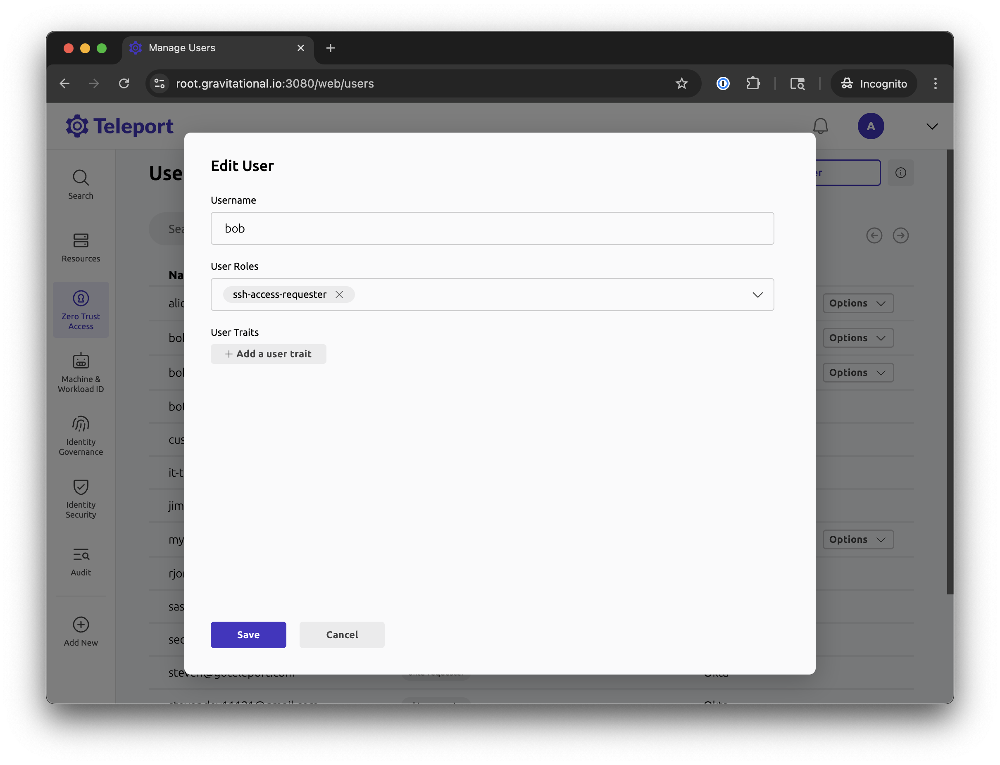
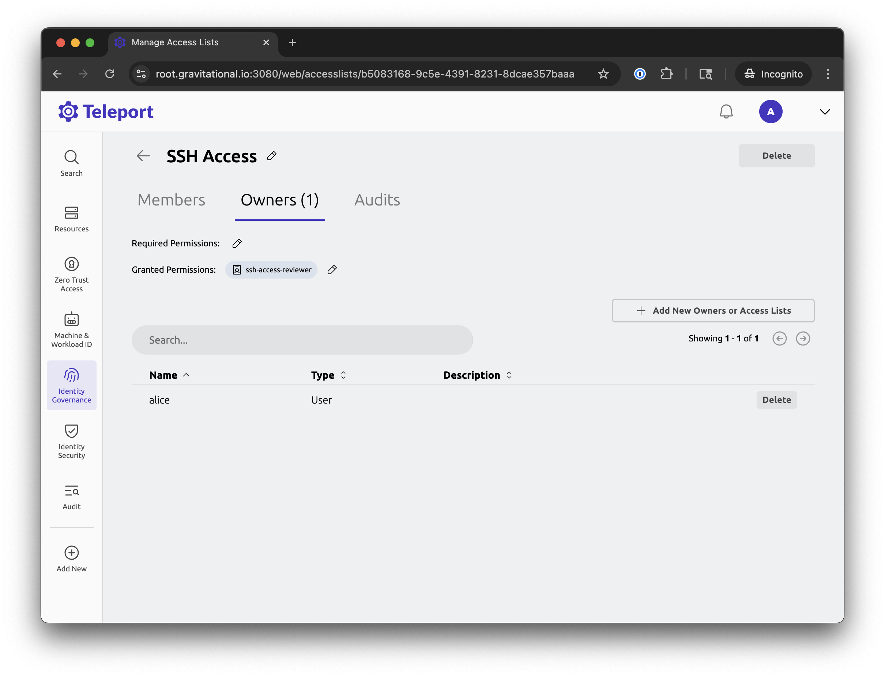
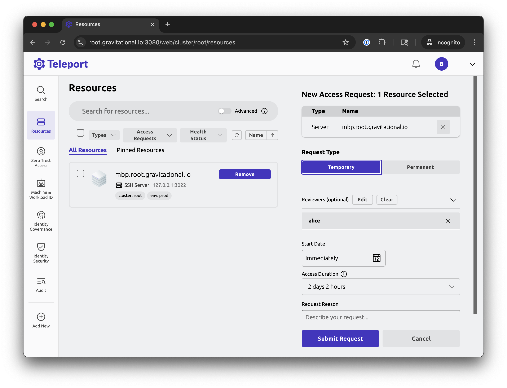
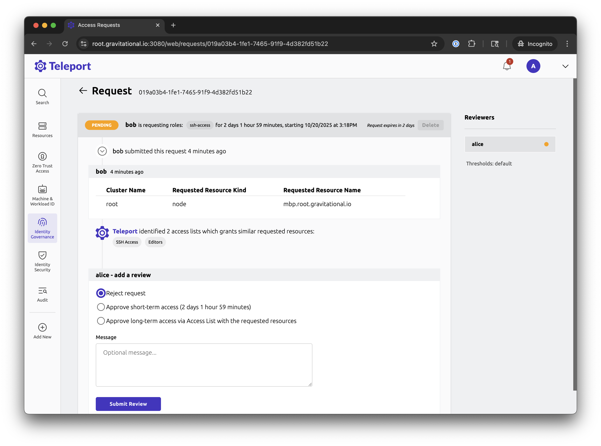
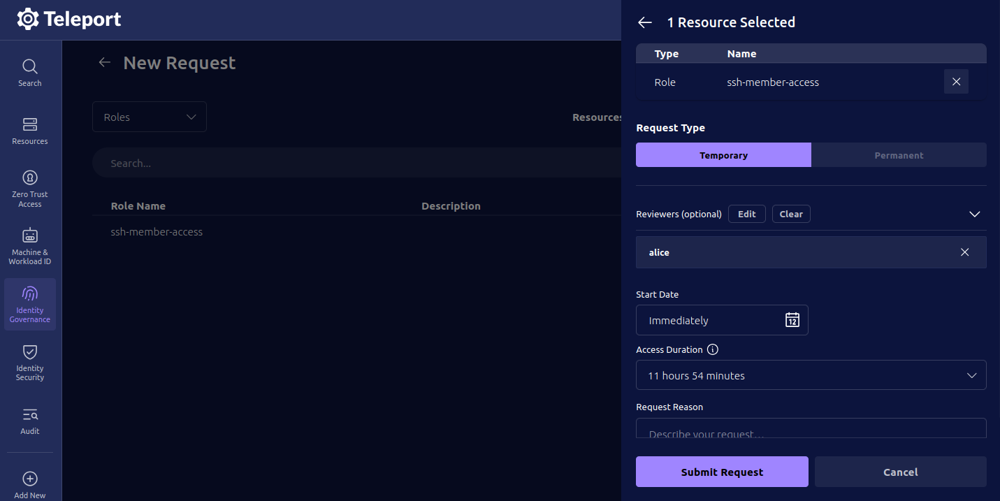
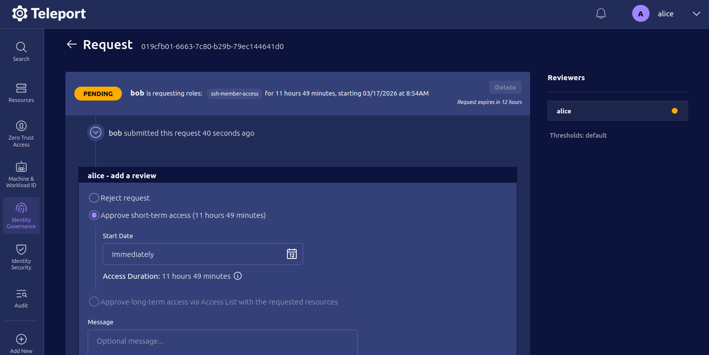

In this guide we will walk through two Access List-related Access Request use-cases.

 - [Access Requests with promotable resources](#access-requests-with-promotable-resources)
 - [Access Requests with reviewers suggested by Access List membership](#access-requests-with-reviewers-suggested-by-access-list-membership)

## Prerequisites

- Teleport cluster with a connected resource e.g. an SSH node.
- Teleport user (`admin` in this guide) with an `editor` role to perform configuration.
- Teleport user (`alice` in this guide) acting as an Access Request reviewer.
- Teleport user (`bob` in this guide) acting as a low-privileged requester user.

## Access Requests with promotable resources

Access List owners can be automatically assigned as suggested reviewers to
resource-based Access Requests that include resources granted by their Access
List.

### How it works

We will create an Access List that grants users access to certain resources and
allows its owners to review Access Requests to those resources.

Then, we will issue an Access Request to those resources to verify that the list
owners are prepopulated as suggested reviewers and that the request can be promoted
to long-term access via the Access List.

### Step 1/5. Create roles

As an `admin` user, let's create 3 roles:

- Role that grants access to SSH nodes with a label `env:prod`
- Role that allows users to request access to SSH nodes with that label
- Role that allows users to review Access Requests for SSH nodes with that label

The `ssh-access` role allows access to SSH nodes with the label `env: prod`:

```yaml
kind: role
version: v8
metadata:
  name: ssh-access
spec:
  allow:
    logins:
    - ubuntu
    node_labels:
      'env': 'prod'
```

The `ssh-access-requester` role allows to request access to such SSH nodes:

```yaml
kind: role
version: v8
metadata:
  name: ssh-access-requester
spec:
  allow:
    request:
      search_as_roles:
      - ssh-access
```

The `ssh-access-reviewer` role allows to review such Access Requests:

```yaml
kind: role
version: v8
metadata:
  name: ssh-access-reviewer
spec:
  allow:
    review_requests:
      roles:
      - ssh-access
      preview_as_roles:
      - ssh-access
```

### Step 2/5. Assign requester role

As an `admin` user, assign the `ssh-access-requester` role to `bob`.



This role will allow `bob` to issue Access Requests to SSH nodes with `env: prod`
labels.

### Step 3/5. Create an Access List

Now, as an `admin` user, let's create an Access List that grants access to the
SSH nodes (via `ssh-access` member role grant) and allows its owners to review
requests to these SSH nodes (via `ssh-access-reviewer` owner role grant).

On the Identity Governance / Access Lists web UI page select "Create New Access
List" and create a new one with the following parameters:

- List name: `SSH Access`
- Permissions granted to list owners: `ssh-access-reviewer`
- Permissions granted to list members: `ssh-access`
- List owner: `alice`



You can fill out the rest of the parameters as desired.

### Step 4/5. Submit an Access Request

Once you log into Teleport as `bob`, you should be able to see your SSH node(-s)
as requestable resources.

On the Access Request checkout dialog, you should see that `alice` has been
prepopulated as a suggested reviewer because she is an owner of the access
list that grants access to the requested SSH node.



Submit the request.

### Step 5/5. Review the Access Request

Once the request is submitted, log in as `alice` and go to the Identity Governance /
Access Requests page to see `bob`'s pending request and review it:



Because access to the requested SSH node can be granted by the "SSH Access" list, `alice` has
the option to promote the request to long-term access via the Access List, or grant 
direct access to the SSH node.

That's it! `alice` as an owner of the "SSH Access" list has successfully reviewed
`bob`'s request to an SSH node that's granted by her Access List.

## Access Requests with reviewers suggested by Access List membership

Access List owners can be automatically assigned as suggested reviewers to 
Access Requests when the requester is already a member of an applicable Access 
List.

### How it works

We will create an Access List that grants a role that allows the requester to 
request a role, and allows its owners to review requests for that role.

We will make the requester a member of the Access List.

Then, we will issue an Access Request for the role and verify the list owner is
prepopulated as a suggested reviewer and that the request can be reviewed by
the owner.

### Step 1/5. Create roles

As an `admin` user, let's create 3 roles:

- Role that grants access to SSH nodes with a label `env:prod`
- Role that allows users to request the access-granting role
- Role that allows users to review Access Requests for the access-granting role

The `ssh-member-access` role allows access to SSH nodes with the label `env: prod`:

```yaml
kind: role
version: v8
metadata:
  name: ssh-member-access
spec:
  allow:
    logins:
    - ubuntu
    node_labels:
      'env': 'prod'
```

The `ssh-member-requester` role allows users to request the `ssh-member-access` role:

```yaml
kind: role
version: v8
metadata:
  name: ssh-member-requester
spec:
  allow:
    request:
      roles:
      - ssh-member-access
```

The `ssh-member-reviewer` role allows users to review Access Requests for the `ssh-member-access` role:

```yaml
kind: role
version: v8
metadata:
  name: ssh-member-reviewer
spec:
  allow:
    review_requests:
      roles:
      - ssh-member-access
      preview_as_roles:
      - ssh-member-access
```

### Step 2/5. Create an Access List

As an `admin` user, create an Access List.

The `ssh-member-access-list` grants its members the ability to request the `ssh-member-access`
role (via `ssh-member-requester` member role grant) and its owners the ability to review
requests for the `ssh-member-access` role (via `ssh-member-reviewer` owner role grant):

```yaml
kind: access_list
version: v2
metadata:
  name: ssh-member-access-list
spec:
  title: "SSH Member Access"
  description: "Access List for membership-based Access Request reviews"
  owners:
    - name: alice
      description: "Access list owner"
  grants:
    roles:
      - ssh-member-requester
  owner_grants:
    roles:
      - ssh-member-reviewer
  audit:
    frequency: "12 months"
```

### Step 3/5. Add the requester as a member of the Access List

Next, add `bob` as a member of `ssh-member-access-list`:

```bash
tctl acl users add ssh-member-access-list bob
```

Once `bob` is a member of the `ssh-member-access-list`, the `ssh-member-requester`
role will be granted, allowing `bob` to request the `ssh-member-access` role.

### Step 4/5. Submit an Access Request

Once you log into Teleport as `bob`, create an Access Request for the 
`ssh-member-access` role: 



On the Access Request checkout dialog, you should see that `alice` has been
prepopulated as a suggested reviewer because she is an owner of the Access
List, has review permission for the requested role, and membership grants the 
ability to request the requested role.

Submit the request.

### Step 5/5. Review the Access Request

Once the request is submitted, log in as `alice` and go to the Identity Governance /
Access Requests page to see `bob`'s pending request and review it:



Because `alice` is an owner of `ssh-member-access-list`, she has been granted the
`ssh-member-reviewer` role, which allows her to review requests for the
`ssh-member-access` role.

That's it! `alice` as an owner of the `ssh-member-access-list` list has successfully reviewed
`bob`'s request for the `ssh-member-access` role.

## Next steps

- Learn more about [Resource Access Requests](../access-requests/resource-requests.mdx).
