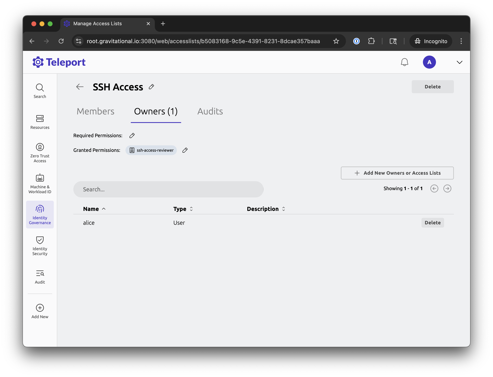

Access List owners can be automatically assigned as suggested reviewers to
resource-based Access Requests that include resources granted by their Access
List.

In this guide we will walk through an example and the configuration of this
use-case.

## How it works

We will create an Access List that grants users access to certain resources and
allows its owners to review Access Requests to those resources.

Then, we will issue an Access Request to those resources to verify that the list
owners are prepopulated as suggested reviewers.

## Prerequisites

- Teleport cluster with a connected resource e.g. an SSH node.
- Teleport user (`admin` in this guide) with an `editor` role to perform configuration.
- Teleport user (`alice` in this guide) acting as an Access Request reviewer.
- Teleport user (`bob` in this guide) acting as a low-privileged requester user.

## Step 1/5. Create roles

As an `admin` user, let's create 3 roles:

- Role that grants access to SSH nodes with a label `env:prod`
- Role that allows users to request access to SSH nodes with that label
- Role that allows users to review Access Requests for SSH nodes with that label

The `ssh-access` role allows access to SSH nodes with the label `env: prod`:

```yaml
kind: role
version: v8
metadata:
  name: ssh-access
spec:
  allow:
    logins:
    - ubuntu
    node_labels:
      'env': 'prod'
```

The `ssh-access-requester` role allows to request access to such SSH nodes:

```yaml
kind: role
version: v8
metadata:
  name: ssh-access-requester
spec:
  allow:
    request:
      search_as_roles:
      - ssh-access
```

The `ssh-access-reviewer` role allows to review such Access Requests:

```yaml
kind: role
version: v8
metadata:
  name: ssh-access-reviewer
spec:
  allow:
    review_requests:
      roles:
      - ssh-access
      preview_as_roles:
      - ssh-access
```

## Step 2/5. Assign requester role

As an `admin` user, assign the `ssh-access-requester` role to `bob`.


This role will allow `bob` to issue Access Requests to SSH nodes with `env: prod`
labels.

## Step 3/5. Create an Access List

Now, as an `admin` user, let's create an Access List that grants access to the
SSH nodes (via `ssh-access` member role grant) and allows its owners to review
requests to these SSH nodes (via `ssh-access-reviewer` owner role grant).

On the Identity Governance / Access Lists web UI page select "Create New Access
List" and create a new one with the following parameters:

- List name: `SSH Access`
- Permissions granted to list owners: `ssh-access-reviewer`
- Permissions granted to list members: `ssh-access`
- List owner: `alice`



You can fill out the rest of the parameters as desired.

## Step 4/5. Submit an Access Request

Once you log into Teleport as `bob`, you should be able to see your SSH node(-s)
as requestable resources.

On the Access Request checkout dialog, you should see that `alice` has been
prepopulated as a suggested reviewer because she is an owner of the access
list that grants access to the requested SSH node.


Submit the request.

## Step 5/5. Review the Access Request

Once the request is submitted, log in as `alice` and go to the Identity Governance /
Access Requests page to see `bob`'s pending request and review it:


That's it! `alice` as an owner of the "SSH Access" list has successfully reviewed
`bob`'s request to an SSH node that's granted by her Access List.

## Next steps

- Learn more about [Resource Access Requests](../access-requests/resource-requests.mdx).
