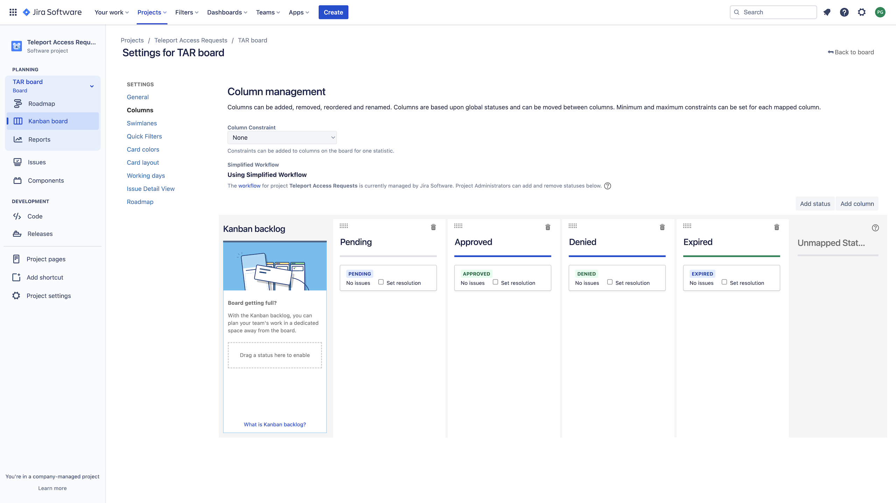

This guide explains how to set up the Teleport Access Request plugin for Jira.
Teleport's Jira integration allows you to manage Access Requests as
Jira issues.

<details>
<summary>This integration is hosted on Teleport Cloud</summary>

(!docs/pages/includes/plugins/enroll.mdx name="the Mattermost integration"!)

</details>

## How it works

The Teleport Jira plugin synchronizes a Jira project board with the Access
Requests processed by your Teleport cluster. When you change the status of an
Access Request within Teleport, the plugin updates the board. And when you
update the status of an Access Request on the board, the plugin notifies a Jira
webhook run by the plugin, which modifies the Access Request in Teleport.

## Prerequisites

(!docs/pages/includes/commercial-prereqs-tabs.mdx!)

(!docs/pages/includes/machine-id/plugin-prerequisites.mdx!)

- A Jira account with permissions to create applications and webhooks.

- A registered domain name for the Jira webhook. Jira notifies the webhook of
  changes in your project board.

- An environment where you will run the Jira plugin. This is either:

  - A Linux virtual machine with ports `80` and `8081` open, plus a means of
    accessing the host (e.g., OpenSSH with an SSH port exposed to your
    workstation). 
  - A Kubernetes cluster deployed via a cloud provider. This guide shows you how
    to allow traffic to the Jira plugin via a `LoadBalancer` service, so your
    environment must support services of this type.

- A means of providing TLS credentials for the Jira webhook run by the plugin.
  **TLS certificates must not be self signed.** For example, you can obtain TLS
  credentials for the webhook with Let's Encrypt by using an [ACME
  client](https://letsencrypt.org/docs/client-options/).

  - If you run the plugin on a Linux server, you must provide TLS credentials to
    a directory available to the plugin. 
  - If you run the plugin on Kubernetes, you must write these credentials to a
    secret that the plugin can read. This guide assumes that the name of the
    secret is `teleport-plugin-jira-tls`.

- (!docs/pages/includes/tctl.mdx!)

## Step 1/7. Define RBAC resources

### Enable Role Access Requests

Before you set up the Jira plugin, you need to enable Role Access Requests in
your Teleport cluster.

(!docs/pages/includes/plugins/editor-request-rbac.mdx!)

### Create a user and role for the plugin

(!docs/pages/includes/plugins/rbac-update.mdx!)

## Step 2/7. Install the Teleport Jira plugin

Install the Teleport Jira plugin following the instructions below, which depend
on whether you are deploying the plugin on a host (e.g., an EC2 instance) or a
Kubernetes cluster.

The Teleport Jira plugin must run on a host or Kubernetes cluster that can
access both Jira and your Teleport Proxy Service (or Teleport Enterprise Cloud
tenant).

(!docs/pages/includes/plugins/install-access-request.mdx name="jira"!)

## Step 3/7. Export the access plugin identity

Give the plugin access to a Teleport identity file. We recommend using Machine
ID for this in order to produce short-lived identity files that are less
susceptible to exfiltration, though in demo deployments, you can generate
longer-lived identity files with `tctl`:

<Tabs>
<TabItem label="Machine ID">
(!docs/pages/includes/plugins/tbot-identity.mdx secret="teleport-plugin-slack-identity"!)
</TabItem>
<TabItem label="Long-lived identity files">
(!docs/pages/includes/plugins/identity-export.mdx user="access-plugin" secret="teleport-plugin-jira-identity"!)
</TabItem>
</Tabs>

## Step 4/7. Set up a Jira project

In this section, you will create a Jira a project that the Teleport plugin can
modify when a Teleport user creates or updates an Access Request. The plugin
then uses the Jira webhook to monitor the state of the board and respond to any
changes in the tickets it creates.

### Create a project for managing Access Requests

In Jira, find the top navigation bar and click **Projects** -> **Create
project**. Select **Kanban** for the template, then **Use template**. Click
**Select a company-managed project**.

You'll see a screen where you can enter a name for your project. In this guide,
we assume that your project is called "Teleport Access Requests", which
receives the key `TAR` by default. 

Make sure "Connect repositories, documents, and more" is unset, then click
**Create project**.

In the three-dots menu on the upper right of your new board, click **Board
settings**, then click **Columns**. Edit the statuses in your board so it
contains the following four:

1. Pending
1. Approved
1. Denied
1. Expired

Create a column with the same name as each status. The result should be the
following:



<Admonition type="warning">

If your project board does not contain these (and only these) columns, each with
a status of the same name, the Jira Access Request plugin will behave in
unexpected ways. Remove all other columns and statuses.

</Admonition>

Click **Back to board** to review your changes.

### Retrieve your Jira API token

Obtain an API token that the Access Request plugin uses to make
changes to your Jira project. Click the gear menu at the upper right of the
screen, then click **Atlassian account settings**. Click **Security** >
**Create and manage API tokens** > **Create API token**. 

Choose any label and click **Copy**. Paste the API token into a convenient
location (e.g., a password manager or local text document) so you can use it
later in this guide when you configure the Jira plugin.

### Set up a Jira webhook

Now that you have generated an API key that the Teleport Jira plugin uses to
manage your project, enable Jira to notify the Teleport Jira plugin when your
project is updated by creating a webhook.

Return to Jira. Click the gear menu on the upper right of the screen. Click
**System** > **WebHooks** > **Create a WebHook**. 

<Tabs>
<TabItem label="Executable">

Enter "Teleport Access Request Plugin" in the "Name" field. In the "URL" field,
enter the domain name you created for the plugin earlier, plus port `8081`.

</TabItem>
<TabItem label="Helm Chart">

Enter "Teleport Access Request Plugin" in the "Name" field. In the "URL" field,
enter the domain name you created for the plugin earlier, plus port `443`.

</TabItem>
</Tabs>

The webhook needs to be notified only when an issue is created, updated, or
deleted. You can leave all the other boxes empty.

Click **Create**.

## Step 5/7. Configure the Jira Access Request plugin

Earlier, you retrieved credentials that the Jira plugin uses to connect to
Teleport and the Jira API. You will now configure the plugin to use these
credentials and run the Jira webhook at the address you configured earlier.

### Create a configuration file

<Tabs>
<TabItem label="Executable or Docker">
The Teleport Jira plugin uses a configuration file in TOML format. Generate a
boilerplate configuration by running the following command (the plugin will not run
unless the config file is in `/etc/teleport-jira.toml`):

```code
$ teleport-jira configure | sudo tee /etc/teleport-jira.toml > /dev/null
```

This should result in a configuration file like the one below:

```toml
(!examples/resources/plugins/teleport-jira-cloud.toml!)
```
</TabItem>
<TabItem label="Helm chart">
The Helm chart for the Jira plugin uses a YAML values file to configure the
plugin. On your local workstation, create a file called
`teleport-jira-helm.yaml` based on the following example:

```yaml
(!examples/resources/plugins/teleport-jira-helm-cloud.yaml!)
```

</TabItem>
</Tabs>

### Edit the configuration file

Open the configuration file created for the Teleport Jira plugin and update the
following fields:

**`[teleport]`**

The Jira plugin uses this section to connect to your Teleport cluster:

(!docs/pages/includes/plugins/config-toml-teleport.mdx!)

(!docs/pages/includes/plugins/refresh-plugin-identity.mdx!)

<Tabs>
<TabItem label="Executable">

### `jira`

**url:** The URL of your Jira tenant, e.g., `https://[your-jira].atlassian.net`.

**username:** The username you were logged in as when you created your API
token.

**api_token:** The Jira API token you retrieved earlier. 

**project:** The project key for your project, which in our case is `TAR`.

You can leave `issue_type` as `Task` or remove the field, as `Task` is the
default.

### `http`

The `[http]` setting block describes how the plugin's webhook works. 

**listen_addr** indicates the address that the plugin listens on, and defaults
to `:8081`. If you opened port `8081` on your plugin host as we recommended
earlier in the guide, you can leave this option unset.

**public_addr** is the public address of your webhook. This is the domain name you
added to the DNS A record you created earlier.

**https_key_file** and **https_cert_file** correspond to the private key and
certificate you obtained before following this guide. Use the following values,
assigning <Var name="example.com" /> to the domain name you created for the
plugin earlier:

- **https_key_file:** 

  ```code
  $ /var/teleport-jira/tls/certificates/acme-v02.api.letsencrypt.org-directory/<Var name="example.com" />/<Var name="example.com" />.key
  ```

- **https_cert_file:** 

  ```code
  $ /var/teleport-jira/tls/certificates/acme-v02.api.letsencrypt.org-directory/<Var name="example.com" />/<Var name="example.com" />.crt
  ```

</TabItem>
<TabItem label="Helm Chart">

### `jira`

**url:** The URL of your Jira tenant, e.g., `https://[your-jira].atlassian.net`.

**username:** The username you were logged in as when you created your API
token. 

**apiToken:** The API token you retrieved earlier.  

**project:** The project key for your project, which in our case is `TAR`.

You can leave `issueType` as `Task` or remove the field, as `Task` is the
default.

### `http`

The `http` setting block describes how the plugin's webhook works. 

**publicAddress:** The public address of your webhook. This is the domain name
you created for your webhook. (We will create a DNS record for this domain name
later.)

**tlsFromSecret:** The name of a Kubernetes secret containing TLS credentials
for the webhook. Use `teleport-plugin-jira-tls`.

</TabItem>
</Tabs>

## Step 6/7. Run the Jira plugin

After finishing your configuration, you can now run the plugin and test your
Jira-based Access Request flow:

<Tabs>
<TabItem label="Executable">

Run the following on your Linux host:

```code
$ sudo teleport-jira start
INFO   Starting Teleport Jira Plugin 12.1.1: jira/app.go:112
INFO   Plugin is ready jira/app.go:142
```
</TabItem>
<TabItem label="Helm Chart">

Install the Helm chart for the Teleport Jira plugin:

```code
$ helm install teleport-plugin-jira teleport/teleport-plugin-jira \
  --namespace teleport \
  --values values.yaml \
  --version (=teleport.plugin.version=)
```

Create a DNS record that associates the webhook's domain name with the address
of the load balancer created by the Jira plugin Helm chart.

See whether the load balancer has a domain name or IP address:

```code
$ kubectl -n teleport get services/teleport-plugin-jira
NAME                   TYPE           CLUSTER-IP      EXTERNAL-IP                          PORT(S)                      AGE
teleport-plugin-jira   LoadBalancer   10.100.135.75   abc123.us-west-2.elb.amazonaws.com   80:30625/TCP,443:31672/TCP   134m
```

If the `EXTERNAL-IP` field has a domain name for the value, create a `CNAME`
record in which the domain name for your webhook points to the domain name of
the load balancer.

If the `EXTERNAL-IP` field's value is an IP address, create a DNS `A` record
instead.

You can then generate signed TLS credentials for the Jira plugin, which expects
them to be written to a Kubernetes secret.

</TabItem>
</Tabs>

### Check the status of the webhook

Confirm that the Jira webhook has started serving by sending a GET request to
the `/status` endpoint. If the webhook is running, it will return a `200` status
code with no document body:

<Tabs>
<TabItem label="Executable">

```code
$ curl -v https://<Var name="example.com" />:8081/status 2>&1 | grep "^< HTTP/2"
< HTTP/2 200
```

</TabItem>
<TabItem label="Helm Chart">

```code
$ curl -v https://<Var name="example.com" />:443/status 2>&1 | grep "^< HTTP/2"
< HTTP/2 200
```

</TabItem>
</Tabs>

### Create an Access Request

Sign in to your cluster as the `myuser` user you created earlier and create an
Access Request:

(!docs/pages/includes/plugins/create-request.mdx!)

When you create the request, you will see a new task in the "Pending" column of the Access Requests board:


### Resolve the request

Move the card corresponding to your new Access Request to the "Denied" column,
then click the card and navigate to Teleport. You will see that the Access
Request has been denied.

<Admonition title="Auditing Access Requests">

Anyone with access to the Jira project board can modify the status of Access
Requests reflected on the board. You can check the Teleport audit log to ensure
that the right users are reviewing the right requests.

When auditing Access Request reviews, check for events with the type `Access
Request Reviewed` in the Teleport Web UI.

</Admonition>

## Step 7/7. Set up systemd

<Admonition type="tip">

This step is only applicable if you are running the Teleport Jira plugin on a
Linux machine.

</Admonition>

In production, we recommend starting the Teleport plugin daemon via an init
system like systemd. Here's the recommended Teleport plugin service unit file
for systemd:

```txt
(!examples/systemd/plugins/teleport-jira.service!)
```

Save this as `teleport-jira.service` or another [unit file load
path](https://www.freedesktop.org/software/systemd/man/systemd.unit.html#Unit%20File%20Load%20Path)
supported by systemd.

```code
$ sudo systemctl enable teleport-jira
$ sudo systemctl start teleport-jira
```
