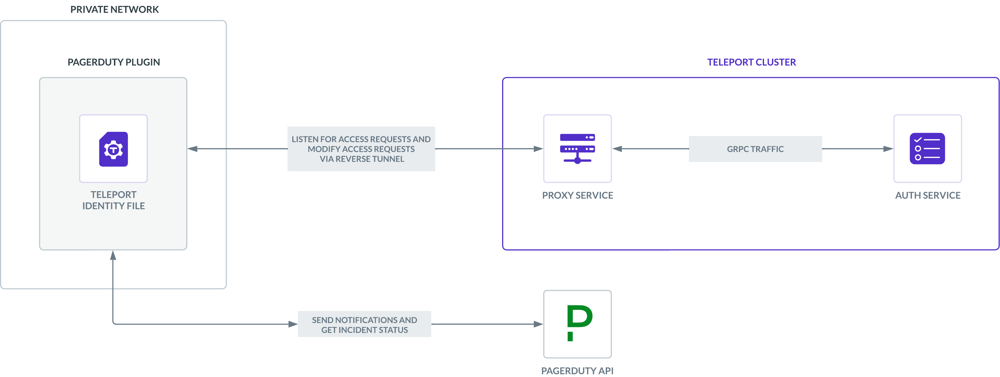

With Teleport's PagerDuty integration, engineers can access the infrastructure
they need to resolve incidents quickly—without longstanding admin permissions
that can become a vector for attacks. This guide explains how to set up
Teleport's Access Request plugin for PagerDuty.

## How it works

Teleport's PagerDuty integration allows you to treat Teleport Role Access
Requests as PagerDuty incidents, notify the appropriate on-call team, and
approve or deny the requests via Teleport. You can also configure the plugin to
approve Role Access Requests automatically if the user making the request is on
the on-call team for a service affected by an incident.

<details>
<summary>This integration is hosted on Teleport Cloud</summary>

(!docs/pages/includes/plugins/enroll.mdx name="the PagerDuty integration"!)

</details>



## Prerequisites

(!docs/pages/includes/commercial-prereqs-tabs.mdx!)

(!docs/pages/includes/machine-id/plugin-prerequisites.mdx!)

- A PagerDuty account with the "Admin", "Global Admin", or "Account Owner"
  roles. These roles are necessary for generating an API token that can list and
  look up user profiles.

  You can see your role by visiting your user page in PagerDuty, navigating to
  the "Permissions & Teams" tab, and checking the value of the "Base Role"
  field.

- Either a Linux host or Kubernetes cluster where you will run the PagerDuty plugin.

- (!docs/pages/includes/tctl.mdx!)

## Step 1/8. Create services

To demonstrate the PagerDuty plugin, create two services in PagerDuty. For each
service, fill in only the "Name" field and skip all other configuration screens,
leaving options as the defaults:

- `Teleport Access Request Notifications`
- `My Critical Service`

We will configure the PagerDuty plugin to create an incident in the `Teleport
Access Request Notifications` service when certain users create an Access
Request.

For users on the on-call team for `My Critical Service` (in this case, your
PagerDuty user), we will configure the PagerDuty plugin to approve Access
Requests automatically, letting them investigate incidents on the service
quickly.

## Step 2/8. Define RBAC resources

The Teleport PagerDuty plugin works by receiving Access Request events from the
Teleport Auth Service and, based on these events, interacting with the PagerDuty
API.

In this section, we will show you how to configure the PagerDuty plugin by
defining the following RBAC resources:

- A role called `editor-requester`, which can request the built-in `editor`
  role. We will configure this role to open a PagerDuty incident whenever a
  user requests it, notifying the on-call team for the `Teleport Access Request
  Notifications` service.
- A role called `demo-role-requester`, which can request a role called
  `demo-role`. We will configure the PagerDuty plugin to auto-approve this
  request whenever the user making it is on the on-call team for `My Critical
  Service`.
- A user and role called `access-plugin` that the PagerDuty plugin will assume
  in order to authenticate to the Teleport Auth Service. This role will have
  permissions to approve Access Requests from users on the on-call team for `My
  Critical Service` automatically.
- A role called `access-plugin-impersonator` that allows you to generate signed
  credentials that the PagerDuty plugin can use to authenticate with your
  Teleport cluster.

### `editor-requester`

Create a file called `editor-request-rbac.yaml` with the following content,
which defines a role called `editor-reviewer` that can review requests for the
`editor` role, plus an `editor-requester` role that can request this role.

```yaml
kind: role
version: v5
metadata:
  name: editor-reviewer
spec:
  allow:
    review_requests:
      roles: ['editor']
---
kind: role
version: v5
metadata:
  name: editor-requester
spec:
  allow:
    request:
      roles: ['editor']
      thresholds:
        - approve: 1
          deny: 1
      annotations:
        pagerduty_notify_service: ["Teleport Access Request Notifications"]
```

The Teleport Auth Service *annotates* Access Request events with metadata based
on the roles of the Teleport user submitting the Access Request. The PagerDuty
plugin reads these annotations to determine how to respond to a new Access
Request event.

Whenever a user with the `editor-requester` role requests the `editor` role, the
PagerDuty plugin will read the `pagerduty_notify_service` annotation and notify
PagerDuty to open an incident in the specified service, `Teleport Access Request
Notifications`, until someone with the `editor-reviewer` role approves or denies
the request.

Create the roles you defined:

```code
$ tctl create -f editor-request-rbac.yaml
role 'editor-reviewer' has been created
role 'editor-requester' has been created
```

(!docs/pages/includes/create-role-using-web.mdx!)

### `demo-role-requester`

Create a file called `demo-role-requester.yaml` with the following content:

```yaml
kind: role
version: v5
metadata:
  name: demo-role
---
kind: role
version: v5
metadata:
  name: demo-role-requester
spec:
  allow:
    request:
      roles: ['demo-role']
      thresholds:
        - approve: 1
          deny: 1
      annotations:
        pagerduty_services: ["My Critical Service"]
```

Users with the `demo-role-requester` role can request the `demo-role` role. When
such a user makes this request, the PagerDuty plugin will read the
`pagerduty_services` annotation. If the user making the request is on the
on-call team for a service listed as a value for the annotation, the plugin will
approve the Access Request automatically.

In this case, the PagerDuty plugin will approve any requests from users on the
on-call team for `My Critical Service`.

Create the resources:

```code
$ tctl create -f demo-role-requester.yaml;
```

<Admonition type="warning">

For auto-approval to work, the user creating an Access Request must have a
Teleport username that is also the email address associated with a PagerDuty
account. In this guide, we will add the `demo-role-requester` role to your own
Teleport account—which we assume is also your email address for PagerDuty—so you
can request the `demo-role` role.

</Admonition>

### `access-plugin`

Teleport's Access Request plugins authenticate to your Teleport cluster as a
user with permissions to list, read, and update Access Requests. This way,
plugins can retrieve Access Requests from the Teleport Auth Service, present
them to reviewers, and modify them after a review.

Define a user and role called `access-plugin` by adding the following content to
a file called `access-plugin.yaml`:

```yaml
kind: role
version: v5
metadata:
  name: access-plugin
spec:
  allow:
    rules:
      - resources: ['access_request']
        verbs: ['list', 'read']
      - resources: ['access_plugin_data']
        verbs: ['update']
    review_requests:
      roles: ['demo-role']
      where: 'contains(request.system_annotations["pagerduty_services"], "My Critical Service")'
---
kind: user
metadata:
  name: access-plugin
spec:
  roles: ['access-plugin']
version: v2
```

Notice that the `access-plugin` role includes an `allow.review_requests.roles`
field with `demo-role` as a value. This allows the plugin to review requests for
the `demo-role` role.

We are also restricting the `access-plugin` role to reviewing only Access
Requests associated with `My Critical Service`. To do so, we have defined a
*predicate expression* in the `review_requests.where` field. This expression
indicates that the plugin *cannot* review requests for `demo-role` unless the
request contains an annotation with the key `pagerduty_services` and the value
`My Critical Service`.

<details>
<summary>How "where" conditions work</summary>

The `where` field includes a predicate expression that determines whether a
reviewer is allowed to review a specific request. You can include two functions
in a predicate expression:

|Function|Description|Example|
|---|---|---|
|`equals`|A field is equivalent to a value.|`equals(request.reason, "resolve an incident")`
|`contains`|A list of strings includes a value.|`contains(reviewer.traits["team"], "devops")`|

When you use the `where` field, you can include the following fields in your
predicate expression:

|Field|Type|Description|
|---|---|---|
|`reviewer.roles`|`[]string`|A list of the reviewer's Teleport role names|
|`reviewer.traits`|`map[string][]string`|A map of the reviewer's Teleport traits by the name of the trait|
|`request.roles`|`[]string`|A list of the Teleport roles a user is requesting|
|`request.reason`|`string`|The reason attached to the request|
|`request.system_annotations`| `map[string][]string`|A map of annotations for the request by annotation key, e.g., `pagerduty_services`|

You can combine functions using the following operators:

|Operator|Format|Description|
|---|---|---|
|`&&`|`function && function`|Evaluates to true if both functions evaluate to true|
|`\|\|`|`function \|\| function`|Evaluates to true if either one or both functions evaluate to true|
|`!`| `!function`|Evaluates to true if the function evaluates to false|

An example of a function is `equals(request.reason, "resolve an incident")`. To
configure an `allow` condition to match any Access Request that does not include
the reason, "resolve an incident", you could use the function,
`!equals(request.reason, "resolve an incident")`.

</details>

Create the user and role:

```code
$ tctl create -f access-plugin.yaml
```

### `access-plugin-impersonator`

As with all Teleport users, the Teleport Auth Service authenticates the
`access-plugin` user by issuing short-lived TLS credentials. In this case, we
will need to request the credentials manually by *impersonating* the
`access-plugin` role and user.

If you are running a self-hosted Teleport Enterprise cluster and are using
`tctl` from the Auth Service host, you will already have impersonation
privileges.

To grant your user impersonation privileges for `access-plugin`, define a role
called `access-plugin-impersonator` by pasting the following YAML document into
a file called `access-plugin-impersonator.yaml`:

```yaml
kind: role
version: v5
metadata:
  name: access-plugin-impersonator
spec:
  allow:
    impersonate:
      roles:
      - access-plugin
      users:
      - access-plugin
```

Create the `access-plugin-impersonator` role:

```code
$ tctl create -f access-plugin-impersonator.yaml
```

### Add roles to your user

Later in this guide, your Teleport user will take three actions that require
additional permissions:

- Generate signed credentials that the PagerDuty plugin will use to connect to
  your Teleport Cluster
- Manually review an Access Request for the `editor` role
- Create an Access Request for the `demo-role` role

To grant these permissions to your user, give your user the `editor-reviewer`,
`access-plugin-impersonator`, and `demo-role-requester` roles we defined
earlier.

Open your user definition in an editor:

```code
$ TELEPORT_USER=$(tsh status --format=json | jq -r .active.username)
$ tctl edit users/${TELEPORT_USER?}
```

Edit the user to include the roles you just created:

```diff
  roles:
   - access
   - auditor
   - editor
+  - editor-reviewer
+  - access-plugin-impersonator
+  - demo-role-requester
```

Apply your changes by saving and closing the file in your editor.

Log out of your Teleport cluster and log in again. You will now be able to
review requests for the `editor` role, request the `demo-role` role, and
generate signed certificates for the `access-plugin` role and user.

### Create a user who will request access

Create a user called `myuser` who has the `editor-requester` role. Later in this
guide, you will create an Access Request as this user to test the PagerDuty
plugin:

```code
$ tctl users add myuser --roles=editor-requester
```

`tctl` will print an invitation URL to your terminal. Visit the URL and log in
as `myuser` for the first time, registering credentials as configured for your
Teleport cluster.

## Step 3/8. Install the Teleport PagerDuty plugin

(!docs/pages/includes/plugins/install-access-request.mdx name="pagerduty"!)

## Step 4/8. Export the access plugin identity

Give the plugin access to a Teleport identity file. We recommend using Machine
ID for this in order to produce short-lived identity files that are less
dangerous if exfiltrated, though in demo deployments, you can generate
longer-lived identity files with `tctl`:

<Tabs>
<TabItem label="Machine ID">
(!docs/pages/includes/plugins/tbot-identity.mdx secret="teleport-plugin-pagerduty-identity"!)
</TabItem>
<TabItem label="Long-lived identity files">
(!docs/pages/includes/plugins/identity-export.mdx user="access-plugin" secret="teleport-plugin-pagerduty-identity"!)
</TabItem>
</Tabs>

## Step 5/8. Set up a PagerDuty API key

Generate an API key that the PagerDuty plugin will use to create and modify
incidents as well as list users, services, and on-call policies.

In your PagerDuty dashboard, go to **Integrations → API Access Keys** and click
**Create New API Key**. Add a key description, e.g., "Teleport integration".
Leave "Read-only API Key" unchecked. Copy the key to a file on your local
machine. We'll use the key in the plugin config file later.


## Step 6/8. Configure the PagerDuty plugin

At this point, you have generated credentials that the PagerDuty plugin will use
to connect to Teleport and the PagerDuty API. You will now configure the
PagerDuty plugin to use these credentials, plus adjust any settings required for
your environment.

<Tabs>
  <TabItem label="Executable or Docker">
Teleport's PagerDuty plugin has its own configuration file in TOML format. On
the host where you will run the PagerDuty plugin, generate a boilerplate config
by running the following commands:

```code
$ teleport-pagerduty configure > teleport-pagerduty.toml
$ sudo mv teleport-pagerduty.toml /etc
```
  </TabItem>
  <TabItem label="Helm Chart">
The PagerDuty Helm Chart uses a YAML values file to configure the plugin. On
the host where you have Helm installed, create a file called
`teleport-pagerduty-values.yaml` based on the following example:

```yaml
teleport:
  address: ""                 # Teleport Auth Service GRPC API address
  identitySecretName: ""      # Identity secret name
  identitySecretPath: ""      # Identity secret path

pagerduty:
  apiKey: ""                  # PagerDuty API Key
  userEmail: ""               # PagerDuty bot user email (Could be admin email)
```
  </TabItem>
</Tabs>

<details>
<summary>Saving the configuration to another location</summary>

The PagerDuty plugin expects the configuration to be in
`/etc/teleport-pagerduty.toml`, but you can override this with the `--config`
flag when you run the plugin binary later in this guide.

</details>

Edit the configuration file in `/etc/teleport-pagerduty.toml` as explained
below:

### `[teleport]`

The PagerDuty plugin uses this section to connect to your Teleport cluster:

(!docs/pages/includes/plugins/config-toml-teleport.mdx!)

(!docs/pages/includes/plugins/refresh-plugin-identity.mdx!)

### `[pagerduty]`

Assign `api_key` to the PagerDuty API key you generated earlier.

Assign `user_email` to the email address of a PagerDuty user on the account
associated with your API key. When the PagerDuty plugin creates a new incident,
PagerDuty will display this incident as created by that user.

<details>
<summary>Overriding annotation names</summary>

This guide has assumed that the Teleport PagerDuty plugin uses
`pagerduty_notify_service` annotation to determine which services to notify of
new Access Request events and the `pagerduty_services` annotation to configure
auto-approval.

If you would like to use a different name for these annotations in your Teleport
roles, you can assign the `pagerduty.notify_service` and `pagerduty.services`
fields.

</details>

The final configuration should resemble the following:

<Tabs>
<TabItem label="Executable or Docker">
```yaml
(!examples/resources/plugins/teleport-pagerduty-cloud.toml!)
```
</TabItem>
<TabItem label="Helm Chart" >
```yaml
(!examples/resources/plugins/teleport-pagerduty-helm-cloud.yaml!)
```
</TabItem>
</Tabs>

## Step 7/8. Test the PagerDuty plugin

<Tabs>
<TabItem label="Executable">
After you configure the PagerDuty plugin, run the following command to start it.
The `-d` flag will provide debug information to ensure that the plugin can
connect to PagerDuty and your Teleport cluster:

```code
$ teleport-pagerduty start -d
# DEBU   DEBUG logging enabled logrus/exported.go:117
# INFO   Starting Teleport Access PagerDuty extension 0.1.0-dev.1: pagerduty/main.go:124
# DEBU   Checking Teleport server version pagerduty/main.go:226
# DEBU   Starting a request watcher... pagerduty/main.go:288
# DEBU   Starting PagerDuty API health check... pagerduty/main.go:170
# DEBU   Starting secure HTTPS server on :8081 utils/http.go:146
# DEBU   Watcher connected pagerduty/main.go:252
# DEBU   PagerDuty API health check finished ok pagerduty/main.go:176
# DEBU   Setting up the webhook extensions pagerduty/main.go:178
```
</TabItem>
<TabItem label="Docker">
Run the plugin:

```code
$ docker run -v <path-to-config>:/etc/teleport-pagerduty.toml public.ecr.aws/gravitational/teleport-plugin-pagerduty:(=teleport.version=) start
```
</TabItem>
<TabItem label="Helm Chart">
After modifying your configuration, run the bot with the following command:

```code
$ helm upgrade --install teleport-plugin-pagerduty teleport/teleport-plugin-pagerduty --values teleport-pagerduty-values.yaml
```

To inspect the plugin's logs, use the following command:

```code
$ kubectl logs deploy/teleport-plugin-pagerduty
```

Debug logs can be enabled by setting `log.severity` to `DEBUG` in
`teleport-pagerduty-helm.yaml` and executing the `helm upgrade ...` command
above again. Then you can restart the plugin with the following command:

```code
$ kubectl rollout restart deployment teleport-plugin-pagerduty
```

</TabItem>
</Tabs>

### Create an Access Request

As the Teleport user `myuser`, create an Access Request for the `editor` role:

(!docs/pages/includes/plugins/create-request.mdx!)

You should see a log resembling the following on your PagerDuty plugin host:

```
INFO   Successfully created PagerDuty incident pd_incident_id:00000000000000
pd_service_name:Teleport Access Request Notifications
request_id:00000000-0000-0000-0000-000000000000 request_op:put
request_state:PENDING pagerduty/app.go:366
```

In PagerDuty, you will see a new incident containing information about the
Access Request:


### Resolve the request

(!docs/pages/includes/plugins/resolve-request.mdx!)

<Admonition title="Auditing Access Requests">

When the PagerDuty plugin sends a notification, anyone who receives the
notification can follow the enclosed link to an Access Request URL. While users
must be authorized via their Teleport roles to review Access Request, you
should still check the Teleport audit log to ensure that the right users are
reviewing the right requests.

When auditing Access Request reviews, check for events with the type `Access
Request Reviewed` in the Teleport Web UI.

</Admonition>

### Trigger an auto-approval

As your Teleport user, create an Access Request for the `demo-role` role.

You will see a log similar to the following on your PagerDuty plugin host:

```
INFO   Successfully submitted a request approval
pd_user_email:myuser@example.com pd_user_name:My User
request_id:00000000-0000-0000-0000-000000000000 request_op:put
request_state:PENDING pagerduty/app.go:511
```

Your Access Request will appear as `APPROVED`:

```code
$ tsh requests ls
ID                                   User               Roles     Created (UTC)       Status
------------------------------------ ------------------ --------- ------------------- --------
00000000-0000-0000-0000-000000000000 myuser@example.com demo-role 12 Aug 22 18:30 UTC APPROVED
```

## Step 8/8. Set up systemd

This section is only relevant if you are running the Teleport PagerDuty plugin
on a Linux host.

In production, we recommend starting the Teleport plugin daemon via an init
system like systemd. Here's the recommended Teleport plugin service unit file
for systemd:

```ini
(!examples/systemd/plugins/teleport-pagerduty.service!)
```

Save this as `teleport-pagerduty.service` in either `/usr/lib/systemd/system/`
or another [unit file load
path](https://www.freedesktop.org/software/systemd/man/systemd.unit.html#Unit%20File%20Load%20Path)
supported by systemd.

Enable and start the plugin:

```code
$ sudo systemctl enable teleport-pagerduty
$ sudo systemctl start teleport-pagerduty
```
