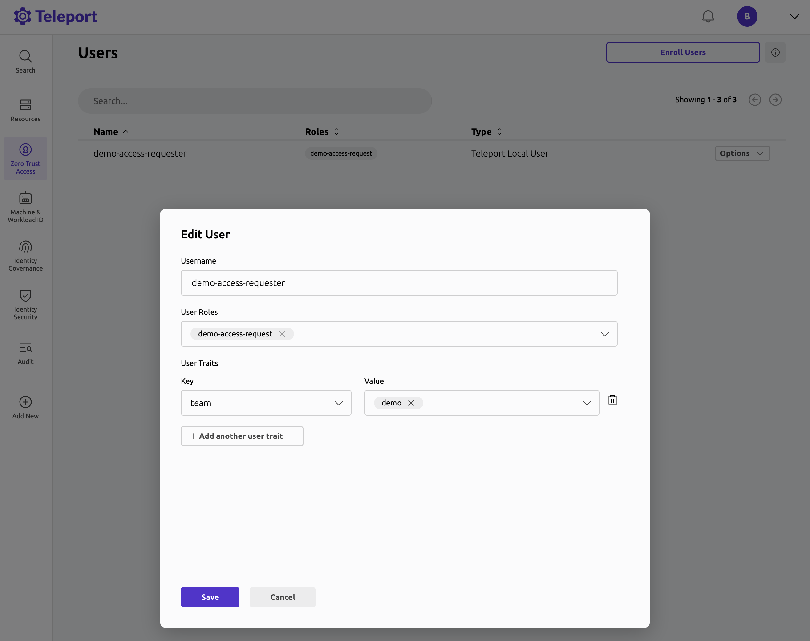

Teleport supports automatic reviews of Access Requests. This
feature enables teams to enforce a zero standing privilege policy, while
still allowing users to receive temporary access without manual approval.

In this guide, we'll walk through how to configure Teleport RBAC and demonstrate
example use cases for automatic reviews:

- Automatically approve role requests from users on a specific team.
- Automatically approve resource requests from users on a specific team.

## How it works

Automatic reviews are triggered by Access Automation Rules. These rules instruct
Teleport to monitor Access Requests and automatically submit a review
when certain conditions (such as requested roles, user traits, or resource labels)
are met.

For example, an Access Automation Rule can perform an automatic Access Request
approval when a user with the Teleport traits or IdP attribute `team: demo`
requests access to the `access` role.

## Prerequisites

(!docs/pages/includes/edition-prereqs-tabs.mdx edition="Teleport Enterprise (v18.2.0 or higher)"!)

- This feature requires Teleport Identity Governance.
- This guide requires at least one labeled SSH server.

## Step 1/2. Create a requester role and user

In this example, we'll first create:

- A role named `demo-access-request`, which allows users to request access to the
`access` role and any resources that the `access` role can access.
- A user named `demo-access-requester`, assigned the above role.

### Create the role

Create a role configuration file named `demo-role.yaml`:

```yaml
# demo-role.yaml
kind: role
version: v7
metadata:
  name: demo-access-request
spec:
  allow:
    request:
      roles:
      - access
      search_as_roles:
      - access
```

Create the role with:
```code
$ tctl create demo-role.yaml
```

### Create the user

Use the following command to create the user and assign the role:
```code
$ tctl users add --roles=demo-access-request demo-access-requester
```

Alternatively, you can assign the role after creating the user:

  (!docs/pages/includes/add-role-to-user.mdx role="demo-access-request" user="\`demo-access-requester\`"!)

## Step 2/2. Assign user traits

To allow automatic review rules to evaluate the requesting user, assign them
traits via the Teleport Web UI:

1. Go to **Zero Trust Access** -> **Users**
2. Next to `demo-access-requester`, click **Options** -> **Edit...**
3. Click **Add user trait**, and set:
   - Key: `team`
   - Value: `demo`
4. Click **Save**
5. Verify that the user has been updated with the desired trait.



When adding user traits, you can enter any keys and values. The user trait form
does not support wildcard or regular expressions.

<Admonition type="tip" title="SSO users">
  Automatic reviews are compatible with SSO users and the attributes provided
  by the IdP.
</Admonition>

The next two sections demonstrate how automatic reviews work for role and
resource requests.

## Role-based automatic reviews

To demonstrate how role requests from a specific team can be automatically
approved, create the following Access Automation Rule via the Teleport Web UI:

1. Go to **Identity Governance** -> **Access Requests** -> **Set Up Access Automation Rules**
2. Click **Create New Access Automation Rule** -> **Automatic Review Rule**
3. Configure the rule and set:
   - **Name of requested roles to match**: `access`
   - **User Traits to match**: `team: demo`
   - **Review decision**: `APPROVED`
4. Click **Create Rule**

This rule automatically approves Access Requests for the `access` role if the
user has the trait `team: demo`.

To verify the new automatic review rule, create an Access Request via the Teleport
Web UI:

1. Log in as `demo-access-requester`
2. Go to **Identity Governance** -> **Access Requests** and click **New Access Request**
3. Change the request type from **Resources** to **Roles**
4. Add the `access` role to the Access Request
5. Click **Proceed to Request**, then **Submit Request**

At this point, the new Access Request should have been created, automatically
reviewed, and transitioned into an `APPROVED` state. Navigate **Back to Listings**
and verify the Access Request status. It might take a second for the review to
process, so you may have to refresh the page.

## Resource-based automatic reviews

Before creating an Access Automation Rule, ensure that you have at least one
labeled SSH server connected to your Teleport cluster:

```code
# List your SSH servers to identify available labels:
$ tsh ls
Node Name   Address    Labels
----------- ---------- -------------------------------
teleport-00 ⟵ Tunnel  env=demo
```

To demonstrate how resource requests from a specific team can be automatically
approved, create the following Access Automation Rule via the Teleport Web UI:

1. Go to **Identity Governance** -> **Access Requests** -> **Set Up Access Automation Rules**
2. Click **Create New Access Automation Rule** -> **Automatic Review Rule**
3. Configure the rule and set:
   - **Name of requested roles to match**: `access`
   - **Resource labels to match**: `env: demo`
   - **User Traits to match**: `team: demo`
   - **Review decision**: `APPROVED`
4. Click **Create Rule**

This rule automatically approves Access Requests for the `access` role and
resources labeled `env: demo` if the user has the trait `team: demo`.

To verify the new automatic review rule, create an Access Request via the Teleport
Web UI:

1. Log in as `demo-access-requester`
2. Go to **Identity Governance** -> **Access Requests** and click **New Access Request**
3. Add the SSH server you'd like to request access to.
4. Click **Proceed to Request**, then **Submit Request**

At this point, the new Access Request should have been created, automatically
reviewed, and transitioned into an `APPROVED` state. Navigate **Back to Listings**
and verify the Access Request status. It might take a second for the review to
process, so you may have to refresh the page.

## Troubleshooting

### Conflicting automatic review rules

Automatic review rules can automatically approve or deny Access Requests based
on the selected review decision. If an Access Request meets the conditions for
both an approval rule and a denial rule, the denial rule takes precedence.

## Next Steps

- Access Automation Rules are configured using an underlying `access_monitoring_rule`
  resource. For more details about the `access_monitoring_rule` resource, refer to the
  [Access Monitoring Rules Reference](../../reference/access-controls/access-monitoring-rules.mdx).
- For configuration with Teleport Terraform Provider, refer to the
  [Terraform Resources Index](../../reference/infrastructure-as-code/terraform-provider/resources/access_monitoring_rule.mdx)
- For configuration options with SSO, refer to the
  [Single Sign-On Guides](../../zero-trust-access/sso/sso.mdx).
- For more details about managing resource labels, refer to the
  [Add Labels to Resources Guide](../../zero-trust-access/rbac-get-started/labels.mdx).
