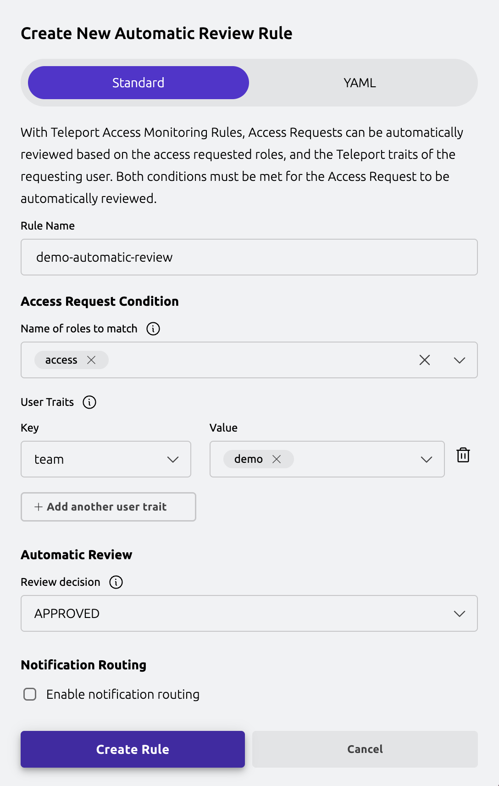
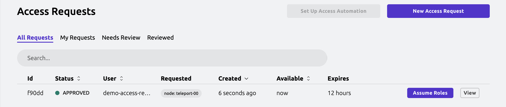

teleport supports automatic reviews of Access Requests. This
feature enables teams to enforce a zero standing privilege policy, while
still allowing users to receive temporary access without manual approval.

## How it works

Automatic reviews are triggered by Access Automation Rules. These rules instruct
Teleport to monitor Access Requests and automatically submit a review
when certain conditions (such as requested roles, user traits, or resource labels)
are met.

For example, an Access Automation Rule can perform an automatic Access Request
approval when a user with the Teleport traits or IdP attribute `team: demo`
requests access to the `access` role.

## Prerequisites

(!docs/pages/includes/edition-prereqs-tabs.mdx edition="Teleport Enterprise (v18.0.0 or higher)"!)

- This feature requires Teleport Identity Governance.

- This guide requires at least one connected SSH Server.

## Step 1/5. Create a requester user

In this example, we'll first create a user named `demo-access-requester` and
assign it the preset `requester` role.

The preset `requester` role includes the necessary permissions to allow a user
to request access to any resource that the preset `access` role permits.

### Create the user

Use the following command to create the user and assign the role:
```code
$ tctl users add --roles=requester demo-access-requester
```

Alternatively, you can assign the role after creating the user:

  (!docs/pages/includes/add-role-to-user.mdx role="requester" user="\`demo-access-requester\`"!)

## Step 2/5. Assign user traits

To allow automatic review rules to evaluate the requesting user, assign them
traits via the Teleport Web UI.

1. Go to **Zero Trust Access** -> **Users**
2. Next to `demo-access-requester`, click **Options** -> **Edit...**
3. Click **Add user trait**, and set:
   - Key: `team`
   - Value: `demo`
4. Click **Save**
5. Verify that the user has been updated with the desired trait.


When adding user traits, you can enter any keys and values. The user trait form
does not support wildcard or regular expressions.

<Admonition type="tip" title="SSO users">
  Automatic reviews are compatible with SSO users and the attributes provided
  by the IdP.
</Admonition>

## Step 3/5. Ensure resource labels

List your SSH Servers to identify available labels.

```code
$ tsh ls
Node Name   Address    Labels
----------- ---------- -------------------------------
teleport-00 ⟵ Tunnel   env=demo
```

This example resource has the labels `env: demo`. If your resource has not been
labeled, reconfigure your resource with a label. Altenratively, you can add a
label using a `server_info` resource. See [Apply resource-based labels](https://goteleport.com/docs/admin-guides/management/admin/labels/#apply-resource-based-labels)
for more information.

1. Retrieve information about the SSH Server.

```code
$ tctl get node/teleport-00
kind: node
metadata:
  expires: "2025-08-14T18:49:19Z"
  name: 116b08d2-7167-4eab-85a8-cf93f054b217
spec:
  addr: ""
  hostname: teleport-00
```

2. Create the corresponding `server_info.yaml` for the node above.

```yaml
# server_info.yaml
kind: server_info
metadata:
  # Must match the `metadata.name` field of the node, prefixed with `si-`.
  name: si-116b08d2-7167-4eab-85a8-cf93f054b217
spec:
  new_labels:
    env: demo
```

3. Create and verify the `server_info` resource. It may take several minutes for
the new labels to appear. Note that labels added this way will be prefixed with
`dynamic/`.

```code
# Create the `server_info` resource
$ tctl create server_info.yaml

# Verify that the labels have been applied
$ tsh ls
Node Name   Address    Labels
----------- ---------- -------------------------------
teleport-00 ⟵ Tunnel  dynamic/env=demo
```

## Step 4/5. Create automatic review rule

Next, define the automatic review rule via the Teleport Web UI.

1. Go to **Identity Governance** -> **Access Requests** -> **Set Up Access Automation Rules**
2. Click **Create New Access Automation Rule** -> **Automatic Review Rule**
3. Configure the rule and set:
   - **Name of requested roles to match**: `access`
   - **Resource labels to match**: `env: demo` (or `dynamic/env=demo`)
   - **User Traits to match**: `team: demo`
   - **Review decision**: `APPROVED`
4. Click **Create Rule**



This automatic review rule ensures that Access Requests for the `access`
role and for resources labeled `env: demo` are automatically reviewed for
approval if the Teleport user traits requirements are satisfied. In this case,
any user with the traits `team: demo` will satisfy the requirement.

## Step 5/5. Verify automatic review rule

To verify the new automatic review rule, create an Access Request via the Teleport
Web UI.
1. Log in as `demo-access-requester`
2. Go to **Identity Governance** -> **Access Requests** and click **New Access Request**
3. Add the SSH Server you'd like to request access to.
4. Click **Proceed to Request**, then **Submit Request**


At this point, the new Access Request should have been created, automatically
reviewed, and transitioned into an `APPROVED` state. Navigate **Back to Listings**
and verify the Access Request status. It might take a second for the review to
process, so you may have to refresh the page.



## Troubleshooting

### Conflicting automatic review rules

Automatic review rules can automatically approve or deny Access Requests based
on the selected review decision. If an Access Request meets the conditions for
both an approval rule and a denial rule, the denial rule takes precedence.

## Next Steps

- Access Automation Rules are configured using an underlying `access_monitoring_rule`
  resource. For more details about the `access_monitoring_rule` resource, refer to the
  [Access Monitoring Rules Reference](../../reference/access-controls/access-monitoring-rules.mdx).
- For configuration with Teleport Terraform Provider, refer to the
  [Terraform Resources Index](../../reference/terraform-provider/resources/access_monitoring_rule.mdx)
- For configuration options with SSO, refer to the
  [Single Sign-On Guides](../../zero-trust-access/sso/sso.mdx)
