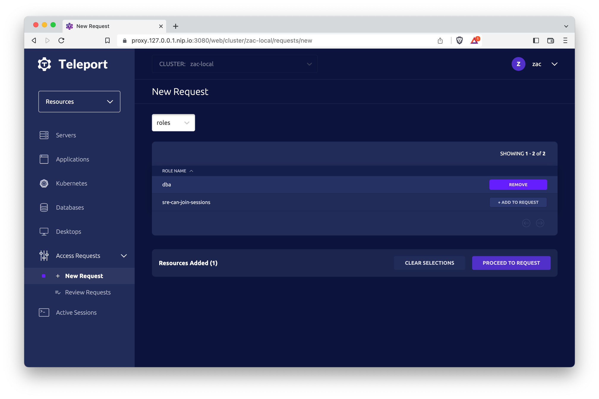

Teleport supports automatic reviews of role Access Requests. This
feature enables teams to enforce a zero standing privilege policy, while
still allowing users to receive temporary access without manual approval.

<Admonition type="note" title="resource access request support">
  Automatic reviews is not currently supported with resource Access Requests.
  This functionality will be enabled in a future Teleport release.
</Admonition>

## How it works

Automatic reviews are triggered by Access Monitoring Rules. These rules instruct
Teleport to monitor Access Requests and automatically submit a review
when certain conditions (such as requested roles or user traits) are met.

For example, an Access Monitoring Rule can perform an automatic Access Request
approval when a user with the Teleport traits or IdP attribute `team: demo`
requests access to the `access` role.

## Prerequisites

(!docs/pages/includes/commercial-prereqs-tabs.mdx!)

- This feature requires Teleport Identity Governance.

## Step 1/4. Create a requester role and user

In this example, we'll first create:
- A role named `demo-access-request`, which allows requesting access to the
`access` role.
- A user named `demo-access-requester`, assigned the above role.

### Create the role

Create a role configuration file named `demo-role.yaml`:
```yaml
# demo-role.yaml
kind: role
version: v7
metadata:
  name: demo-access-request
spec:
  allow:
    request:
      roles:
      - access
      search_as_roles:
      - access
```

Create the role with:
```code
$ tctl create demo-role.yaml
```

### Create the user

Use the following command to create the user and assign the role:
```code
$ tctl users add --roles=demo-access-request demo-access-requester
```

Alternatively, you can assign the role after creating the user:

  (!docs/pages/includes/add-role-to-user.mdx role="demo-access-request" user="\`demo-access-requester\`"!)

## Step 2/4. Assign user traits

To allow automatic review rules to evaluate the requesting user, assign them
traits via the Teleport Web UI.

1. Go to **Zero Trust Access** -> **Users**
2. Next to `demo-access-requester`, click **Options** -> **Edit...**
3. Click **Add user trait**, and set:
   - Key: `team`
   - Value: `demo`
4. Click **Save**
5. Verify that the user has been updated with the desired trait.


When adding user traits, you can enter any keys and values. The user trait form
does not support wildcard or regular expressions.

<Admonition type="tip" title="SSO users">
  Automatic reviews are compatible with SSO users and the attributes provided
  by the IdP.
</Admonition>

## Step 3/4. Create Access Monitoring Rule

Next, define the automatic review rule via the Teleport Web UI.

1. Go to **Identity Governance** -> **Access Requests** -> **View Access Monitoring Rules**
2. Click **Create Access Monitoring Rule** -> **Automatic Review Rule**
3. Configure the rule and set:
   - **Name of roles to match**: `access`
   - **User Traits**: `team: demo`
   - **Review decision**: `APPROVED`
4. Click **Create Rule**


This Access Monitoring Rule will ensure that Access Requests for the `access`
role will be automatically reviewed for approval if the Teleport user traits
requirements are satisfied. In this case, any user with the traits `team: demo`
will satisfy the requirement.

## Step 4/4. Verify automatic review rule

To verify the new Access Monitoring Rule, create an Access Request via the Teleport
Web UI.
1. Log in as `demo-access-requester`
2. Go to **Access Requests** and click **New Access Request**
3. Change the request type from **Resources** to **Roles**
4. Add the `access` role to the Access Request
5. Click **Proceed to Request**, then **Submit Request**



At this point, the new Access Request should have been created, automatically
reviewed, and transitioned into an `APPROVED` state. Navigate **Back to Listings**
and verify the Access Request status. It might take a second for the review to
process, so you may have to refresh the page.


## Troubleshooting

### Conflicting automatic review rules

Automatic review rules can automatically approve or deny Access Requests based
on the selected review decision. If an Access Request meets the conditions for
both an approval rule and a denial rule, the denial rule takes precedence.

### Resource Access Requests

Automatic review rules are not currently supported for resource Access Requests.
These rules will not be applied to any Access Requests that include a resource
other than a role.

## Next Steps

- For more configuration options with Access Monitoring Rules, refer to the
  [Access Monitoring Rules Reference](../../reference/access-controls/access-monitoring-rules.mdx).
- For configuration with Teleport Terraform Provider, refer to the
  [Terraform Resources Index](../../reference/terraform-provider/resources/access_monitoring_rule.mdx)
- For configuration options with SSO, refer to the
  [Single Sign-On Guides](../../admin-guides/access-controls/sso/sso.mdx)
