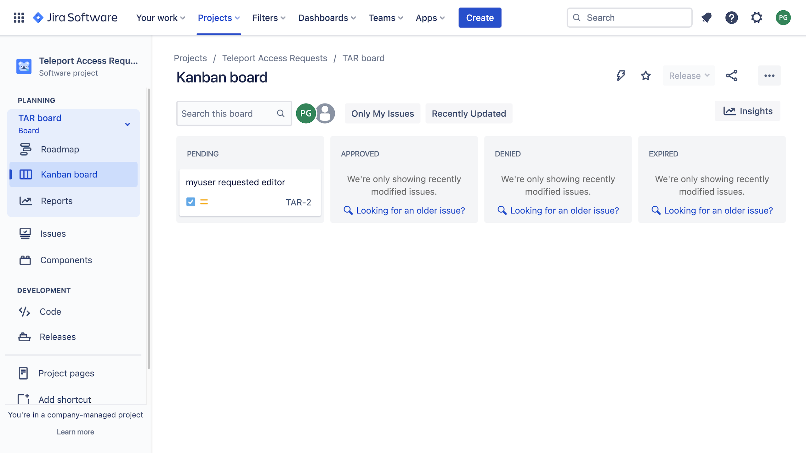

This guide explains how to set up the Teleport Access Request plugin for Jira.
Teleport's Jira integration allows you to manage Access Requests as
Jira issues.

<details>
<summary>This integration is hosted on Teleport Cloud</summary>

(!docs/pages/includes/plugins/enroll.mdx name="the Jira integration"!)

</details>

## How it works

The Teleport Jira plugin synchronizes a Jira project board with the Access
Requests processed by your Teleport cluster. When you change the status of an
Access Request within Teleport, the plugin updates the board. And when you
update the status of an Access Request on the board, the plugin notifies a Jira
webhook run by the plugin, which modifies the Access Request in Teleport.

## Prerequisites

(!docs/pages/includes/edition-prereqs-tabs.mdx edition="Teleport Enterprise"!)

(!docs/pages/includes/machine-id/plugin-prerequisites.mdx!)

- A Jira account with permissions to create applications and webhooks.

- A registered domain name for the Jira webhook. Jira notifies the webhook of
  changes in your project board.

- An environment where you will run the Jira plugin. This is either:

  - A Linux virtual machine with ports `80` and `8081` open, plus a means of
    accessing the host (e.g., OpenSSH with an SSH port exposed to your
    workstation). 
  - A Kubernetes cluster deployed via a cloud provider. This guide shows you how
    to allow traffic to the Jira plugin via a `LoadBalancer` service, so your
    environment must support services of this type.

- A Jira Kanban project with exactly four columns named `Pending`, `Approved`,
  `Denied`, and `Expired`, and no other columns or statuses. This requires
  manual preparation using the Jira Web UI. In this guide, we assume that your
  project is called "Teleport Access Requests", which receives the key `TAR` by
  default. 

  <Admonition type="warning">

  If your project board does not contain these (and only these) columns, each
  with a status of the same name, the Jira Access Request plugin will behave in
  unexpected ways.

  </Admonition>

- A Jira API token for the plugin to authenticate with, which requires the
  Atlassian Web UI. Follow the [Atlassian
  documentation](https://support.atlassian.com/atlassian-account/docs/manage-api-tokens-for-your-atlassian-account/)
  for instructions on creating a token.

- The public domain name (including any DNS records) for the Teleport Jira
  plugin. Jira must be able to reach your webhook on this domain name.

- A Jira webhook pointing to `<plugin-domain>:8081` (if you are deploying the
  plugin on a Linux server) or `<plugin-domain>:443` (if using Kubernetes). The
  webhook needs to be notified only when an issue is created, updated, or
  deleted. Follow the [Atlassian webhook
  docs](https://developer.atlassian.com/server/jira/platform/webhooks/) to
  create it.

- A means of providing TLS credentials for the Jira webhook run by the plugin.
  **TLS certificates must not be self signed.** For example, you can obtain TLS
  credentials for the webhook with Let's Encrypt by using an [ACME
  client](https://letsencrypt.org/docs/client-options/).

  - If you run the plugin on a Linux server, you must provide TLS credentials to
    a directory available to the plugin. 
  - If you run the plugin on Kubernetes, you must write these credentials to a
    secret that the plugin can read. This guide assumes that the name of the
    secret is `teleport-plugin-jira-tls`.

- (!docs/pages/includes/tctl.mdx!)

## Step 1/7. Define RBAC resources

Before you set up the Jira plugin, you need to enable Role Access Requests in
your Teleport cluster.

(!docs/pages/includes/plugins/editor-request-rbac.mdx!)

## Step 2/7. Define a Teleport Jira plugin user

The required permissions for the plugin are configured in the preset
`access-plugin-update` role. To generate credentials for the plugin, define
either a Machine ID bot user or a regular Teleport user.

<Tabs>
<TabItem label="Machine & Workload Identity">

Teleport's Access Request plugins authenticate to your Teleport cluster as a
user with permissions to list, read, and update Access Requests. This way,
plugins can retrieve Access Requests from the Teleport Auth Service, present
them to reviewers, and modify them after a review.

Define a role called `access-plugin-update` by adding the following content to a
file called `access-plugin-update.yaml`:

```yaml
kind: role
version: v5
metadata:
  name: access-plugin-update
spec:
  allow:
    rules:
      - resources: ['access_request']
        verbs: ['list', 'read', 'update']
      - resources: ['access_plugin_data']
        verbs: ['update']
```

Create the role:

```code
$ tctl create -f access-plugin-update.yaml
```

(!docs/pages/includes/create-role-using-web.mdx!)

If you haven't set up a Machine ID bot yet, refer to the [deployment
guide](../../../machine-workload-identity/deployment/deployment.mdx) to run the
`tbot` binary on your infrastructure.

Next, allow the Machine ID bot to generate credentials for the
`access-plugin-update` role. You can do this using `tctl`, replacing `my-bot`
with the name of your bot:

```code
$ tctl bots update my-bot --add-roles access-plugin-update
```

</TabItem>
<TabItem label="Long-lived identity files">
(!docs/pages/includes/plugins/rbac-update.mdx!)
</TabItem>
</Tabs>

## Step 3/7. Export the access plugin identity

Give the plugin access to a Teleport identity file. We recommend using Machine
ID for this in order to produce short-lived identity files that are less
dangerous if exfiltrated, though in demo deployments, you can generate
longer-lived identity files with `tctl`:

<Tabs>
<TabItem label="Machine & Workload Identity">
(!docs/pages/includes/plugins/tbot-identity.mdx secret="teleport-plugin-jira-identity"!)
</TabItem>
<TabItem label="Long-lived identity files">
(!docs/pages/includes/plugins/identity-export.mdx user="access-plugin-update" secret="teleport-plugin-jira-identity"!)
</TabItem>
</Tabs>

## Step 4/7. Install the Teleport Jira plugin

Install the Teleport Jira plugin following the instructions below, which depend
on whether you are deploying the plugin on a host (e.g., an EC2 instance) or a
Kubernetes cluster.

The Teleport Jira plugin must run on a host or Kubernetes cluster that can
access both Jira and your Teleport Proxy Service (or Teleport Enterprise Cloud
tenant).

(!docs/pages/includes/plugins/install-access-request.mdx name="jira"!)

## Step 5/7. Configure the Jira Access Request plugin

Earlier, you retrieved credentials that the Jira plugin uses to connect to
Teleport and the Jira API. You will now configure the plugin to use these
credentials and run the Jira webhook at the address you configured earlier.

### Create a configuration file

<Tabs>
<TabItem label="Executable or Docker">
The Teleport Jira plugin uses a configuration file in TOML format. Generate a
boilerplate configuration by running the following command (the plugin will not run
unless the config file is in `/etc/teleport-jira.toml`):

```code
$ teleport-jira configure | sudo tee /etc/teleport-jira.toml > /dev/null
```

This should result in a configuration file like the one below:

```toml
(!examples/resources/plugins/teleport-jira-cloud.toml!)
```
</TabItem>
<TabItem label="Helm chart">
The Helm chart for the Jira plugin uses a YAML values file to configure the
plugin. On your local workstation, create a file called
`teleport-jira-helm.yaml` based on the following example:

```yaml
(!examples/resources/plugins/teleport-jira-helm-cloud.yaml!)
```

</TabItem>
</Tabs>

### Edit the configuration file

Open the configuration file created for the Teleport Jira plugin and update the
following fields:

**`[teleport]`**

The Jira plugin uses this section to connect to your Teleport cluster:

(!docs/pages/includes/plugins/config-toml-teleport.mdx!)

(!docs/pages/includes/plugins/refresh-plugin-identity.mdx!)

<Tabs>
<TabItem label="Executable">

### `jira`

**url:** The URL of your Jira tenant, e.g., `https://[your-jira].atlassian.net`.

**username:** The username you were logged in as when you created your API
token.

**api_token:** The Jira API token you retrieved earlier. 

**project:** The project key for your project, which in our case is `TAR`.

You can leave `issue_type` as `Task` or remove the field, as `Task` is the
default.

### `http`

The `[http]` setting block describes how the plugin's webhook works. 

**listen_addr** indicates the address that the plugin listens on, and defaults
to `:8081`. If you opened port `8081` on your plugin host as we recommended
earlier in the guide, you can leave this option unset.

**public_addr** is the public address of your webhook. This is the domain name you
added to the DNS A record you created earlier.

**https_key_file** and **https_cert_file** correspond to the private key and
certificate you obtained before following this guide. Use the following values,
assigning <Var name="example.com" /> to the domain name you created for the
plugin earlier:

- **https_key_file:** 

  ```code
  $ /var/teleport-jira/tls/certificates/acme-v02.api.letsencrypt.org-directory/<Var name="example.com" />/<Var name="example.com" />.key
  ```

- **https_cert_file:** 

  ```code
  $ /var/teleport-jira/tls/certificates/acme-v02.api.letsencrypt.org-directory/<Var name="example.com" />/<Var name="example.com" />.crt
  ```

</TabItem>
<TabItem label="Helm Chart">

### `jira`

**url:** The URL of your Jira tenant, e.g., `https://[your-jira].atlassian.net`.

**username:** The username you were logged in as when you created your API
token. 

**apiToken:** The API token you retrieved earlier.  

**project:** The project key for your project, which in our case is `TAR`.

You can leave `issueType` as `Task` or remove the field, as `Task` is the
default.

### `http`

The `http` setting block describes how the plugin's webhook works. 

**publicAddress:** The public address of your webhook. This is the domain name
you created for your webhook. (We will create a DNS record for this domain name
later.)

**tlsFromSecret:** The name of a Kubernetes secret containing TLS credentials
for the webhook. Use `teleport-plugin-jira-tls`.

</TabItem>
</Tabs>

## Step 6/7. Run the Jira plugin

After finishing your configuration, you can now run the plugin and test your
Jira-based Access Request flow:

<Tabs>
<TabItem label="Executable">

Run the following on your Linux host:

```code
$ sudo teleport-jira start
INFO   Starting Teleport Jira Plugin 12.1.1: jira/app.go:112
INFO   Plugin is ready jira/app.go:142
```
</TabItem>
<TabItem label="Helm Chart">

Install the Helm chart for the Teleport Jira plugin:

```code
$ helm install teleport-plugin-jira teleport/teleport-plugin-jira \
  --namespace teleport \
  --values values.yaml \
  --version (=teleport.plugin.version=)
```

Create a DNS record that associates the webhook's domain name with the address
of the load balancer created by the Jira plugin Helm chart.

See whether the load balancer has a domain name or IP address:

```code
$ kubectl -n teleport get services/teleport-plugin-jira
NAME                   TYPE           CLUSTER-IP      EXTERNAL-IP                          PORT(S)                      AGE
teleport-plugin-jira   LoadBalancer   10.100.135.75   abc123.us-west-2.elb.amazonaws.com   80:30625/TCP,443:31672/TCP   134m
```

If the `EXTERNAL-IP` field has a domain name for the value, create a `CNAME`
record in which the domain name for your webhook points to the domain name of
the load balancer.

If the `EXTERNAL-IP` field's value is an IP address, create a DNS `A` record
instead.

You can then generate signed TLS credentials for the Jira plugin, which expects
them to be written to a Kubernetes secret.

</TabItem>
</Tabs>

### Check the status of the webhook

Confirm that the Jira webhook has started serving by sending a GET request to
the `/status` endpoint. If the webhook is running, it will return a `200` status
code with no document body:

<Tabs>
<TabItem label="Executable">

```code
$ curl -v https://<Var name="example.com" />:8081/status 2>&1 | grep "^< HTTP/2"
< HTTP/2 200
```

</TabItem>
<TabItem label="Helm Chart">

```code
$ curl -v https://<Var name="example.com" />:443/status 2>&1 | grep "^< HTTP/2"
< HTTP/2 200
```

</TabItem>
</Tabs>

### Create an Access Request

Sign in to your cluster as the `myuser` user you created earlier and create an
Access Request:

(!docs/pages/includes/plugins/create-request.mdx!)

When you create the request, you will see a new task in the "Pending" column of the Access Requests board:



### Resolve the request

Move the card corresponding to your new Access Request to the "Denied" column,
then click the card and navigate to Teleport. You will see that the Access
Request has been denied.

<Admonition type="warning" title="Auditing Access Requests">

Anyone with access to the Jira project board can modify the status of Access
Requests reflected on the board. You can check the Teleport audit log to ensure
that the right users are reviewing the right requests.

When auditing Access Request reviews, check for events with the type `Access
Request Reviewed` in the Teleport Web UI.

</Admonition>

## Step 7/7. Set up systemd

<Admonition type="tip">

This step is only applicable if you are running the Teleport Jira plugin on a
Linux machine.

</Admonition>

In production, we recommend starting the Teleport plugin daemon via an init
system like systemd. Here's the recommended Teleport plugin service unit file
for systemd:

```txt
(!examples/systemd/plugins/teleport-jira.service!)
```

Save this as `teleport-jira.service` or another [unit file load
path](https://www.freedesktop.org/software/systemd/man/systemd.unit.html#Unit%20File%20Load%20Path)
supported by systemd.

```code
$ sudo systemctl enable teleport-jira
$ sudo systemctl start teleport-jira
```

## Troubleshooting

(!docs/pages/includes/plugins/access-plugin-troubleshooting.mdx!)

