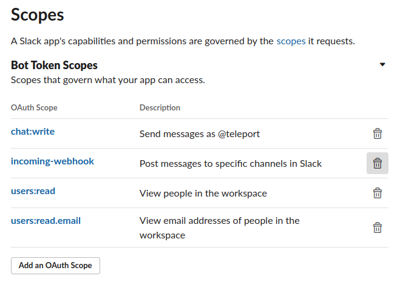
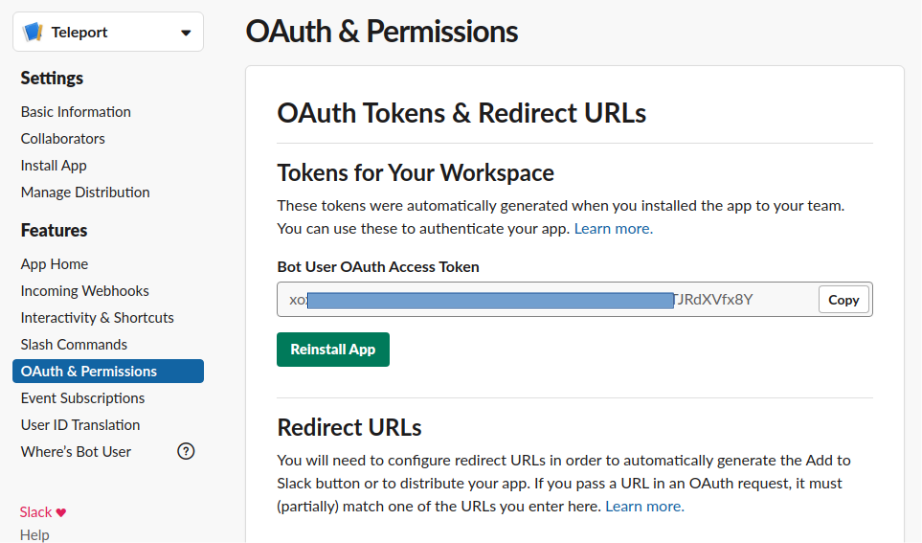

This guide will explain how to configure the Teleport Slack plugin to be able to review
Access Requests directly within Slack.

Currently, only self-hosted plugins support this feature.
Support for Teleport-hosted plugins will be added in the future.

Security-critical Teleport deployments should follow the [regular Slack plugin guide](slack.mdx),
which requires reviewers to authenticate to Teleport before approving or denying requests.

<Admonition type="warning">
Enabling this feature reduces the security of the Teleport cluster.
Access Request reviews submitted through Slack are bound to a Slack identity rather than
the reviewer's Teleport identity, and bypass Teleport authentication
(and MFA for admin actions if enabled on cluster).
As a result, a compromised Slack account can approve requests from Slack and escalate privileges in Teleport.
</Admonition>

## How it works

Teleport's Slack integration notifies individuals and channels of
Access Requests. By enabling the plugin with native Access Request reviews, users can then
approve or deny Access Requests directly within Slack without being redirected to the Teleport Web UI.

## Prerequisites

(!docs/pages/includes/edition-prereqs-tabs.mdx edition="Teleport Enterprise"!)

(!docs/pages/includes/machine-id/plugin-prerequisites.mdx!)

- Slack admin privileges to create an app and install it to your workspace. Your
  Slack profile must have the "Workspace Owner" or "Workspace Admin" banner
  below your profile picture.

- Slack users that are linked to persistent Teleport users in order to review Access Requests from Slack.
  When using an external Identity Provider, users should be imported using
  the User Sync feature from the
  [Teleport Okta integration](../../integrations/okta/user-sync.mdx) or the
  [Teleport Entra ID integration](../../integrations/entra-id/entra-id.mdx).
  SSO-only users are represented by temporary users in Teleport and they
  will be able to submit reviews until their temporary Teleport user expires,
  after which they must re-login to Teleport again.

- Either a Linux host or Kubernetes cluster where you will run the Teleport Slack plugin.

- A Slack application, Bot OAuth token, and App-level token to use for the plugin.

  <details>
  <summary>Creating a Slack app</summary>

    1. Visit [https://api.slack.com/apps](https://api.slack.com/apps) to create
       a new Slack app. Click "Create an App", then "From scratch". Fill in the
       form as shown below:

       

       The "App Name" should be "Teleport". Click the "Development Slack
       Workspace" dropdown and choose the workspace where you would like to see
       Access Request messages.

    1. Configure your application to authenticate to the Slack API. We will do
       this by generating an OAuth token that the plugin will present to the
       Slack API.

       We will restrict the plugin to the narrowest possible permissions by
       using OAuth scopes. The Slack plugin needs to post messages to your
       workspace. It also needs to read usernames and email addresses in order
       to direct Access Request notifications from the Auth Service to the
       appropriate Teleport users in Slack.

       After creating your app, the Slack website will open a console where you
       can specify configuration options. 

    1. On the sidebar menu under "Features", click "OAuth & Permissions".

    1. Scroll to the "Scopes" section and click "Add an OAuth Scope" for each of
       the following scopes:

       - `chat:write`
       - `incoming-webhook`
       - `users:read`
       - `users:read.email`

       The result should look like this:

       

     1. After you have configured scopes for your plugin, scroll back to the top
        of the OAuth & Permissions page, find the "OAuth Tokens for Your
        Workspace" section, and click "Install to Workspace". You will see a
        summary of the permission you configured for the Slack plugin earlier.

     1. In "Where should Teleport post?", choose "Slackbot" as the default
        channel the plugin will post to. The plugin will post here when sending
        direct messages.  Later in this guide, we will configure the plugin to
        post in other channels as well.

        After submitting this form, you will see an OAuth token in the "OAuth &
        Permissions" tab under "Tokens for Your Workspace":

        

        You will use this token later when configuring the Slack plugin.

  </details>

(!/docs/pages/includes/tctl.mdx!)

## Step 1/7. Configure your Slack app

In this step, you will configure your Slack app to support the native Access Request reviews feature.

### Generate an app-level token

Enter the following URL and select your Slack app to reach your app's settings:
[`https://api.slack.com/apps`](https://api.slack.com/apps)

In your Slack app's settings, head to the **Basic Information** tab.

Then, under **App-Level Tokens**, click **Generate Token and Scopes**. Set a name
and add the `connections:write` scope. This will provide the plugin with the necessary permissions
to receive user interactions from Slack.

Copy the generated app-level token for use in a later step.

### Enable Socket Mode setting

Head to the **Socket Mode** tab and enable Socket Mode. This will allow the Teleport Slack plugin
to build a WebSocket connection with the Slack server in order to process Access Request reviews from Slack.


## Step 2/7. Define requester and reviewer users

For the purpose of this guide, we will define an `access-requester` role that
can request the built-in `access` role, and an `access-reviewer` role that can
review requests for the `access` role.

Create a file called `access-request-rbac.yaml` with the following content:

```yaml
kind: role
version: v8
metadata:
  name: access-reviewer
spec:
  allow:
    review_requests:
      roles: ['access']
---
kind: role
version: v8
metadata:
  name: access-requester
spec:
  allow:
    request:
      roles: ['access']
      thresholds:
        - approve: 1
          deny: 1
```

Create the roles you defined:

```code
$ tctl create -f access-request-rbac.yaml
role 'access-reviewer' has been created
role 'access-requester' has been created
```

(!docs/pages/includes/create-role-using-web.mdx!)

### Set up the requester user

Create a user called `myuser` who has the `access-requester` role:

```code
$ tctl users add myuser --roles=access-requester
```

Visit the invitation URL that is printed and login as `myuser` for the first time,
registering credentials as configured for your Teleport cluster.

Later in this guide, you will have `myuser` request the `access` role so you can
review the request using the Teleport Slack plugin.

### Set up the reviewer user

Next, we will set up a user that can review Access Requests directly within Slack.

<Admonition type="info">
All users performing Access Request reviews within Slack must be linked to a persistent Teleport user.
When using an external Identity Provider, users should be imported using
the User Sync feature from the
[Teleport Okta integration](../../integrations/okta/user-sync.mdx) or the
[Teleport Entra ID integration](../../integrations/entra-id/entra-id.mdx).
SSO-only users are represented by temporary users in Teleport and they
will be able to submit reviews until their temporary Teleport user expires,
after which they must re-login to Teleport again.
</Admonition>

There are two identity binding models for Slack reviewers:
- binding based on Teleport username and Slack email
- binding based on Teleport trait and Slack user ID

The binding based on Teleport trait is stronger, but requires a Teleport user to be given a trait with
their Slack user ID, often coming from the Identity Provider/SSO connector.

You can set up both types of identity bindings if some users are imported
from an Identity Provider/SSO connector while others are local Teleport users.

<Tabs>
<TabItem label="Teleport trait binding">

Create a Teleport user with a username set as <Var name="alice@example.com" />
and assigned the role `access-reviewer`.

We will assign this reviewer user with a Teleport trait named <Var name="slack_uid" />
that holds the value of the Slack user's ID: <Var name="U123456789" />.
The trait name can also be configured in the plugin configuration step.

<Tabs>
<TabItem label="Local users">

Create a local user:

```code
$ tctl users add <Var name="alice@example.com" /> --roles=access-reviewer
```

Visit the invitation URL that is printed and login as <Var name="alice@example.com" /> for the first time,
registering credentials as configured for your Teleport cluster.

Create a file called `user-traits.yaml` with the following content:

```yaml
kind: user
version: v2
metadata:
  name: <Var name="alice@example.com" />
spec:
  roles: ['access-reviewer']
  traits:
    <Var name="slack_uid" />: ['<Var name="U123456789" />']
```

Update the newly created user:

```code
$ tctl create -f user-traits.yaml
```

</TabItem>
<TabItem label="SSO users">

When using a single sign-on user, the Teleport trait should be configured in the Identity Provider.

To get started integrating your Identity Provider with Teleport, read [Integrate
your Identity Provider](../../../zero-trust-access/sso/integrate-idp/integrate-idp.mdx).

</TabItem>
</Tabs>

</TabItem>
<TabItem label="Teleport username binding">

Prepare a Slack user with an email address.
Create a Teleport user with a username set to the Slack user's email <Var name="alice@example.com" />
and assigned the role `access-reviewer`.

```code
$ tctl users add <Var name="alice@example.com" /> --roles=access-reviewer
```

Visit the invitation URL that is printed and login as <Var name="alice@example.com" /> for the first time,
registering credentials as configured for your Teleport cluster.

</TabItem>
</Tabs>

The Slack user will now be able to review Access Requests for the `access` role within Slack
once we set up the Teleport Slack plugin.

## Step 3/7. Install the Teleport Slack plugin

(!docs/pages/includes/plugins/install-access-request.mdx name="slack"!)

## Step 4/7. Set up the Teleport Slack plugin

In this section, you will set up the Teleport Slack plugin 
and generate credentials that the plugin will use for authentication.

### Enable issuing of credentials for the plugin user

The required permissions for the plugin are configured in the preset `access-plugin-with-review`
role. To generate credentials for the plugin, define either a Machine ID bot user
or a regular Teleport user.

<Tabs>
<TabItem label="Machine & Workload Identity">
(!docs/pages/includes/plugins/rbac-impersonate-machine-id.mdx role="access-plugin-with-review"!)
</TabItem>
<TabItem label="Long-lived identity files">
(!docs/pages/includes/plugins/rbac-impersonate.mdx role="access-plugin-with-review"!)
</TabItem>
</Tabs>

### Export an identity file for the plugin user

Give the plugin access to a Teleport identity file. We recommend using Machine
ID for this in order to produce short-lived identity files that are less
dangerous if exfiltrated, though in demo deployments, you can generate
longer-lived identity files with `tctl`:

<Tabs>
<TabItem label="Machine & Workload Identity">
(!docs/pages/includes/plugins/tbot-identity.mdx secret="teleport-plugin-slack-identity"!)
</TabItem>
<TabItem label="Long-lived identity files">
(!docs/pages/includes/plugins/identity-export.mdx user="access-plugin-with-review" plugin="slack" secret="teleport-plugin-slack-identity"!)
</TabItem>
</Tabs>

## Step 5/7. Run the Teleport Slack plugin

At this point, the Teleport Slack plugin has the credentials it needs to
communicate with your Teleport cluster and the Slack API. In this step, you will
configure the Slack plugin to use these credentials. You will also configure the
plugin to notify the right Slack channels when it receives an Access Request
update.

Lastly, you will configure the plugin to enable reviews of Access Requests
directly within Slack.

### Configure the plugin

(!docs/pages/includes/plugins/slack-review-config.mdx!)

<details>
<summary>Suggested reviewers</summary>

Users can suggest reviewers when they create an Access Request, e.g.:

```code
$ tsh request create --roles=dbadmin --reviewers=alice@example.com,ivan@example.com
```

If an Access Request includes suggested reviewers, the Slack plugin will add
these to the list of channels to notify. If a suggested reviewer is an email
address, the plugin will look up the direct message channel for that
address and post a message in that channel.

</details>

### Invite the plugin to your Slack app

Once you have configured the channels that the Slack plugin will notify when it
receives an Access Request, you will need to ensure that the plugin can post in
those channels.

You have already configured the plugin to send direct messages as Slackbot. For
any other channel you mention in your `role_to_recipients` map, you will need
to invite the plugin to that channel. Navigate to each channel and enter `/invite
@teleport` in the message box.

### Start the plugin

Start the plugin by following the instructions below.

<Tabs>
<TabItem label="Executable">
```code
$ teleport-slack start --config teleport-slack.toml
```
</TabItem>
<TabItem label="Docker">
```code
$ docker run -v teleport-slack.toml:/etc/teleport-slack.toml public.ecr.aws/gravitational/teleport-plugin-slack:(=teleport.version=) start
```
</TabItem>
<TabItem label="Helm Chart">
```code
$ helm upgrade --install teleport-plugin-slack teleport/teleport-plugin-slack --values teleport-plugin-slack-values.yaml
```

To inspect the plugin's logs, use the following command:

```code
$ kubectl logs deploy/teleport-plugin-slack
```

Debug logs can be enabled by setting `log.severity` to `DEBUG` in
`teleport-plugin-slack-values.yaml` and executing the `helm upgrade ...` command
above again. Then you can restart the plugin with the following command:

```code
$ kubectl rollout restart deployment teleport-plugin-slack
```
</TabItem>
</Tabs>

## Step 6/7. Test your Slack app

Once you've created the Slack app and the Teleport Slack plugin is
running, you can now test the workflow.

### Create an Access Request

(!docs/pages/includes/plugins/create-request.mdx role="access"!)

The user you configured earlier to review the request should receive a direct
message from "Teleport" in Slack with Access Request details.
This message will contain “Approve” and “Deny” buttons for the user to either
approve or deny the request.


### Resolve the request

As the Slack user you set as an Access Request reviewer, click the "Approve" button,
and the plugin will send a reply to the original message with the review response.

Once the request is resolved, the Slack bot will add an emoji reaction of ✅ or
❌ to the Slack message for the Access Request, depending on whether the request
was approved or denied.

The Web UI will also reflect the resolved Access Request.


The Teleport audit log will report the Access Request as submitted by the Teleport Slack plugin identity.
The `submitted_by` field represents the plugin identity that submitted on behalf of the `reviewer` user.

<details>
<summary>Audit log</summary>

```json
{
  "RequestedResourceAccessIDs": null,
  "cluster_name": "kevin18.cloud.gravitational.io",
  "code": "T5002I",
  "ei": 0,
  "event": "access_request.review",
  "expires": "2026-06-18T11:26:07Z",
  "id": "019ed7ee-e581-7644-81be-dffd1229028c",
  "max_duration": "2026-06-18T11:26:07Z",
  "proposed_state": "APPROVED",
  "reviewer": "kevin.shi@goteleport.com",
  "state": "APPROVED",
  "submitted_by": "access-plugin-with-review",
  "time": "2026-06-17T23:34:06.274Z",
  "uid": "8912fd42-d1f4-4847-9621-fb7313e0ef08"
}
```

</details>

<Admonition type="info" title="Auditing Access Requests">

When the Slack plugin posts an Access Request notification to a channel, anyone
with access to the channel can view the notification and follow the link. While
users must be authorized via their Teleport roles to review Access Requests, you
should still check the Teleport audit log to ensure that the right users are
reviewing the right requests.

When auditing Access Request reviews, check for events with the type `Access
Request Reviewed` in the Teleport Web UI.

</Admonition>

## Step 7/7. Set up systemd

This section is only relevant if you are running the Teleport Slack plugin on a
Linux host.

In production, we recommend starting the Teleport plugin daemon via an init
system like systemd.  Here's the recommended Teleport plugin service unit file
for systemd:

```ini
(!examples/systemd/plugins/teleport-slack.service!)
```

Save this as `teleport-slack.service` in either `/usr/lib/systemd/system/` or
another [unit file load
path](https://www.freedesktop.org/software/systemd/man/systemd.unit.html#Unit%20File%20Load%20Path)
supported by systemd.

Enable and start the plugin:

```code
$ sudo systemctl enable teleport-slack
$ sudo systemctl start teleport-slack
```

## Troubleshooting

- Ensure Socket Mode is turned on in your Slack app’s settings.
- Ensure the Slack app-level token is provided for the plugin configuration field `review.app_token`.
  This is different from the Slack bot OAuth token.
- If you receive an Access Request review reply with the following error:
  `Insufficient permissions to review request`,
  ensure the Slack reviewer is properly bound with a local Teleport user,
  and that Teleport user has sufficient review permissions.
  Also ensure that the Slack plugin is using the preset Teleport role
  `access-plugin-with-review` which provides proper RBAC permissions for the Slack plugin.
- A Slack plugin using a long-lived identity file will not work with a Teleport cluster
  with admin-action MFA enabled. If admin-action MFA is enabled, use a Slack plugin with a Machine ID bot.

## Next steps

- Read our guides to configuring [Resource Access
    Requests](../resource-requests.mdx) and [Role Access
    Requests](../role-requests.mdx) so you can get the most out
    of your Access Request plugins.
- To see all of the options you can set in the values file for the
  `teleport-plugin-slack` Helm chart, consult our [reference
  guide](../../../reference/helm-reference/teleport-plugin-slack.mdx).
