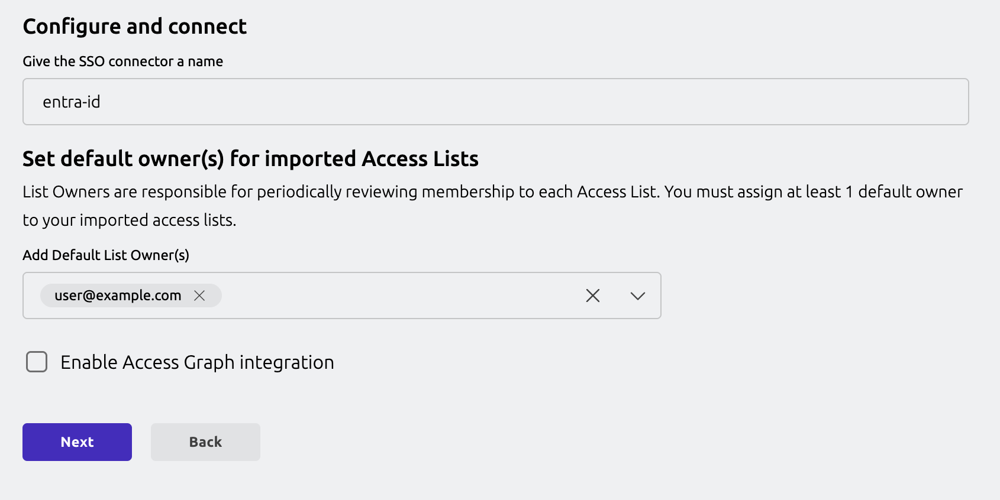
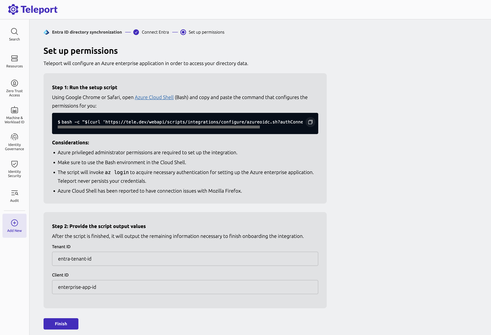

Entra ID integration enables the following features in Teleport:

1. **Single sign-on (SSO):** Configures Teleport authentication with Entra ID as an
   identity provider.
2. **User sync:** Imports Entra ID users as Teleport users.
3. **Group sync:** Imports Entra ID groups as Teleport
   Access Lists. 
4. **Application sync (Optional):** Imports Entra ID applications. 
5. **Integration with Identity Security (Optional):** Configures Identity Security integration that lets 
you analyze policy and access paths. 

## How it works

An enterprise application will be configured in the Entra ID. 
The purpose of this application is twofold - 
1. Set up a SAML SSO provider for Teleport 
2. Set up Microsoft graph API credential for Teleport that allows to fetch resources 
from Entra ID directory to Teleport.  

Once the integration is configured, Teleport periodically imports users, groups, 
and applications into Teleport.

### Choosing an authentication method

In order to authenticate with Microsoft Graph API and fetch resources from Entra ID, 
Teleport can be configured as an OIDC IdP for Entra ID enterprise application,
or set up with a system credential that grants access to Microsoft graph API. 

#### Teleport as an OIDC Provider for Entra ID 

In this setup, Teleport is configured as an OpenID Connect (OIDC) identity provider, establishing a trusted
connection with an Entra ID application created during setup. This trust allows Teleport to authenticate using
the Entra ID application, accessing permissions tied to it without requiring additional credentials or managed
Identities.

Direct bidirectional connectivity between Teleport and Azure is necessary for Azure to validate the OIDC
tokens issued by Teleport.


#### System credentials

Designed for air-gapped Teleport clusters that are not publicly accessible, this setup accommodates environments where Azure cannot validate OIDC tokens issued by Teleport. Instead, Teleport relies on Azure credentials available on the VMs where Teleport Auth Service is running.

Unidirectional connectivity from Teleport to Azure infrastructure.


## Prerequisites

- Teleport Identity Governance enabled for your account. Optionally, Identity Security should
also be enabled if you choose to enable Identity Security integration.
- Your user must have privileged administrator permissions in the Azure account
- For OIDC setup, the Teleport cluster must be publicly accessible from the internet.
- For air gapped clusters, `tctl` must be v16.4.7 or later.


## Guided Configuration

The guided configuration expects setting up a new Entra ID auth connector and OIDC
Integration as a default. 

<Tabs groupId="entra-id">
<TabItem label="Teleport as OIDC provider (Web UI)" >

## Step 1/3: Generate configuration script
In the Teleport Web UI, from the side-navigation, select “Add New > Integration”.

In the integration UI, select the “Microsoft Entra ID” tile. 


In the Microsoft Entra ID configuration UI, you will notice a default integration name “entra-id”
is already populated for you. You will need to select Teleport user(s) that will be assigned as 
the default owner of Access Lists that are created for your Entra ID groups. 

In the next step, you will be provided with a Entra ID configuration script.



## Step 2/3: Configure Entra ID

(!docs/pages/includes/identity-governance/azure-shell.mdx!)

## Step 3/3: Finish plugin installation

Once the script is done setting up the necessary permissions,
it prints out tenant ID and client ID. Copy these values and provide it to the
Web UI to finish the integration.



</TabItem>

<TabItem label="Teleport as OIDC provider (tctl)" >

## Step 1/3: Generate configuration script (tctl)

To begin integration, run `tctl plugins install entraid` command.

```code
$ tctl plugins install entraid \
    --name entra-id-default \
    --auth-connector-name entra-id \
    --default-owner=<Var name="Access List Owner"/> \
    --default-owner=someOtherOwner@teleport.sh  \
    --auth-server <Var name="example.teleport.sh:443" /> \
    –-no-access-graph 

Step 1: Run the Setup Script

...

To rerun the script, type 'exit' to close and then restart the process.

Once the script completes, type 'continue' to proceed, 'exit' to quit: exit
```

## Step 2/3: Configure Entra ID (tctl)

(!docs/pages/includes/identity-governance/azure-shell.mdx!)

## Step 3/3: Finish plugin installation (tctl)

Once the script is done setting up the necessary permissions,
it prints out tenant ID and client ID. Copy these values and provide it to the
`tctl` to finish the integration.

</TabItem>
</Tabs>


The integration is now configured and the Teleport Entra ID service will start importing resources from Entra ID to Teleport.

