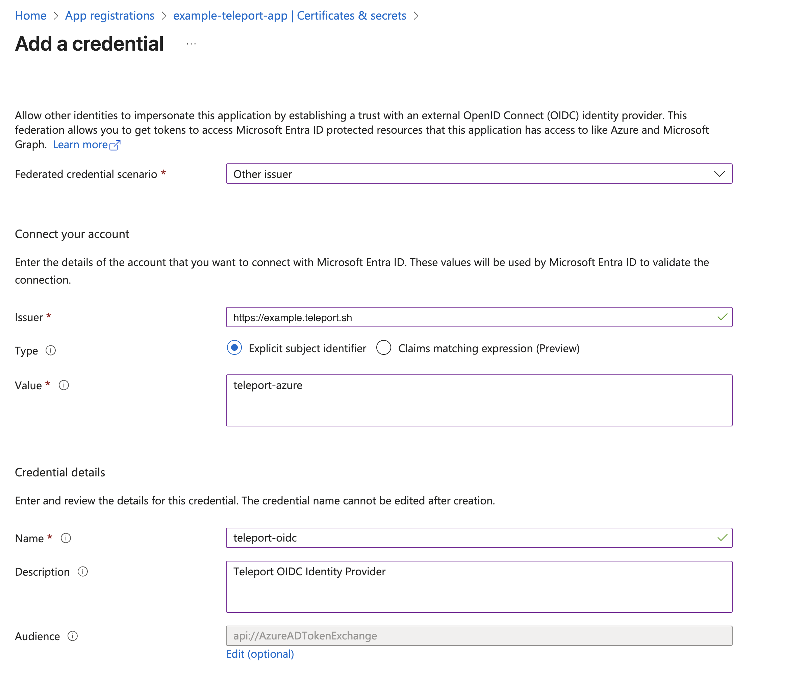
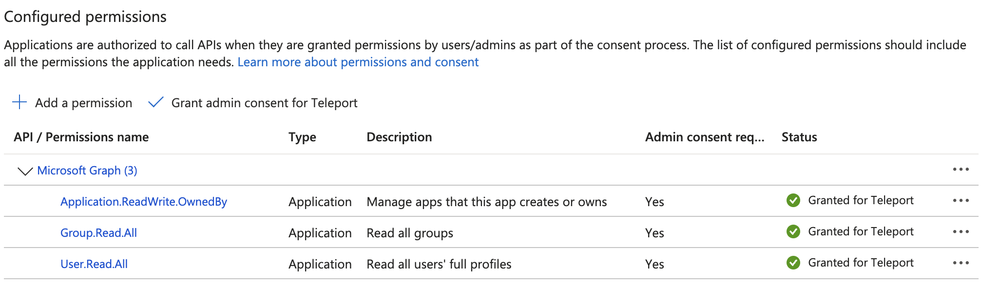

This guide shows how to configure Entra ID integration in Teleport.

## How it works

The Entra ID integration enables the following features in Teleport:

1. **Single Sign-On (SSO):** Configures Teleport authentication with Entra ID as an
   identity provider.
2. **User sync:** Periodic import of the Entra ID users as Teleport users.
3. **Group sync:** Periodic import of the Entra ID groups as Teleport
   Access Lists. 
4. **Integration with Teleport Identity Security (Optional):** Lets you analyze user access 
paths and policies from the Teleport Identity Security product. If enabled, Teleport imports 
enterprise applications as well. 

To configure SSO, Teleport uses an Entra ID enterprise application where 
Teleport must be set up as an SAML service provider. 

To import users and groups from the Entra ID, Teleport must be configured with 
a credential to authenticate with the Microsoft Graph API. 

### Choosing the Microsoft Graph API authentication method

Teleport supports two types of authentication mechanisms to authenticate with the
Microsoft Graph API: OIDC IdP and system credentials. 

#### Teleport as an OIDC Provider for Entra ID 

In this setup, Teleport is configured as an OpenID Connect (OIDC) identity provider 
for the Entra ID enterprise application, which is created during the setup. 
Teleport OIDC IdP then generates a short-lived credential for the Microsoft Graph API
client configured for the Entra ID. Authorization is limited to the API permission 
configured in the Entra ID enterprise application. 

Direct bidirectional connectivity between Teleport and Entra ID is necessary for 
the Entra ID to validate the OIDC tokens issued by Teleport.

For a Teleport cloud cluster, OIDC IdP based authentication is the only supported
authentication method. 

#### System credentials

Designed for air-gapped Teleport clusters that are not publicly accessible, this setup 
accommodates environments where Entra ID cannot validate OIDC tokens issued by Teleport. 

Instead, Teleport relies on API credentials available where Teleport 
Auth Service is running.

### Choosing guided or manual Entra ID configuration method

In the guided Entra ID configuration process, Teleport generates a configuration 
script, which configures your Entra ID tenant with the properties that are required
for the Teleport Entra ID integration. 

But if you want to have more control over the Entra ID configuration, a manual
Entra ID configuration may be suitable for you. In this case, you update the Entra ID
tenant with the properties that are required for Teleport Entra ID integration. 

The Web UI only supports guided Entra ID configuration with Teleport as OIDC IdP 
authentication method. `tctl` supports both the guided and manual Entra ID 
configuration methods, for both Teleport as OIDC IdP and system credential based setup. 

Both the guided and manual configuration is demonstrated in this guide. 

## Prerequisites

- Teleport Identity Governance enabled for your Teleport cluster. Optionally, Identity Security should
also be enabled if you choose to enable Identity Security integration.
- Your user must have privileged administrator permissions in the Microsoft Entra ID tenant.
- For the OIDC IdP setup, the Teleport cluster must be publicly accessible from the internet.


## Guided Configuration

Teleport will generate a script that will configure your Entra ID tenant with the 
properties required for the Teleport Entra ID integration.

Below, the configuration methods are categorized based on the authentication method
you choose, i.e. OIDC IdP or system credential. 

## Step 1/3: Generate configuration script
<Tabs groupId="entra-guided">
<TabItem default label="Teleport as OIDC provider (Web UI)" name="entra-oidc-ui">

In the Teleport Web UI, from the side-navigation, select “Add New > Integration”.

Next, select the “Microsoft Entra ID” tile. 

In the Teleport Microsoft Entra ID configuration UI, you will notice a default
integration name “entra-id” is already populated for you. You will need to select 
Teleport user(s) that will be assigned as the default owner of Access Lists that 
are created for your Entra ID groups. 


In the next step, you will be provided with a Entra ID configuration script.

</TabItem>

<TabItem label="Teleport as OIDC provider (tctl)" name="entra-oidc-tctl">

To begin integration, run the `tctl plugins install entraid` command.

```code
$ tctl plugins install entraid \
    --name entra-id-default \
    --auth-connector-name entra-id \
    --default-owner=<Var name="Access List Owner"/> \
    --auth-server <Var name="example.teleport.sh:443" /> 
```

The command will generate a configuration script in the current directory 
from where the `tctl` is invoked. 

</TabItem>

<TabItem label="System credential (tctl)" name="entra-system-cred-tctl">

You will need to grant Azure Identity with the necessary permissions required for the Entra ID
integration.

In the Azure Portal, find the identities linked to your Teleport Auth Service,
and copy the Principal ID of the identity you wish to update with the new permissions.

After obtaining the Principal ID, open the [Azure Cloud Shell](https://portal.azure.com/#cloudshell/)
in PowerShell mode and run the following script to assign the required permissions to `<Var name="Principal ID" />`.

<details>
<summary>Assign required permissions to Azure Identity</summary>

```powershell
# Connect to Microsoft Graph with the required scopes for directory and app role assignment permissions.
Connect-MgGraph -Scopes 'Directory.ReadWrite.All', 'AppRoleAssignment.ReadWrite.All'

# Retrieve the managed identity's service principal object using its unique principal ID (UUID).
$managedIdentity = Get-MgServicePrincipal -ServicePrincipalId '<Var name="Principal ID" />'

# Set the Microsoft Graph enterprise application object.
# This is a service principal object representing Microsoft Graph in Azure AD with a specific app ID.
$graphSPN = Get-MgServicePrincipal -Filter "AppId eq '00000003-0000-0000-c000-000000000000'"

# Define the permission scopes that we want to assign to the managed identity.
# These are Microsoft Graph API permissions required by the managed identity.
$permissions = @(
  "Application.ReadWrite.OwnedBy"   # Permission to read application
  "Group.Read.All"     # Permission to read groups
  "User.Read.All"        # Permission to read users
)

# Filter and find the app roles in the Microsoft Graph service principal that match the defined permissions.
# Only include roles where "AllowedMemberTypes" includes "Application" (suitable for managed identities).
$appRoles = $graphSPN.AppRoles |
    Where-Object Value -in $permissions |
    Where-Object AllowedMemberTypes -contains "Application"

# Iterate over each app role to assign it to the managed identity.
foreach ($appRole in $appRoles) {
    # Define the parameters for the role assignment, including the managed identity's principal ID,
    # the Microsoft Graph service principal's resource ID, and the specific app role ID.
    $bodyParam = @{
        PrincipalId = $managedIdentity.Id  # The ID of the managed identity (service principal)
        ResourceId  = $graphSPN.Id         # The ID of the Microsoft Graph service principal
        AppRoleId   = $appRole.Id          # The ID of the app role being assigned
    }

    # Create a new app role assignment for the managed identity, granting it the specified permissions.
    New-MgServicePrincipalAppRoleAssignment -ServicePrincipalId $managedIdentity.Id -BodyParameter $bodyParam
}

```

</details>

Your identity principal `<Var name="Principal ID" />` now has the necessary permissions to list Applications,
Directories, and Policies.

Now, to begin integration, run the `tctl plugins install entraid` command.

```code
$ tctl plugins install entraid \
    --name entra-id-default \
    --auth-connector-name entra-id \
    --default-owner=<Var name="Access List Owner"/> \
    --auth-server <Var name="example.teleport.sh:443" /> \
    --use-system-credentials 
```

The command will generate a configuration script in the current directory 
from where the `tctl` is invoked. 

</TabItem>
</Tabs>

## Step 2/3: Configure Entra ID

(!docs/pages/includes/identity-governance/azure-shell.mdx!)

## Step 3/3: Finish plugin installation

<Tabs groupId="entra-guided">
<TabItem default label="Teleport as OIDC provider (Web UI)" name="entra-oidc-ui">

Copy the Entra ID tenant ID and enterprise application client ID from the script output
and enter it in the Web UI to finish the integration.


</TabItem>

<TabItem label="Teleport as OIDC provider (tctl)" name="entra-oidc-tctl">

Copy the Entra ID tenant ID and enterprise application client ID from the script output
and enter it in the `tctl` to finish the integration.

</TabItem>

<TabItem label="System credential (tctl)" name="entra-system-cred-tctl">

Copy the Entra ID tenant ID and enterprise application client ID from the script output
and enter it in the `tctl` to finish the integration.

</TabItem>
</Tabs>

The integration is now configured and the Teleport Entra ID service will start 
importing resources from Entra ID to Teleport.

## Manual configuration

Manual configuration may be preferable if you wish to have more control on the 
Entra ID configuration. Below, a manual Entra ID configuration is demonstrated,
which as based on setting up the OIDC IdP based authentication method.  

## Step 1/5. Create enterprise application

In the Azure Portal, under “Azure services”, select “Enterprise applications”.
Click on `+ New Application` button, then click `+ Create your own application` button.
Enter a name for your application and create the application.


## Step 2/5. Configure SSO

Open the newly created enterprise application.

Under “Manage” menu select “Single sign-on”. In this configuration UI, you will need to set up Teleport
as an SAML servicer provider.

Click edit button to configure  “Basic SAML Configuration”.
Enter the SAML assertion endpoint as Entity ID and ACS URL value.
- **Entity ID and ACS URL:** SAML ACS endpoint of your Teleport cluster. 
E.g. `https://<teleport cluster addr>/v1/webapi/saml/acs/entra-id`

For “Attributes & Claims”, attributes with user will already be available for you but you will need to 
add a `groups` claim. 


## Step 3/5. Configure OIDC IdP

Under “App registrations” from Azure services menu, find and open your enterprise
application created in step 1.

Select “Manage > Certificates & secrets” and then select “Federated credentials“.
Click `+ Add credential` button.

Under “Add a credential” UI, configure credential with the following values:
- **Federated credential scenario:** Other issuer

Under “Connect your account”, configure the following values:
- **Issuer:** <Var name="https://example.teleport.sh" />
- **Type:** Explicit subject identifier
- **Value:** teleport-azure

Under “Credential details”, configure the following values:
- **Name:** teleport-oidc
- **Description:** Teleport OIDC Identity Provider



## Step 4/5. Configure API permissions

Under the same App registration UI for your enterprise application, select “Manage > API permissions”.

You can add a new graph permission by clicking on `+ Add a permission` button and then selecting 
“Microsoft Graph > Application permissions”.

The following permissions need to be added to the application. 
- `Application.ReadWrite.OwnedBy`
- `Group.Read.All`
- `User.Read.All`




## Step 5/5. Install the Entra ID plugin

Now run the `tctl plugins install entraid` command.

```code
$ tctl plugins install entraid \
    --name entra-id-default \
    --auth-connector-name entra-id \
    --default-owner=<Var name="Access List Owner"/> \
    –-manual-setup
```

`tctl` will then prompt for Entra ID tenant ID and application ID of the enterprise 
application created in step 1.

Once you enter these values, Entra ID plugin will be installed with the OIDC IdP based authentication method.

## FAQ

### What resources are imported to Teleport?

Teleport imports all the users, user groups and its members from the Entra ID directory.
There is no filter available to control custom import rules.

If Teleport Identity Security integration is enabled, Teleport will import 
applications and policies as well. 

### How does it work with nested Access Lists?

If an Entra ID group is assigned as a member to another group, Teleport preserves this assignment 
as a nested Access List. 

However, note that Teleport does not support recursive groups where group A is a member of group B
and group B is also a member of group A.

### What permissions does Teleport need to authenticate with the Microsoft Graph API?

At minimum, Teleport needs read access to users, groups and the main enterprise application 
for which the integration is configured.
```code 
- Application.ReadWrite.OwnedBy
- Group.Read.All
- User.Read.All
```

If you enable the Identity Security integration, you will need a broader set of permissions.
```code
- Application.Read.All # instead of Application.ReadWrite.OwnedBy
- Directory.Read.All # instead of User.Read.All and Group.Read.All
- Policy.Read.All
```

By default, the guided configuration script sets up a broader scoped permission, which 
is required by the Identity Security product to perform policy and access path analysis.

## Next steps

- Take a deeper look into setting up [Entra ID auth connector](../zero-trust-access/sso/azuread.mdx). 
- Learn more about [Access List](access-lists/access-lists.mdx) management.
- Learn how the [Identity Security integration with Entra ID](../identity-security/integrations/entra-id.mdx) works. 
