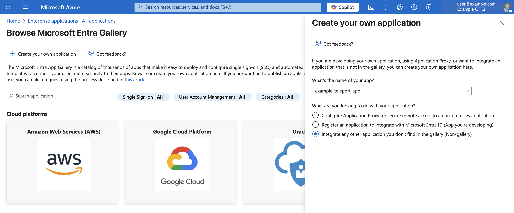
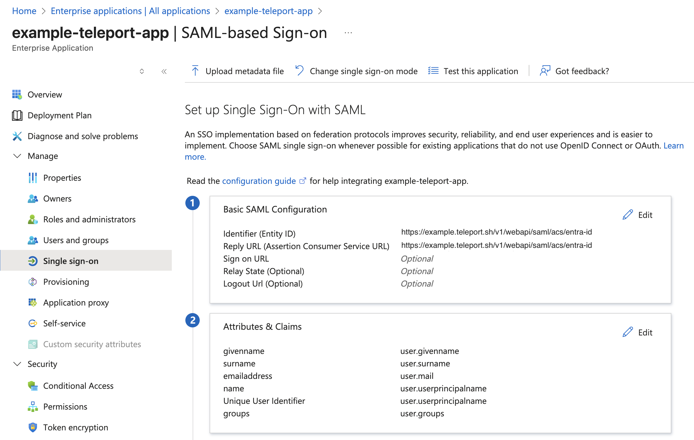

Entra ID integration enables the following features in Teleport:

1. **Single sign-on (SSO):** Configures Teleport authentication with Entra ID as an
   identity provider.
2. **User sync:** Imports Entra ID users as Teleport users.
3. **Group sync:** Imports Entra ID groups as Teleport
   Access Lists. 
4. **Application sync (Optional):** Imports Entra ID applications. 
5. **Integration with Teleport Identity Security (Optional):** Lets you analyze user access paths
and policies from the Teleport Identity Security product. 

## How it works

An enterprise application will be configured in the Entra ID. 
The purpose of this application is twofold - 
1. Set up a SAML SSO provider for Teleport. 
2. Set up Microsoft graph API credential for Teleport that allows to fetch resources 
from Entra ID directory to Teleport.  

Once the integration is configured, Teleport periodically imports users, groups, 
and applications into Teleport.

The installation process provides an option to extend Entra ID integration with the 
Teleport Identity Security product, which offers user [access path and policy analysis](../identity-security/integrations/entra-id.mdx).

### Choosing an authentication method

In order to fetch resources from the Entra ID directory, Teleport needs to be 
configured with credential that grants access to the Microsoft Graph API. 

#### Teleport as an OIDC Provider for Entra ID 

In this setup, Teleport is configured as an OpenID Connect (OIDC) identity provider, 
establishing a trusted connection with an Entra ID application created during setup. 
This trust allows Teleport to authenticate using the Entra ID application, accessing 
permissions tied to it without requiring additional credentials or managed Identities.

Direct bidirectional connectivity between Teleport and Azure is necessary for Azure to 
validate the OIDC tokens issued by Teleport.

#### System credentials

Designed for air-gapped Teleport clusters that are not publicly accessible, this setup 
accommodates environments where Azure cannot validate OIDC tokens issued by Teleport. 
Instead, Teleport relies on Azure credentials available on the VMs where Teleport 
Auth Service is running.

## Prerequisites

- Teleport Identity Governance enabled for your account. Optionally, Identity Security should
also be enabled if you choose to enable Identity Security integration.
- Your user must have privileged administrator permissions in the Azure account.
- For the OIDC IdP setup, the Teleport cluster must be publicly accessible from the internet.
- For air gapped clusters, `tctl` must be v16.4.7 or later.


## Guided Configuration

The guided configuration expects setting up a new Entra ID auth connector and OIDC
IdP integration as a default. 

<Tabs groupId="entra-id">
<TabItem label="Teleport as OIDC provider (Web UI)" >

## Step 1/3: Generate configuration script
In the Teleport Web UI, from the side-navigation, select “Add New > Integration”.

In the integration UI, select the “Microsoft Entra ID” tile. 


In the Microsoft Entra ID configuration UI, you will notice a default integration name “entra-id”
is already populated for you. You will need to select Teleport user(s) that will be assigned as 
the default owner of Access Lists that are created for your Entra ID groups. 


In the next step, you will be provided with a Entra ID configuration script.

## Step 2/3: Configure Entra ID

(!docs/pages/includes/identity-governance/azure-shell.mdx!)

## Step 3/3: Finish plugin installation

Once the script is done setting up the necessary permissions,
it prints out tenant ID and client ID. Copy these values and provide it to the
Web UI to finish the integration.


</TabItem>

<TabItem label="Teleport as OIDC provider (tctl)" >

## Step 1/3: Generate configuration script (tctl)

To begin integration, run the `tctl plugins install entraid` command.

```code
$ tctl plugins install entraid \
    --name entra-id-default \
    --auth-connector-name entra-id \
    --default-owner=<Var name="Access List Owner"/> \
    --default-owner=someOtherOwner@teleport.sh  \
    --auth-server <Var name="example.teleport.sh:443" /> 

Step 1: Run the Setup Script
...

Once the script completes, type 'continue' to proceed, 'exit' to quit: 
```

## Step 2/3: Configure Entra ID (tctl)

(!docs/pages/includes/identity-governance/azure-shell.mdx!)

## Step 3/3: Finish plugin installation (tctl)

Once the script is done setting up the necessary permissions,
it prints out tenant ID and client ID. Copy these values and provide it to the
`tctl` to finish the integration.

</TabItem>

<TabItem label="System credential (tctl)" >

## Step 1/4: Set up system credential

You will need to grant Azure Identity with the necessary permissions required for the Entra ID
integration.

In the Azure Portal, find the identities linked to your Teleport Auth Service VMs,
and copy the Principal ID of the identity you wish to update with the new permissions.

After obtaining the Principal ID, open the [Azure Cloud Shell](https://portal.azure.com/#cloudshell/)
in PowerShell mode and run the following script to assign the required permissions to `<Var name="Principal ID" />`.

<details>
<summary>Assign required permissions to Azure Identity</summary>

```powershell

# Connect to Microsoft Graph with the required scopes for directory and app role assignment permissions.
Connect-MgGraph -Scopes 'Directory.ReadWrite.All', 'AppRoleAssignment.ReadWrite.All'

# Retrieve the managed identity's service principal object using its unique principal ID (UUID).
$managedIdentity = Get-MgServicePrincipal -ServicePrincipalId '<Var name="Principal ID" />'

# Set the Microsoft Graph enterprise application object.
# This is a service principal object representing Microsoft Graph in Azure AD with a specific app ID.
$graphSPN = Get-MgServicePrincipal -Filter "AppId eq '00000003-0000-0000-c000-000000000000'"

# Define the permission scopes that we want to assign to the managed identity.
# These are Microsoft Graph API permissions required by the managed identity.
$permissions = @(
  "Application.ReadWrite.OwnedBy"   # Permission to read application
  "Group.Read.All"     # Permission to read groups
  "User.Read.All"        # Permission to read users
)

# Filter and find the app roles in the Microsoft Graph service principal that match the defined permissions.
# Only include roles where "AllowedMemberTypes" includes "Application" (suitable for managed identities).
$appRoles = $graphSPN.AppRoles |
    Where-Object Value -in $permissions |
    Where-Object AllowedMemberTypes -contains "Application"

# Iterate over each app role to assign it to the managed identity.
foreach ($appRole in $appRoles) {
    # Define the parameters for the role assignment, including the managed identity's principal ID,
    # the Microsoft Graph service principal's resource ID, and the specific app role ID.
    $bodyParam = @{
        PrincipalId = $managedIdentity.Id  # The ID of the managed identity (service principal)
        ResourceId  = $graphSPN.Id         # The ID of the Microsoft Graph service principal
        AppRoleId   = $appRole.Id          # The ID of the app role being assigned
    }

    # Create a new app role assignment for the managed identity, granting it the specified permissions.
    New-MgServicePrincipalAppRoleAssignment -ServicePrincipalId $managedIdentity.Id -BodyParameter $bodyParam
}

```

</details>

Your identity principal `<Var name="Principal ID" />` now has the necessary permissions to list Applications,
Directories, and Policies.


## Step 2/4: Generate configuration script (tctl)

To begin integration, run the `tctl plugins install entraid` command.

```code
$ tctl plugins install entraid \
    --name entra-id-default \
    --auth-connector-name entra-id \
    --default-owner=<Var name="Access List Owner"/> \
    --default-owner=someOtherOwner@teleport.sh  \
    --auth-server <Var name="example.teleport.sh:443" /> \
    --use-system-credentials 

Step 1: Run the Setup Script
...

Once the script completes, type 'continue' to proceed, 'exit' to quit: 
```

## Step 3/4: Configure Entra ID (tctl)

(!docs/pages/includes/identity-governance/azure-shell.mdx!)

## Step 4/4: Finish plugin installation (tctl)

Once the script is done setting up the necessary permissions,
it prints out tenant ID and client ID. Copy these values and provide it to the
`tctl` to finish the integration.

</TabItem>
</Tabs>

The integration is now configured and the Teleport Entra ID service will start 
importing resources from Entra ID to Teleport.

## Manual configuration

Manual configuration may be preferable if you wish to have more control on the 
Entra ID configuration. Below, an OIDC IdP based manual configuration is 
demonstrated. 

## Step 1/5. Create enterprise application

In the Azure Portal, under “Azure services”, select “Enterprise applications”.
Click on `+ New Application` button, then click `+ Create your own application` button.
Enter a name for your application and create the application.




## Step 2/5. Configure SSO

Open the newly created enterprise application.

Under “Manage” menu select “Single sign-on”. In this configuration UI, you will need to set up Teleport
as an SAML servicer provider.

Click edit button to configure  “Basic SAML Configuration”.
Enter the SAML assertion endpoint as Entity ID and ACS URL value.
- **Entity ID and ACS URL:** SAML ACS endpoint of your Teleport cluster. 
E.g. `https://<teleport cluster addr>/v1/webapi/saml/acs/entra-id`

For “Attributes & Claims”, attributes with user will already be available for you but you will need to 
add a `groups` claim. 




## Step 3/5. Configure OIDC IdP

Under “App registrations” from Azure services menu, find and open your enterprise
application created in step 1.

Select “Manage > Certificates & secrets” and then select “Federated credentials“.
Click `+ Add credential` button.

Under “Add a credential” UI, configure credential with the following values:
- **Federated credential scenario:** Other issuer

Under “Connect your account”, configure the following values:
- **Issuer:** https://example.com
- **Type:** Explicit subject identifier
- **Value:** teleport-azure

Under “Credential details”, configure the following values:
- **Name:** teleport-oidc
- **Description:** Teleport OIDC Identity Provider


## Step 4/5. Configure API permissions

Under the same App registration UI for your enterprise application, select “Manage > API permissions”.

You can add a new graph permission by clicking on `+ Add a permission` button and then selecting 
“Microsoft Graph > Application permissions”.

The following permissions needs to be added to the application. 
- `Application.ReadWrite.OwnedBy`
- `Group.Read.All`
- `User.Read.All`


## Step 5/5. Install the Entra ID plugin

Now run the `tctl plugins install entraid` command.

```code
$ tctl plugins install entraid \
    --name entra-id-default \
    --auth-connector-name entra-id \
    --default-owner=<Var name="Access List Owner"/> \
    –-manual-setup
```

`tctl` will then prompt for Entra ID tenant ID and Application ID of the enterprise 
application created in step 1.

Once you enter these values, Entra ID plugin will be installed with the OIDC IdP based authentication method.

## FAQ

### What resources are imported to Teleport?

Teleport imports all the users, user groups and its members from the Entra ID directory.
There is no filter available to control custom import rules.

If Teleport Identity Security integration is enabled, Teleport will import 
applications and policies as well. 

### How does it work with nested Access Lists?

If an Entra ID group is assigned as a member to another group, Teleport preserves this assignment 
as a nested Access List. 

However, note that Teleport does not support recursive groups where group A is a member of group B
and group B is also a member of group A.

### What permissions does Teleport need to authenticate with the Microsoft Graph API?

At minimum, Teleport needs read access to users, groups and the main enterprise application 
for which the integration is configured.
```code 
- Application.ReadWrite.OwnedBy
- Group.Read.All
- User.Read.All
```

If you enable Identity Security integration, you will need a broader sets of permission.
```code
- Application.Read.All
- Directory.Read.All
- Policy.Read.All
```

By default, the guided configuration script sets up a broader scoped permission, which 
is required by the Identity Security product to perform policy and access path analysis.

## Next steps

- Take a deeper look into setting up [Entra ID auth connector](../zero-trust-access/sso/azuread.mdx). 
- Learn more about [Access List](access-lists/access-lists.mdx) management.
