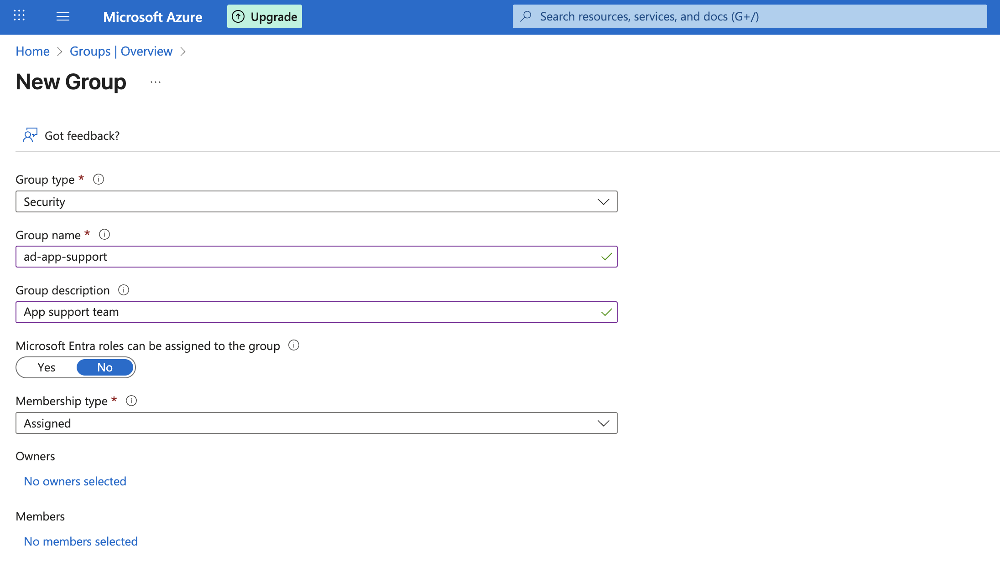
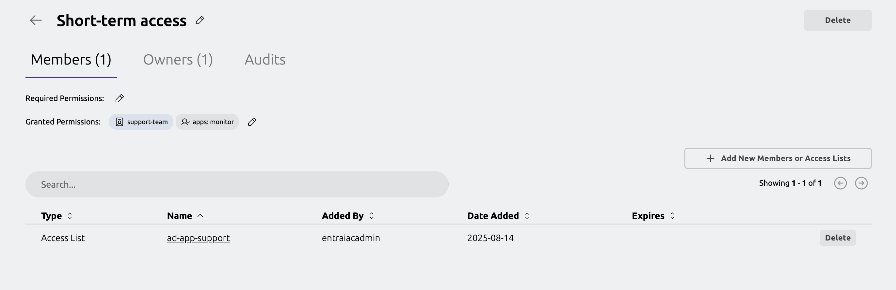
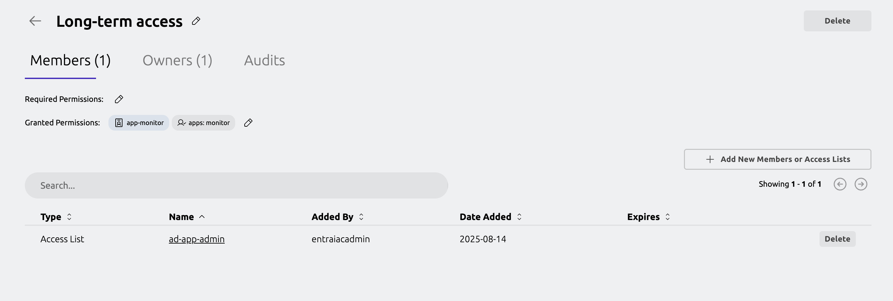

This guide shows how to configure access for Entra ID imported users with Nested Access Lists. 

## How it works

In a Nested Access List setup, the child Access List inherits roles that are granted 
by the parent Access List. 

By utilizing this feature, we can add an Entra ID imported Access List as a member of 
another Access List that grants Teleport roles to its members. 

For demonstration, this guide uses Grafana as a reference application to which we 
want to configure access for Entra ID users. This application is enrolled 
in Teleport with a resource label `env: monitor`. 
```yaml
app_service:
  enabled: true
  apps:
  - name: Grafana
    uri: "app.example.com:3000"
    labels:
      env: monitor
```

We will have two user groups created in Entra ID: `ad-app-admin` and 
`ad-app-support`. We want members of these groups to have long-term and 
short-term access to Grafana respectively.

We will then create two roles in Teleport. One will allow access to Grafana application while 
the other role will allow requesting access to the role that grants access to Grafana application.

These roles will then be assigned to the Access List to grant roles to the Entra ID imported groups. 


## Prerequisites

- Teleport user with preset `editor` or an equivalent role that allows to 
read and write Auth Connector, plugins, roles and Access Lists. 
- Permission to create groups in Entra ID.
- [Entra ID integration](getting-started.mdx) configured in your Teleport cluster. 
- For demonstration, this guide references a Grafana application. You may use any other 
[resource](../../enroll-resources/enroll-resources.mdx) type to get started. 

## Step 1/4. Create groups in Entra ID

In the Azure portal, select the "Groups" menu under "Azure services". 

From the "Groups" page, click the "New group" button to create a new user group 
named `ad-app-support`. You may add desired users to this group. 



Repeat the steps and create another user group named `ad-app-admin`.

Every 5 minutes, Teleport imports groups from Entra ID and creates 
an Access List for each of the imported groups. Teleport will also preserve respective 
group members as an Access List member.

## Step 2/4. Create roles in Teleport

First, create a [templated role](../../zero-trust-access/access-controls/guides/role-templates.mdx)
that grants access to Grafana. 

In the Teleport Web UI, from side navigation menu, select "Zero Trust Access > Roles".
From the "Roles" UI, click "Create New Role" button. Switch to the YAML editor.


Copy the role spec shown below and paste it in the role editor to create a new role.
```yaml
kind: role
metadata:
  name: app-monitor
spec:
  allow:
    app_labels:
      env: '{{external.apps}}'
  deny: {}
  options:
    cert_format: standard
    enhanced_recording:
    - command
    - network
    record_session:
      default: best_effort
version: v8
```

Here's what defined in the role spec-  we name this role as "app-monitor". 
The role is configured with allowed `app_labels` that matches 
label key `env` and a label value `'{{external.apps}}'`, which will be derived from 
user's `apps` trait. As long as the label value configured in the application resource 
label, and the value configured in the user `apps` trait matches, this role will grant 
access to that application. 


Repeat the role creation step in the UI to create another role that allows 
requesting access to the `app-monitor` role. 

We name this role as `support-team`.
```yaml
kind: role
metadata:
  name: support-team
spec:
  allow:
    request: 
      roles: 
        - app-monitor
  deny: {}
  options:
    cert_format: standard
    enhanced_recording:
    - command
    - network
    record_session:
      default: best_effort
version: v8
```

<Admonition type="tip" title="Role resource label">
  In the example role `app-monitor`, the allow `app_labels` 
  rule we defined applies to the application resources. You may need to reference 
  a different [resource label](../../reference/access-controls/roles.mdx#example-role-specification) 
  rule if you are following through this guide with a different kind of resource.  
</Admonition>

## Step 3/4 Create Nested Access List to grant role and trait

Assuming Teleport has already imported new groups we created in Entra ID, 
we will now create new Access Lists for short-term (Just-In-Time) 
and long-term access management. The Entra ID imported groups will then be added as a member to 
these new Access Lists.

In the Teleport Web UI, from the side-navigation menu, select “Identity Governance > Access List”.

Next, click the “Create New Access List” button and enter Access List details as follows. 

- **Title**: Short-term access
- **Deadline for First Review**: Select a future date.
- **Member Role Grants**: `support-team`
- **Member Trait Grants**: `apps: monitor`
- **Owners**: Add yourself or any appropriate users as owners.
- **Members**: `ad-app-support`. This is the Access List created for the Entra ID group of the same name. 



This Access List grants `support-team` role and a trait `apps: monitor` to its members.
Effectively, allowing its members to request access to the `app-monitor` role.

Create another Access List that will grant its members with a long-term access to Grafana
based on a direct-assigned `app-monitor` role. 
- **Title**: Long-term access
- **Deadline for First Review**: Select a future date.
- **Member Role Grants**: `app-monitor`
- **Member Trait Grants**: `apps: monitor`
- **Owners**: Add yourself or any appropriate users as owners.
- **Members**: `ad-app-admin`. This is the Access List created for the Entra ID group of the same name. 



This Access List grants `app-monitor` role and a trait `apps: monitor` to its members.
Effectively, allowing its members to access resource application resource by the `app-monitor` role.

## Next steps

- Learn more about [Access List](../access-lists/access-lists.mdx) management.
- Learn more about [Role and Resource Access Request](../access-requests/access-requests.mdx).
- Learn more about [role templates](../../zero-trust-access/access-controls/guides/role-templates.mdx).