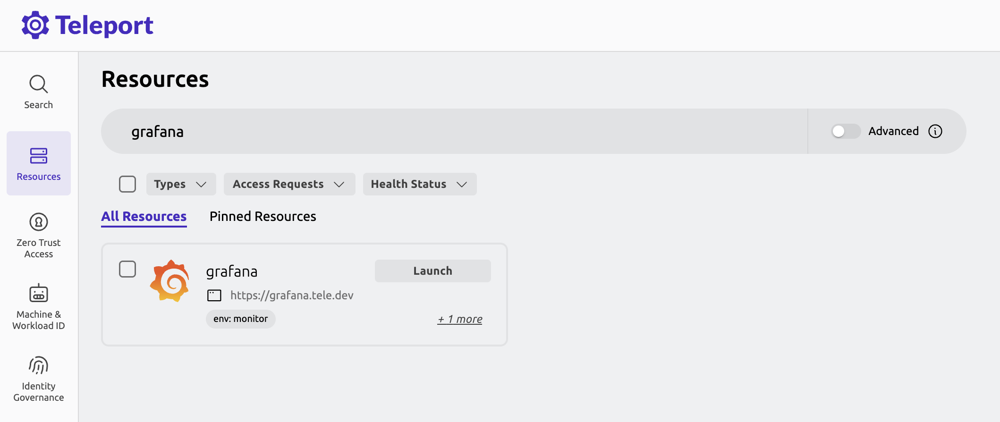
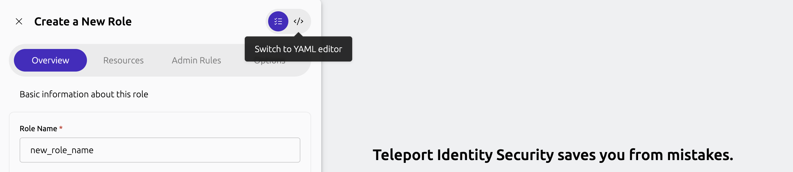

This guide shows how to setup access for Entra ID imported users based on their Entra
group memberships using Teleport's Nested Access Lists. 

## How it works

In a Nested Access List setup, the child Access List inherits roles and traits that
are granted by the parent Access List. 

By utilizing this feature, we can add an Entra ID imported Access List as a member of 
another Access List to grant Teleport roles to its members. 

For demonstration, this guide uses Grafana as a reference application to which we 
want to configure access for Entra ID users. This application is enrolled 
in Teleport with a resource label `env: monitor`. 


We will have two user groups created in Entra ID: `ad-app-admin` and 
`ad-app-support`. We want members of these groups to have a permanent 
access and an ability to request access to Grafana respectively. You 
may also use existing Entra ID groups instead.

We will then create two roles in Teleport. One will allow access to Grafana 
application while the other role will allow requesting access to the role that 
grants access to Grafana application. 

These roles will then be assigned to the Access List to grant roles and traits 
to the Entra ID imported groups. 


## Prerequisites

- Teleport user with preset `editor` or an equivalent role that allows to 
read and write Auth Connector, plugins, roles and Access Lists. 
- Permission to create groups in Entra ID.
- [Entra ID integration](getting-started.mdx) configured in your Teleport cluster. 
- For demonstration, this guide references a Grafana application. You may use any other 
[resource](../../enroll-resources/enroll-resources.mdx) type to get started. 

## Step 1/3. Create groups in Entra ID

<Admonition type="info" title="New Group">
  You may skip this step if you are using an existing Entra ID 
  groups to follow through this guide.
</Admonition>

In the Azure portal, select the "Groups" menu under "Azure services". 

From the "Groups" page, click the "New group" button to create a new user group 
named `ad-app-support`. You may add desired users to this group. 


Repeat the steps and create another user group named `ad-app-admin`.

Every 5 minutes, Teleport imports groups from Entra ID and creates 
an Access List for each of the imported groups. Teleport will also preserve respective 
group members as an Access List member.

## Step 2/3. Create roles in Teleport

First, create a role template that grants access to Grafana. 

In the Teleport Web UI, from side navigation menu, select "Zero Trust Access > Roles".
From the "Roles" UI, click "Create New Role" button. Switch to the YAML editor.


Copy the role spec shown below and paste it in the role editor to create a new role.
```yaml
kind: role
version: v8
metadata:
  name: app-monitor
spec:
  allow:
    app_labels:
      env: '{{external.apps}}'
```

The role is configured with allowed `app_labels` that matches 
label key `env` and a label value `'{{external.apps}}'`, which will be derived from 
user's `apps` trait. As long as the label value configured in the application resource 
label, and the value configured in the user `apps` trait matches, this role will grant 
access to that application. 

Using trait template to define label makes this role scalable as user traits are dynamically
configurable. You can learn more about traits and role templates [in this guide](../../zero-trust-access/rbac-get-started/role-templates.mdx).

When user authenticates with Entra ID, the SAML attributes (or claims if you are using OIDC) 
that are available in the user SSO response are preserved as user traits. Additionally, you 
can also grant traits to user using Access List. As you will see in the next step below, 
this guide will use Access List to grant trait to the user.


Repeat the role creation step in the UI to create another role that allows 
requesting access to the `app-monitor` role. 

We name this role as `support-team`.
```yaml
kind: role
version: v8
metadata:
  name: support-team
spec:
  allow:
    request: 
      roles: 
        - app-monitor
```

<Admonition type="tip" title="Role resource label">
  In the example role `app-monitor`, the allow `app_labels` 
  rule we defined applies to the application resources. You may need to reference 
  a different [resource label](../../reference/access-controls/roles.mdx#example-role-specification) 
  rule if you are following through this guide with a different kind of resource.  
</Admonition>

## Step 3/3. Create a Nested Access List

Assuming Teleport has already imported new groups we created in Entra ID, 
we will now create new Access Lists for short-term (Just-In-Time) 
and long-term access management. The Entra ID imported groups will then be added as a member to 
these new Access Lists.

In the Teleport Web UI, from the side-navigation menu, select “Identity Governance > Access List”.

Next, click the “Create New Access List” button and enter Access List details as follows. 

- **Title**: Short-term access
- **Deadline for First Review**: Select a future date.
- **Member Role Grants**: `support-team`
- **Member Trait Grants**: `apps: monitor`
- **Owners**: Add yourself or any appropriate users as owners.
- **Members**: `ad-app-support`. This is the Access List created for the Entra ID group of the same name. 


This Access List grants `support-team` role and a trait `apps: monitor` to its members.
Effectively, allowing its members to request access to the `app-monitor` role.

Create another Access List that will grant its members with a long-term access to Grafana
based on a direct-assigned `app-monitor` role. 
- **Title**: Long-term access
- **Deadline for First Review**: Select a future date.
- **Member Role Grants**: `app-monitor`
- **Member Trait Grants**: `apps: monitor`
- **Owners**: Add yourself or any appropriate users as owners.
- **Members**: `ad-app-admin`. This is the Access List created for the Entra ID group of the same name. 


This Access List grants `app-monitor` role and a trait `apps: monitor` to its members.
Effectively, allowing its members to access application resource via the `app-monitor` role.

## Next steps

- Learn more about [Access List](../access-lists/access-lists.mdx) and [Nested Access List](../access-lists/nested-access-lists.mdx) management.
- Learn more about [Role and Resource Access Request](../access-requests/access-requests.mdx).
- Learn more about [role templates](../../zero-trust-access/rbac-get-started/role-templates.mdx).
