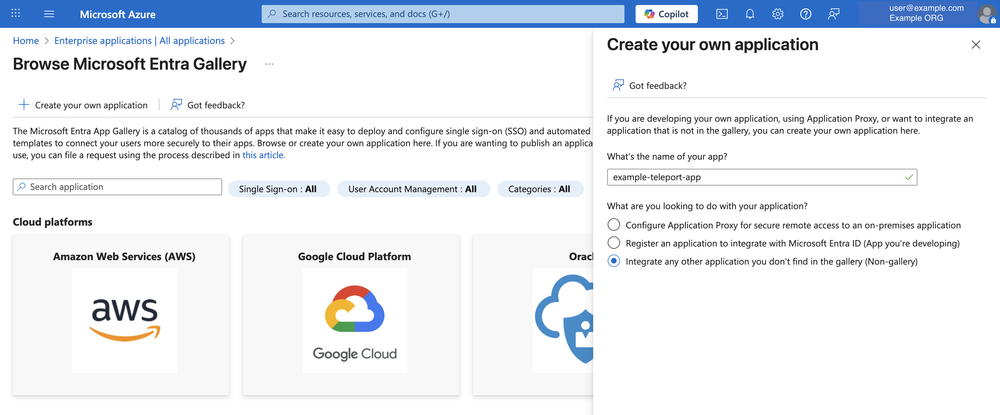
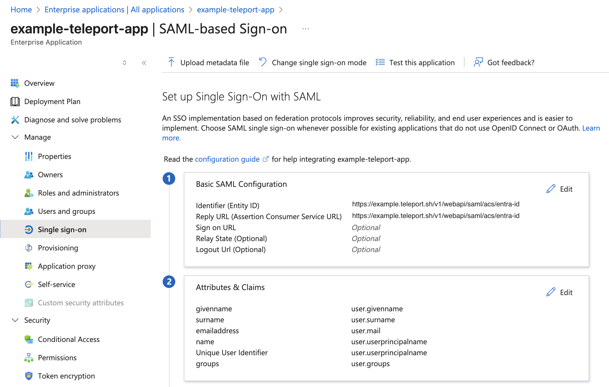
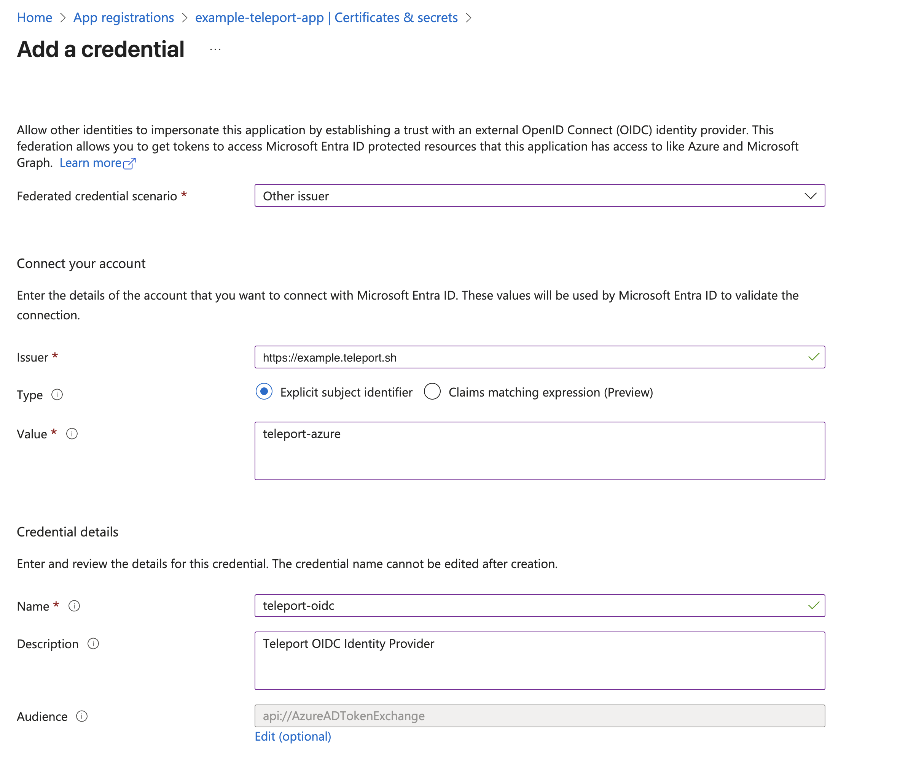
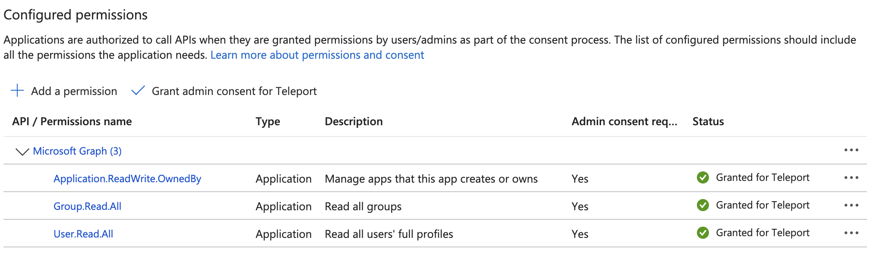

This guide shows manual Entra ID configuration steps to set up Teleport Entra ID integration.
See [getting started with Entra ID integration](getting-started.mdx) for a guided Entra ID configuration. 

The set up is based on the [OIDC IdP authentication method](entra-id.mdx#choosing-the-microsoft-graph-api-authentication-method).

{/* lint ignore page-structure remark-lint */}

## Prerequisites

- Teleport Identity Governance enabled for your Teleport cluster.
- Your user must have privileged administrator permissions in the Microsoft Entra ID tenant.

## Step 1/5. Create enterprise application

In the Azure Portal, under “Azure services”, select “Enterprise applications”.
Click on `+ New Application` button, then click `+ Create your own application` button.
Enter a name for your application and create the application.




## Step 2/5. Configure SSO

Open the newly created enterprise application.

Under “Manage” menu select “Single sign-on”. In this configuration UI, you will need to set up Teleport
as an SAML servicer provider.

Click edit button to configure  “Basic SAML Configuration”.
Enter the SAML assertion endpoint as Entity ID and ACS URL value.
- **Entity ID and ACS URL:** SAML ACS endpoint of your Teleport cluster. 
E.g. `https://example.teleport.sh/v1/webapi/saml/acs/entra-id`

For “Attributes & Claims”, attributes with user will already be available for you but you will need to 
add a `groups` claim. 




## Step 3/5. Configure OIDC IdP

Under “App registrations” from Azure services menu, find and open your enterprise
application created in step 1.

Select “Manage > Certificates & secrets” and then select “Federated credentials“.
Click `+ Add credential` button.

Under “Add a credential” UI, configure credential with the following values:
- **Federated credential scenario:** Other issuer

Under “Connect your account”, configure the following values:
- **Issuer:** `https://example.teleport.sh` (replace this value with your Teleport cluster proxy address)
- **Type:** Explicit subject identifier
- **Value:** teleport-azure

Under “Credential details”, configure the following values:
- **Name:** teleport-oidc
- **Description:** Teleport OIDC Identity Provider



## Step 4/5. Configure API permissions

Under the same App registration UI for your enterprise application, select “Manage > API permissions”.

You can add a new graph permission by clicking on `+ Add a permission` button and then selecting 
“Microsoft Graph > Application permissions”.

The following permissions need to be added to the application. 
- `Application.ReadWrite.OwnedBy`
- `Group.Read.All`
- `User.Read.All`




## Step 5/5. Install the Entra ID plugin

Now run the `tctl plugins install entraid` command, including the name of the
<Var name="Access List owner"/>:

```code
$ tctl plugins install entraid \
    --name entra-id-default \
    --auth-connector-name entra-id \
    --default-owner=<Var name="Access List owner"/> \
    --no-access-graph \
    --manual-setup
```

The `--name` flag specifies the resource name of the Entra ID plugin. 
The `--auth-connector-name` flag specifies the name of the auth connector this integration will create.
The `--default-owner` flag specifies default owners for the Access Lists that will be created
in Teleport based on the groups imported from the Entra ID.
The `--manual-setup` flag specifies a manual Entra ID configuration is selected by the user.

`tctl` will then prompt for Entra ID tenant ID and application ID of the enterprise 
application created in step 1.

After you enter these values, Entra ID plugin will be installed with the OIDC IdP based authentication method.

## Next steps

- [Configure Access](configure-access.mdx) for Entra ID users.
- Learn more about [Access List](../access-lists/access-lists.mdx) management.
- Take a deeper look into setting up [Entra ID auth connector](../../zero-trust-access/sso/entra-id.mdx). 
- Learn how the [Identity Security integration with Entra ID](../../identity-security/integrations/entra-id.mdx) works. 
- See [FAQs](faq.mdx) related to the Teleport Entra ID integration. 
