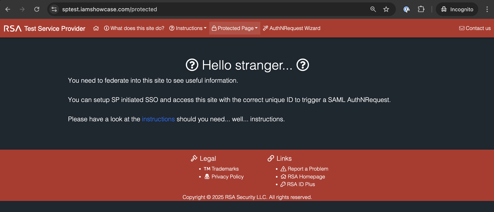
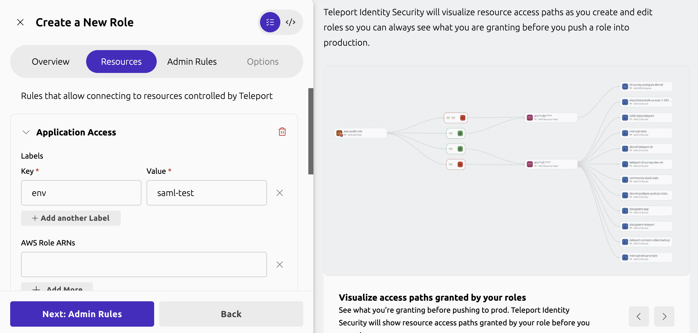
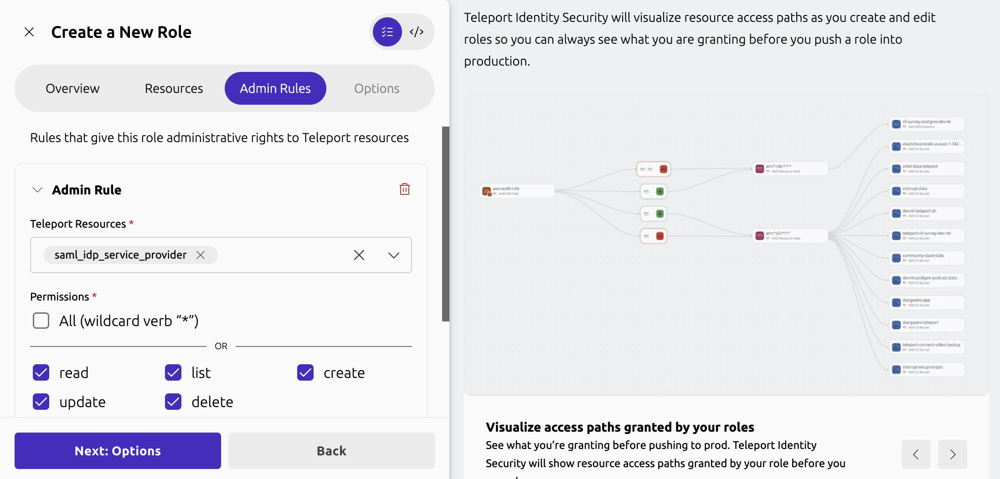
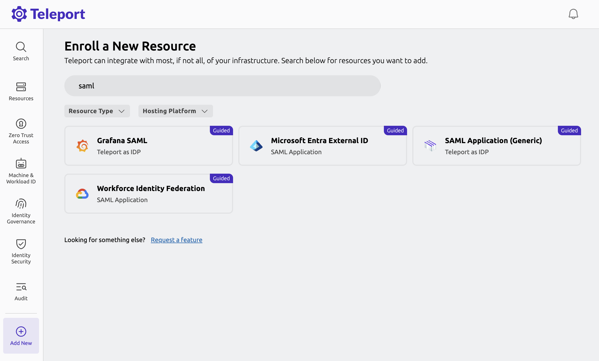
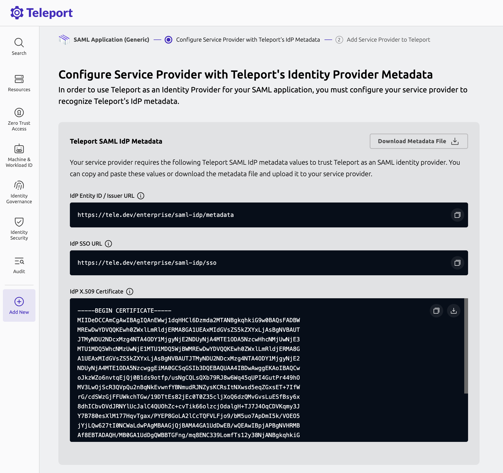
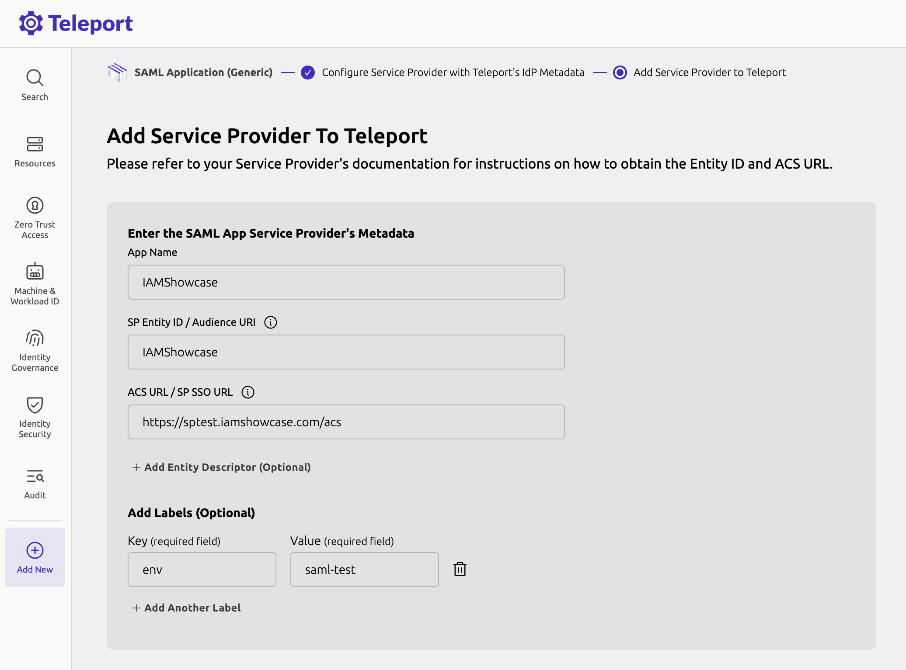
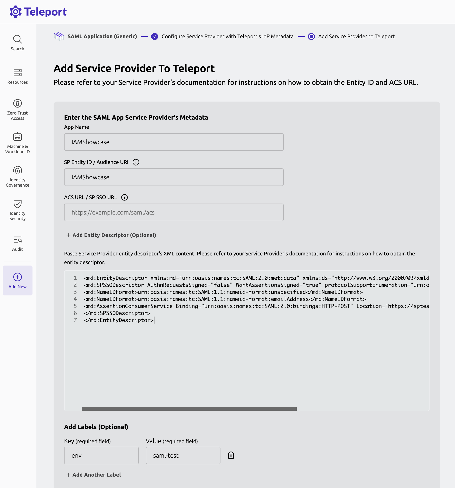
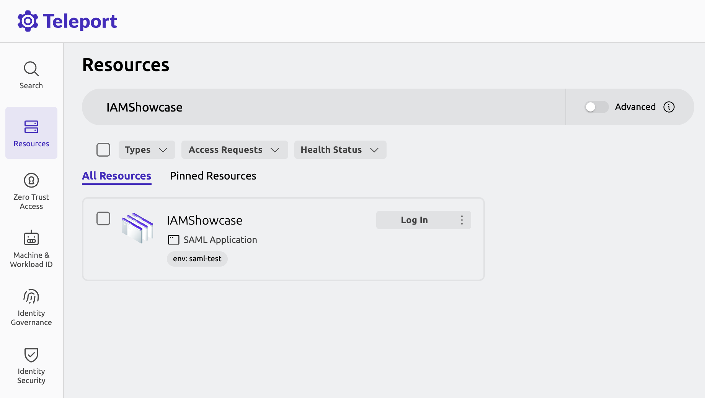
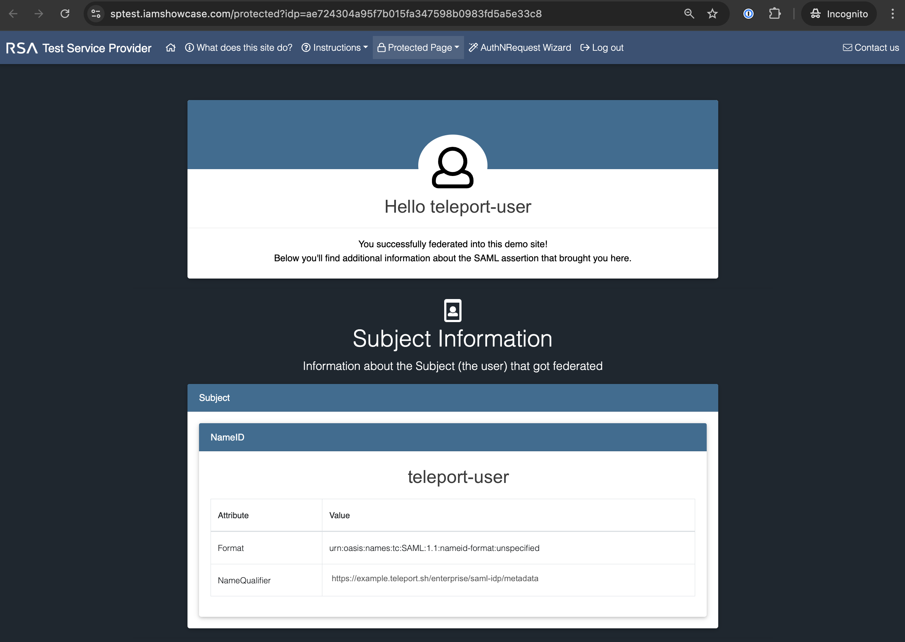

This guide details an example on how to use Teleport as a SAML identity provider
(IdP). You can set up the Teleport SAML IdP to enable Teleport users to
authenticate to external services through Teleport.

## How it works

On Teleport Enterprise deployments, the Teleport SAML IdP runs as part of the
Teleport Proxy Service and exposes paths of the Proxy Service HTTP API that
implement a SAML IdP. You can register a third-party application with the IdP by
creating a Teleport dynamic resource, the SAML IdP service provider, that
includes information about the application.

## Prerequisites

(!docs/pages/includes/edition-prereqs-tabs.mdx edition="Teleport Enterprise"!)

- (!docs/pages/includes/tctl.mdx!)
- If you're new to SAML, consider reviewing our [SAML Identity Provider
  Reference](../../reference/access-controls/saml-idp.mdx) before proceeding.
- SAML application (also known as a SAML service provider or SP) for testing. 
  For this guide, we'll be using [RSA Simple Test Service Provider](https://sptest.iamshowcase.com/) - 
  a free service that lets us test the Teleport SAML IdP. The test service 
  has a protected page, which can be accessed only after a user is federated to 
  the site with a valid SAML assertion flow. Below in this guide, we will refer 
  to this application as the "IAMShowcase" app. 


## Step 1/4. Create a role

As a first step, we will create a role which will grant permissions to manage 
a `saml_idp_service_provider` resource for the IAMShowcase app. 
The role will also grant permission to log in to this application 
by authenticating with Teleport. We will name this role as `saml-admin`.

In the Teleport Web UI, from the side the navigation menu, select **Zero Trust Access > Roles** 
menu. From the **Roles** UI, click `Create New Role` button. 

Enter "saml-admin" as a role name and then click the `Next: Resources` button to 
move to the "Resources" tab. 

{/* vale off */}
In the **Resources** tab, open the dropdown menu by clicking on the `+ Add Teleport Resource Access` 
button, then select **Application Access**. Enter "env" as the label key and "saml-test" 
as the label value. In the Step 3 of this guide below, we will create a SAML service 
provider resource with this matching label value `env: saml-test`, limiting 
scope of the permissions granted by this role.



Click `Next: Admin Rules` button to move to the **Admin Rules** tab.

In the **Admin Rules** tab, click `+ Add New` button. In the **Teleport Resources**
input box, search and select the `saml_idp_service_provider` resource. 
And then in the **Permissions** section, check `read, list, create, update, delete`
permissions.



Click `Next: Options` button to move to next step and then click `Create Role`
button to create a new role.

<details>

<summary>Reference YAML spec for the `saml-admin` role.</summary>
```yaml
kind: role
metadata:
  name: saml-admin
spec:
  allow:
    app_labels:
      env: saml-test
    rules:
    - resources:
      - saml_idp_service_provider
      verbs:
      - read
      - list
      - create
      - update
      - delete
version: v8
```
</details>

(!docs/pages/includes/add-role-to-user.mdx role="saml-admin"!) 

## Step 2/4. Configure the service provider

This step involves configuring the SAML service provider with the Teleport SAML IdP metadata.

You can obtain the Teleport SAML IdP metadata values from the SAML application 
setup wizard, which is available in the Teleport Web UI.

In the Teleport Web UI, select **Add New > Resource** menu, and search for 
"saml application". Choose the "SAML Application (Generic)" tile. 



As a first step of the SAML Application setup wizard, the Teleport Web UI displays
the Teleport SAML IdP metadata values. 

The process of SAML service provider configuration varies from service provider 
to service provider. Some service provider may ask to provide Teleport SAML IdP's 
entity ID, SSO URL and X.509 certificate explicitly. Other's may ask to upload 
the Teleport SAML IdP metadata (SAML entity descriptor) file .



In the case of IAMShowcase app, which this guide is 
based on, it is designed to grant access protected page for any well formatted 
IdP federated SAML assertion data.

As such, we will move to the next step in the setup wizard to add the IAMShowcase app to Teleport.

## Step 3/4. Add a service provider to Teleport

To add a service provider to Teleport, you must configure a service provider
metadata. This can be configured by either providing an entity ID and ACS URL 
values of the service provider or by providing an entity descriptor value 
(also known as metadata file, which is an XML file) of the service provider.

Below we'll show both of the configuration options.

### Option 1: Configure with entity ID and ACS URL

With this configuration method, Teleport first tries to fetch an entity 
descriptor by querying the entity ID endpoint. If an entity descriptor is not 
found at that endpoint, Teleport will generate a new entity descriptor with the 
given entity ID and ACS URL values.

To configure the IAMShowcase app, the values you 
need to provide are the following:
- **App Name:** `IAMShowcase`.
- **SP Entity ID / Audience URI:** `IAMShowcase`. The SAML metadata value or an 
  endpoint of the service provider.
- **ACS URL / SP SSO URL:** `https://sptest.iamshowcase.com/acs`. The endpoint 
  where users will be redirected after SAML authentication. ACS URL is also 
  referred to as SAML SSO URL.
- **Label:** `env: saml-test`. Label will be used in RBAC.



Click `Finish` button. The "IAMShowcase" app is now added to Teleport.

### Option 2: Configure with Entity Descriptor file

With this option, you provide the service provider entity descriptor file, which 
has all the details required to configure service provider metadata.

If the service provider provides an option to download its entity descriptor file 
or you need more control over the entity descriptor, this is the recommended 
option to add a service provider to Teleport.

To configure the IAMShowcase app, the values you need to provide are the following:
- **App Name:** `IAMShowcase`.
- **Entity Descriptor:** Entity descriptor for the IAMShowcase app 
  which is available in this URL: `https://sptest.iamshowcase.com/testsp_metadata.xml`.
- **Label:** `env: saml-test`.



Click `Finish` button. The "IAMShowcase" app is now added to Teleport.

<Admonition type="important">
If an entity descriptor is provided, its content takes preference over values 
provided for entity ID and ACS URL.
</Admonition>

## Step 4/4. Verify access to the protected page

To verify everything works, navigate to the **Resources** page in the Teleport Web UI 
and search for the "IAMShowcase" app.



From the "IAMShowcase" app tile, click the `Log in` button, which will forward 
you to the IAMShowcase app's protected page with a SAML assertion data signed by 
the Teleport SAML IdP.



This page shows Teleport user details along with other attributes such as role 
names that are federated by the Teleport SAML IdP, confirming a successful SAML 
service provider configuration in Teleport.


## Manage SAML IdP service provider resource using `tctl`

Examples of managing a `saml_idp_service_provider` resource using `tctl`.

### Create a `saml_idp_service_provider` resource

First, create a Teleport resource spec file with the following `saml_idp_service_provider`
resource spec:

```yaml
cat > iamshowcase.yaml << EOF
kind: saml_idp_service_provider
metadata:
  labels:
    env: saml-test
  # The resource name of the service provider.
  name: IAMShowcase
spec:
  acs_url: https://sptest.iamshowcase.com/acs
  entity_id: IAMShowcase
version: v1
EOF
```

Next, create a Teleport resource using the `tctl create` command:

```code
$ tctl create iamshowcase.yaml
# SAML IdP service provider 'IAMShowcase' has been created.
```

### Update a `saml_idp_service_provider` resource

To update the resource, first, get the latest copy of the resource spec 
from the Teleport cluster.
```code
$ tctl get saml_idp_service_provider/IAMShowcase > iamshowcase.yaml
```

Then modify the spec by updating the `iamshowcase.yaml`, save it, and then update 
the Teleport resource by using the `tctl create -f` command:
```code
$ tctl create -f iamshowcase.yaml 
```

### List `saml_idp_service_provider` resources
To list a specific service provider:
```code
$ tctl get saml_idp_service_provider/IAMShowcase 
```

To list all the service providers:
```code
$ tctl get saml_idp_service_provider 
```

### Delete a `saml_idp_service_provider` resource
```code
$ tctl rm saml_idp_service_provider/IAMShowcase 
```

## Next steps

- Learn how to [control access](saml-idp-rbac.mdx) to the SAML IdP service provider resource.
- Configure [SAML Attribute Mapping](./saml-attribute-mapping.mdx).
