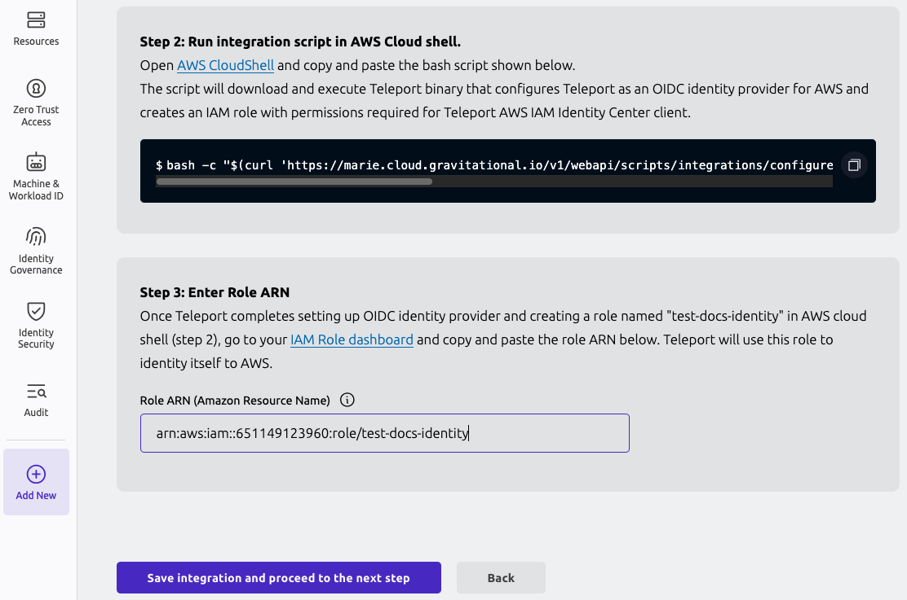

Teleport's integration with [AWS IAM Identity Center](https://aws.amazon.com/iam/identity-center/)
allows you to organize and manage your users' short- and long-term access to AWS
accounts and their permissions.

## How it works

The Teleport Web UI provides a guided configuration flow for the Identity Center
integration. The AWS IAM Identity Center integration fetches Identity Center
accounts, users, groups, permission set assignments, and other data. To enable
the integration, you set up Teleport as an OIDC identity provider for your AWS
account and create an AWS role with the permissions required for the integration
to function. You then enable the SCIM endpoint in AWS Identity Center to allow
Teleport to push user and group changes.

## Prerequisites

- Teleport Enterprise or Teleport Enterprise Cloud cluster version 17.0 or higher.
- Administrative access to AWS IAM Identity Center.
- Teleport preset `editor` role or equivalent to configure plugin resource, integration 
  resource and SAML IdP service provider resource. If you are using [role version 8](../../../reference/access-controls/roles.mdx#role-versions) 
  to manage access (which is the default role version since Teleport version 18.0), 
  ensure that your role allows `app_labels` for the AWS IAM Identity Center 
  resource `'teleport.dev/origin': 'aws-identity-center'`.

Note that Identity Center integration requires using Teleport as an external
identity source.

As such, we recommend ensuring that all Identity Center users have access to
your Teleport cluster before turning the integration on to avoid access
interruption. If your Identity Center already uses external identity source,
you can configure the corresponding [SSO connector](../../../zero-trust-access/sso/sso.mdx)
in Teleport or, if you're using Okta, enable the
[Okta integration](../okta/okta.mdx).

## Step 1/7. Configure AWS integration

To get started, navigate to the "Add new integration" page in your Teleport
cluster control panel and select "AWS Identity Center".


Next, you will generate a script that creates an AWS IAM role for the
integration.

<details>
<summary>Full list of IAM permissions required by Identity Center integration</summary>
```
// ListAccounts
organizations:ListAccounts
organizations:ListAccountsForParent

// ListGroupsAndMembers
identitystore:ListUsers
identitystore:ListGroups
identitystore:ListGroupMemberships

// ListPermissionSetsAndAssignments
sso:DescribeInstance
sso:DescribePermissionSet
sso:ListPermissionSets
sso:ListAccountAssignmentsForPrincipal
sso:ListPermissionSetsProvisionedToAccount

// CreateAndDeleteAccountAssignment
sso:CreateAccountAssignment
sso:DescribeAccountAssignmentCreationStatus
sso:DeleteAccountAssignment
sso:DescribeAccountAssignmentDeletionStatus
iam:AttachRolePolicy
iam:CreateRole
iam:GetRole
iam:ListAttachedRolePolicies
iam:ListRolePolicies

// AllowAccountAssignmentOnOwner
iam:GetSAMLProvider

// ListProvisionedRoles
iam:ListRoles
```
</details>


Enter required information such as Identity Center region, ARN and integration
name, and execute the generated command in the Cloud Shell.

After the script has run, fill out the ARN for the role created by the script.



## Step 2/7. Preview AWS resources

On the next step, you are presented with the list of AWS accounts, groups, and
permission sets that Teleport was able to find in your Identity Center.


Pick the default owners that should be assigned to the Access Lists in Teleport.
These resources will be imported into Teleport once the plugin is installed.

## Step 3/7. Configure identity source

<Admonition type="warning">
After this step, Teleport will become your Identity Center's identity provider.

To avoid access interruptions, we recommend making sure that all existing
Identity Center users have access to your Teleport cluster by, for example, using
the same [IdP](../../../zero-trust-access/sso/sso.mdx) as your current Identity Center
external identity source.
</Admonition>

In this step, you will configure Teleport as an SAML IdP for the AWS IAM Identity 
Center. 

You will also configure AWS IAM Identity Center as an SAML service provider in 
Teleport.

Follow the instructions to change your Identity Center's identity source to
Teleport.


## Step 4/7. Enable SCIM

The final step is to enable the SCIM endpoint in your Identity Center to
allow Teleport to push user and group changes.


Make sure to test SCIM connection after enabling it.

## Step 5/7. Verify the integration

Navigate to the Access Lists view page in your cluster and make sure that all
your Identity Center groups have been imported.

<Admonition type="note">
It may take a few minutes for the initial sync to complete.
</Admonition>


Imported Access Lists should show the same members as their corresponding
Identity Center groups.

## Step 6/7. Configure access

You need two kinds of Teleport role permissions to access the AWS accounts:
- A permission that allows access to the SAML service provider which logs you into the 
  AWS Console. You configured this SAML service provider for the AWS IAM Identity Center
  in Step 3.
- A permission that allows access to the AWS account and permission set. 

### Configure access to the SAML service provider

First, we will configure an access to the SAML service provider that logs you 
into the AWS Console.

In the Teleport Web UI, from side navigation menu, select "Zero Trust Access > Roles".
From the "Roles" UI, click "Create New Role" button. Switch to the YAML editor.


Copy the role spec shown below and paste it in the role editor to create a new role.
```yaml
kind: role
version: v8
metadata:
  name: identity-center-access
spec:
  allow:
    app_labels:
      'teleport.dev/origin': 'aws-identity-center'
```

Notice that in the role spec above, the `app_labels` defines a `'teleport.dev/origin': 'aws-identity-center'`
label. This is the default resource label which Teleport assigns to the SAML service 
provider resource created for the AWS IAM Identity Center. 

Grant this role to the users so they can log in to the AWS Console. Note that users
still needs access to the AWS account and permission set, which is explained below. 

### Configure access to the AWS account and permission set

Once you ensure that users have access to the SAML service provider created for the 
AWS IAM Identity Center, the next step is to grant permission to the 
AWS accounts and permission sets.

When the Teleport AWS IAM Identity Center integration service is run for the first time, 
Teleport preserves the current state of the group-based account and permission set
assignments that exists in your AWS IAM Identity Center instance. If a user has 
had an access to an AWS account based on their membership to a group, they will 
continue to have that access.

If you want to configure a new sets of AWS account access for a user, you will 
have to grant them an account assignment role. An account assignment role defines 
an `account_assignment` rule that binds an AWS account with the AWS permission set. 

Teleport creates an account assignment role for each of the cartesian product of 
the AWS account and a permission set which is available in your AWS IAM Identity 
Center instance. These roles have the following role name format: 
`<permission-set-name>-on-<account-name>-<account-id>` (e.g. `AdministratorAccess-on-MyAccount-012345678`).

You may use these auto-generated roles, or create an entirely new role that defines
an `account_assignment` rule. Below is an example of such a role, which allows
access to the two different AWS accounts and permission sets.

```yaml
kind: role
version: v8
metadata:
  name: identity-center-access
spec:
  allow:
    app_labels:
      'teleport.dev/origin': 'aws-identity-center'
    account_assignments:
    - account: "<account_id>" # AWS identity center account ID
      # permission set ARN of AdministratorAccess
      permission_set: arn:aws:sso:::permissionSet/ssoins-1234/ps-5678
    - account: "<account_id>"
      # permission set ARN of ReadOnlyAccess
      permission_set: arn:aws:sso:::permissionSet/ssoins-1234/ps-8765 
```

This role can then be granted to the users either by a direct assignment, 
Access List role grants or by using the Access Request workflow.

## Step 7/7. Connect to AWS

Once the integration is up and running, and you have the required permissions,
you will see an application named `aws-identity-center` among your resources:


Clicking the "Log In" button for this app takes you to your Identity Center
SSO start page which you can use to pick a role and connect to your AWS account
as usual.

## Usage scenarios

Let's take a look at some common usage scenarios enabled by the Identity Center
integration.

### Managing Account Assignments with Access Lists

Teleport creates an Access List for each group imported from the Identity Center
instance, with group members becoming Access List members. Default Access List 
owners are configured during the initial integration enrollment flow and can be
adjusted as necessary after the initial sync completes.

Each imported Access List is automatically assigned a role (or a set of roles)
that grant all members of that list access to all of the Account Assignments
assigned to the corresponding AWS Identity Center group during the integration
setup. 

These Teleport-generated roles each represent a single Account Assignment, and
are named using `<permission-set-name>-on-<account-name>-<account-id>` convention
(e.g. `AdministratorAccess-on-MyAccount-012345678`). 

<Admonition type="warning">
These roles are considered system roles, and any edits or updates to them will
be automatically reverted. 
</Admonition>

To give a user permission granted by an already-existing Identity Center synced
Access List, an owner can add that user as a member which makes Teleport to add
the user to its corresponding Identity Center group.

<Admonition type="warning">
Currently all existing Teleport users are synced to Identity Center. Label-based
user filtering will be supported in a later release.
</Admonition>

Removing a member from an Identity Center synced Access List removes them
from the corresponding Identity Center group effectively revoking privileges.

In addition to membership changes, Teleport propagates changes in Access List
grants back to Identity Center as well. For example, imagine an Access List with
the roles `AdminAccess-on-my-account` and `ReadOnlyAccess-on-my-account`. If the
Access List owner removes the `AdminAccess-on-my-account` role from the Access Lists,
that change will be propagated back to AWS and the corresponding Identity Center
group will have its assignments updated to remove the `AdminAccess` Permission 

### Just-in-time Access with Resource Access Requests

Teleport represents the imported AWS accounts as apps in the Teleport Resource
View, with the permission sets available for each account bundled up inside the
app. AWS accounts are treated the same as any other Teleport-managed resource, 
so users can see what AWS permission sets they are allowed to request just by
checking "Show requestable resources" in the resource view. 

Users can then choose the specific Account Assignments they want access to by 
selecting from the Permission Sets available to each AWS Account. Users
can mix Permission Sets from multiple AWS Accounts, and even include other 
Teleport-managed resources if necessary.


Once the used has selected their desired Account Assignments, the Access Request
submission and review process is the same as for any other Teleport-managed
resource. Assuming the Access Request is approved, Teleport will create the
appropriate AWS Account Assignments in Identity Center to grant the requested
access. These AWS Account Assignments will automatically be deleted when the
Access Request expires.

The user can access their temporary AWS Accounts and Roles from within Teleport
by assuming the Access Request roles. 


<Admonition type="warning">
The AWS Account Assignments will exist for the lifetime of the Access Request,
regardless of when the user assumes the associated role(s).
</Admonition>

### Just-in-time access with role Access Requests

The Identity Center integration allows Teleport users to submit Access Requests for short-term privilege elevation.

When an Access Request for a role granting Identity Center privileges is
approved, Teleport creates an individual assignment for that user in the
Identity Center. The assignment is deleted when the Access Request expires.

### Long-term access with Access Requests

If a user requests access to Account Assignments that can also be granted via an
existing Access List, Teleport will offer the reviewer the option of *promoting*
the Access Request to long-term access.


When an Access Request is promoted to long-term access, the requesting user is
added to the targeted Access List. This membership change is propagated to the
corresponding Identity Center group, and the user is then granted their requested
Account Assignments via group membership.

## FAQ

### Which Access Lists are synced to Identity Center?

Teleport syncs all Access Lists that have AWS account and permission set rules
among their role grants to Identity Center.

### How does it work with nested Access Lists?

Identity Center does not support nested groups. As such, Teleport recursively 
flattens any [nested Access Lists](../../access-lists/nested-access-lists.mdx)
into a single Identity Center group containing all members reachable from the 
top-level Access List.

The flattened Identity Center group will be kept updated as members are added to
or removed from nested 

### How do I uninstall the integration?

<Admonition type="warning">
Before fully removing the integration, make sure to remember to change the
identity source in your Identity Center instance.
</Admonition>

Deleting the integration automatically removes all Teleport resources it used to manage its state, including:

- Teleport roles created for AWS Identity Center account assignments.
- Access Lists imported from AWS Identity Center groups.

However, user-created resources remain intact, including:

- Access Lists you created.
- Roles you manually configured for account assignments.

If an Access List grants permissions to a now-deleted integration role, or if a user
has a deleted role assigned directly, you must manually remove those references.

If you decide not to switch to Teleport, you can delete the Identity Center integration in two ways.

You can remove the integration by navigating to your cluster's Integrations
list and deleting both the integration named `AWS IAM Identity Center`. The AWS
OIDC integration that was created during the first enrollment step will be
automatically removed as well once the plugin is uninstalled.

To clean up AWS resources created for the integration, remove the Identity
Provider and its role from your AWS IAM console as well.

## Troubleshooting

### Access forbidden during AWS account login

This may happen if the user does not have access to the SAML IdP service provider 
resource created for the AWS IAM Identity Center. 

First, check the SAML IdP audit event which can be found in the Teleport Audit Log UI. 


More detail on the error message can be found by clicking on the "Details" button.

Example of a failed login audit log due to missing permission:
```
{
  "cluster_name": "example.teleport.sh",
  "code": "TSI000I",
  "ei": 0,
  "error": "access to saml_idp_service_provider denied. User does not have permissions. ",
  "event": "saml.idp.auth",
  "service_provider_entity_id": "https://ca-central-1.signin.aws.amazon.com/platform/saml/d-xxxxxx",
  "sid": "",
  "success": false,
  "time": "2025-09-03T04:36:40.123Z",
  "uid": "7523b6cc-313e-4f56-9f58-3f1b91075c4d",
  "user": "example-user"
}
```

To resolve RBAC errors, first, identify what roles are assigned to the user. 

If the user has been assigned with a Teleport role of version 8, 
the role must define `app_labels` matching the `teleport.dev/origin: aws-identity-center`
label.

```yaml
kind: role
version: v8
metadata:
  name: ic-access-example
spec:
  allow:
    app_labels:
      'teleport.dev/origin': 'aws-identity-center'
```

If the role requires Device Trust, the user must have a device authenticated 
Teleport web session.

If the role requires a session MFA, the user must authorize the login flow with MFA.

If the user is assigned with a Teleport role version 7 or below, 
check if the IdP role option is not disabled: 
```yaml
kind: role
version: v7
metadata:
  name: ic-access-example
spec:
  options:
    idp:
      saml:
        enabled: true # idp must be enabled.
```


## Next steps

- Take a deeper dive into fundamental Teleport concepts used in Identity Center
  integration such as
  [RBAC](../../../zero-trust-access/authentication/authentication.mdx),
  [JIT Access Requests](../../access-requests/access-requests.mdx),
  [Access Lists](../../access-lists/access-lists.mdx)
  and the [Teleport SAML IdP](../../idps/idps.mdx).
- Learn how to enable the [Okta integration](../okta/okta.mdx)
  to sync apps, users and groups from Okta in conjunction with Identity Center
  integration.
