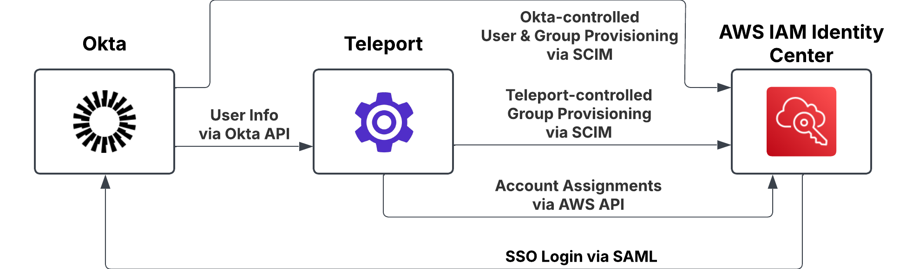

This guide describes how to introduce Teleport into an existing Okta-managed AWS
IAM Identity Center configuration. It specifically describes two scenarios: one where 
Teleport shares control of your Identity Center managed resources in conjunction
with Okta, and another where Teleport replaces Okta as the Identity Center SSO
Provider and user provisioner

## How it works

You can introduce Teleport into an existing Okta-managed AWS IAM Identity Center
instance in one of two ways:
- **Partial hand-off** (also called _Hybrid mode_): Keep Okta as the User provisioner
and SSO provider for the AWS IAM Identity Center instance, but delegate account
assignment and (some) Identity Center group provisioning to Teleport, or
- **Full hand-off**: Fully transfer the control of AWS IAM Identity Center from
Okta to Teleport, including user provisioning, group provisioning, account assignment provisioning and SAML SSO.

For simplicity, we recommend full hand-off. 

In both cases, the AWS IAM Identity Center SCIM bearer token must be shared with
Teleport, as Teleport uses SCIM even in Partial hand-off mode to provision Identity
Center groups and manage Group membership.

## Prerequisites

- A Teleport cluster.
- An AWS role configured as per the [AWS IAM Identity Center guide](./guide.mdx#step-17-configure-aws-integration)
  for the integration to use.
- AWS credentials configured for the Teleport Auth Service to pick up and use
  (e.g. as environment vars, system profiles, etc).
- An Okta API token, with the following privileges:
  - View users and their details.
  - View groups and their details.
  - View applications and their details.
- The AWS IAM Identity Center ARN, AWS region, SCIM base address and SCIM bearer token.

## Partial hand-off (Hybrid setup)

We will start by setting up Teleport, Okta and Identity Center in a Partial hand-off
configuration, covering
- integrating Okta and Teleport, ensuring that all users Okta users provisioned 
  into Identity Center are also provisioned into Teleport,
- configuring Teleport to manage groups and account assignments in Identity Center
- setting up Teleport group import rules so that Identity Center groups managed
  by Okta are not overridden by Teleport.

Once this initial setup is complete you can either run in Partial hand-off mode indefinitely, or
use the Partial hand-off configuration as a stepping stone towards a full hand-off integration.

<Admonition type="warning" title="Teleport will not disable locked or deactivated Teleport users in AWS">
Given the nature of a Partial hand-off configuration it is trivial for the external
IdP (in this case, Okta) to re-activate an AWS user deactivated by Teleport, without
Teleport being aware of it.

To avoid confusion, when in a Partial hand-off configuration Teleport assumes that
_all_ user-related provisioning will be managed by the external IdP, including
deactivating and re-activating users as necessary. Teleport will **not** propagate
Teleport user locks to Identity Center users, nor strip an Identity Center user's 
account assignments or group memberships in response to a Teleport lock.

To prevent a deactivated user accessing AWS resources, they need to be forbidden
from logging in to AWS via the external IdP SSO provider.
</Admonition>

<Admonition type="tip" title="Note">
  If you already have an Okta integration set up in Teleport, can ensure that users and groups 
  that exist in AWS IAM Identity Center are already synced to Teleport, and want Teleport to fully 
  control AWS IAM Identity Center, you can switch to Teleport right away, without the need for migration. 

  See [Getting Started with AWS IAM Identity Center integration](./guide.mdx).
</Admonition>

### Starting Point

This is our starting configuration: Okta as sole Identity Source for Identity Center.


### Destination

At this point Okta remains in control of User provisioning and SSO, while 
Teleport controls Identity Center groups and account assignments. 



Specifically:
 - Okta provides SSO login for Identity Center.
 - Okta manages a subset of the Identity Center group membership (selected via Push Groups in Okta).
 - Okta controls user provisioning via SCIM.
 - Teleport manages a second subset of Identity Center groups (selected via group filters during plugin installation).
 - Teleport controls Identity Center group account assignments for the Identity Center groups under its control.
 - Teleport controls direct Identity Center user account assignments for the Identity Center users under its control.

### Step 1/6. Install Okta SAML connector

Install Okta SAML connector into Teleport as per the Teleport
[Okta as an SSO provider](../../../zero-trust-access/sso/okta.mdx) guide.

<Admonition type="note">
 For the integration to function properly, both AWS IAM Identity Center and Teleport must view the
 same user set which can be achieved by using the same Okta SAML application for both Identity
 Center and Teleport SAML connector.

 If this is not possible, the most flexible approach we've found is having an
 an Okta Group for those users that should have Identity Center access, and then assigning
 both the Okta Identity Center App and the Okta SAML App used for Teleport SAML
 connector to that group. This ensures that the same user set is visible across
 both applications.
</Admonition>

You will need the Teleport SAML Connector Name and Okta SAML App ID in the next
step.

### Step 2/6. Install the Teleport Okta integration

We will be using a very limited subset of the Teleport Okta integration in this
deployment, disabling all features except periodic user synchronization. This
configuration is not currently supported by the normal installation UI, so we
will have to use `tctl` to install it:

```console
$ tctl plugins install okta \
    --org ${OKTA_ORG_URL} \
    --saml-connector ${TELEPORT_SAML_CONNECTOR_NAME} \
    --app-id ${OKTA_SAML_APP_ID} \
    --api-token ${OKTA_API_TOKEN} \
    --no-scim \
    --no-accesslist-sync \
    --no-appgroup-sync
```

This will install the Okta integration and start the user sync service with a
configuration that:
- Imports Okta users assigned to the Okta App `${OKTA_SAML_APP_ID}`, and keeps
  them synced with the upstream Okta organization.
- Does *not* expose a SCIM service.
- Does *not* attempt to sync or manage any other resources from Okta.

You can monitor the state of the Okta integration in the Teleport Integrations UI.

### Step 3/6. Wait for user sync

To make sure everything is working, wait until the first Okta to Teleport user
sync has occurred. You can verify this by either
 - Refreshing the user page and finding your Okta users, or
 - Checking the Okta integration status page.

Once your Okta users are imported into Teleport, you can progress to the next
step.

### Step 4/6. Install the Teleport AWS IAM Identity Center integration

Again, we need to install the plugin using `tctl`.

```console
$ tctl plugins install awsic \
    --instance-arn ${IDENTITY_CENTER_INSTANCE_ARN} \
    --instance-region ${IDENTITY_CENTER_INSTANCE_REGION} \
    --use-system-credentials \
    --assume-role-arn ${AWS_IAM_ROLE_ARN} \
    --scim-url ${IDENTITY_CENTER_SCIM_BASE_URL} \
    --scim-token ${IDENTITY_CENTER_SCIM_BEARER_TOKEN} \
    --access-list-default-owner ${TELEPORT_ACCESS_LIST_DEFAULT_OWNER} \
    --user-origin okta \
    --account-name ${ACCOUNT_NAME_ALLOW_FILTER} \
    --group-name ${GROUP_NAME_ALLOW_FILTER}
```

This will install the Teleport AWS IAM Identity Center integration with a
Teleport configuration that:
- Controls the AWS IAM Identity Center instance indicated by `--instance-arn`.
- Uses the system AWS credentials to authenticate with AWS (from `--use-system-credentials`)
  and assumes the IAM role indicated by `--assume-role-arn`.
- Manages account assignments all AWS accounts that match the `${ACCOUNT_NAME_ALLOW_FILTER}`.
- Provisions all users imported from Okta into AWS IAM Identity Center (from the `--user-origin okta` flag).
- Only imports all groups matching `${GROUP_NAME_ALLOW_FILTER}` into Teleport as Access
  Lists, with `${TELEPORT_ACCESS_LIST_DEFAULT_OWNER}` as the owner.

<Admonition type="note">
Note that the `tctl` installer currently only supports installations using
system-level AWS credentials with `--use-system-credentials`.

Using system-level credential is also the recommended way to provide AWS credential when
configuring integration in the Teleport Enterprise self-hosted deployment.
</Admonition>

You can change the AWS account, group and user filters later by following the
instructions in the [Extending the Integration](#extending-the-integration) section
below.

During the installation process, Teleport will import all of the Identity Center
groups that match its allow list (or all of them, if no allow list is defined)
and create matching Access Lists, preserving the group membership and account
assignments.

For more installation options, such as disabling the creation of Teleport Roles
for each Account Assignments, see the [Advanced Options](./advanced-options.mdx) guide.

<Admonition type="warning">
Individual user account assignments will ***not*** be preserved during import. You
will need to ensure these are preserved manually, or converted to group assignments
prior to installation.
</Admonition>

#### Group import control

The Group import allow list is controlled by the `--group-name` option. You can
specify multiple filters and a Group will be imported if matches _any_ of the
supplied filters. Filters can be either literal names, globbed names or Go
compatible regular expressions. To treat a filter as a regular expression,
enclose it in a leading `^` and trailing `$`.

Example filters:
 - `administrators`: The literal "administrators" group
 - `site-*`: Any group with the prefix `site-`
 - `^(?:[^a]|a[^w]|aw[^s]|aws[^\-]).*$`: Any group that does ***not*** have the prefix `aws-`

Ensure that there is no overlap between the groups imported to Teleport and the
groups you want Okta to maintain control over.

<Admonition type="warning">
Avoid creating an Access List with the same name as a Push Group managed by Okta.
Teleport will attempt to adopt the group, and may change the group membership.
Deleting the Teleport Access List and forcing a re-push from Okta should restore
access.
</Admonition>

#### User provisioning control

Your Teleport cluster may have a mix of local Teleport users (e.g. a local Admin
user) and users imported from Okta. By default, Teleport will try to provision
_all_ Teleport users into Identity Center. You can control which users are
provisioned by the Identity Center integration with the `--user-origin` and
`--user-filter` arguments. In the example above, the `--user-origin okta` will
restrict Teleport to only provisioning users that are synced from Okta, and
excluding all local Teleport users.

#### AWS account import control

By default, Teleport will take control of account assignments for all AWS Accounts
managed by Identity Center. You can create an allow-list of AWS Accounts to
import with the  `--account-name` and `--account-id` install options.

The `--account-name` filters work like the `--group-name` filters above. The
`--account-id` filters specify a literal AWS Account ID.

Teleport will not create or delete account assignments on AWS accounts outside
of its allow-list.

### Step 5/6. Migrate AWS account

We have now configured the Teleport Identity Center integration in partial hand-off
mode, and ready to migrate account assignments from Okta-managed groups into new
Teleport-managed Access Lists. To migrate groups, create a new Access List in 
Teleport (taking care _not_ to use the same name as the existing Okta-managed Group) 
and create the appropriate memberships and account assignments.

Account assignments can be created on an Access List by assigning it the Account
Assignment roles created by the Identity Center integration, assigning it a
custom Teleport role that specifies a specific combination of access, or a
combination of each.

For more information, see the [Identity Center integration guide](./guide.mdx).

### Step 6/6. Retire Okta group provisioning

Once you are satisfied that an AWS IAM Identity Center group has been migrated to 
Teleport control, you can remove the corresponding push Group from the Okta
Identity Center integration.

## Full hand-off

Teleport, Okta and Identity Center are now running in partial hand-off mode. It is
perfectly fine to continue running Teleport this way indefinitely, but you can also
use the Partial hand-off configuration as a stepping stone towards a full
hand-off integration. 

Moving from Partial- to Full hand-off fully transfers control of AWS users and
groups to Teleport, including SSO login.


<Admonition type="note">
Teleport generally has much less information about users than Okta, so when Teleport
takes over user provisioning from Okta it may strip user attributes from your
Identity Center users.

Please ensure that your AWS security policies do not rely on any user attributes
beyond the username and ID.
</Admonition>

### Step 1/4. Create a Teleport SAML IdP Service Provider

To operate in Full hand-off mode Teleport needs to be the Identity Source for
your AWS Identity Center instance by providing SAML authentication for your users.
To do this we need to create a Teleport SAML Service Provider configured for your
Identity Center instance.

#### Obtain the Identity Center SAML Metadata

You can get the Identity Center SAML metadata file from AWS by following the AWS 
[How To Connect to an External Identity Provider](https://docs.aws.amazon.com/singlesignon/latest/userguide/how-to-connect-idp.html)
guide. Once you have the metadata file you will need to pause configuring AWS
and switch back to Teleport.

#### Create the Teleport SAML Service Provider

Create a SAML Service Provider in Teleport following the (Using Teleport as a SAML
Identity Provider)[../idps/saml-guide.mdx] guide. Use the Identity Center SAML
Metadata file from the previous step to provide the Identity Center metadata to
Teleport.

While creating the Teleport SAML service provider, download the Teleport IdP metadata
when offered. You will need this to finish configuring the Identity Source in
Identity Center.

### Step 2/4. Configure Identity Center to use Teleport as its Identity Source

Once you have created the Teleport SAML Service Provider you can finish configuring 
the new Identity Center Identity Source. Continue following the AWS [How To Connect to an External Identity Provider](https://docs.aws.amazon.com/singlesignon/latest/userguide/how-to-connect-idp.html)
guide, uploading the Teleport IdP Metadata file when prompted. 

### Step 3/4. Switch Teleport to Full hand-off Mode

Teleport uses the absence of a SAML service provider name in the Identity Center
configuration to trigger running in Partial hand-off mode. To switch Teleport to
Full hand-off mode we need to link the Identity Center integration and the 
SAML Service Provider created in the previous step.

This can currently only be done by manually editing the integration configuration
with `tctl`.

<Admonition type="warning">
Manually editing the Identity Center's plugin resource using `tctl` is a
dangerous operation. Please ensure you take a backup of the plugin resource in
order to roll back if necessary.

A guided editing workflow is currently under development.
</Admonition>

The plugin resource is a YAML document describing the Identity Center integration 
configuration. Running `tctl edit` will fetch the resource and open it your
configured editor, for example:

```console
$ tctl edit plugins/aws-identity-center
```

To enable Full hand-off mode, set the `saml_idp_service_provider_name` field in
the `aws_ic` block to the name of the SAML Service Provider created in (Step 1)[#step-14-create-a-teleport-saml-idp-service-provider] above. 

```YAML
kind: plugin
version: v1
metadata:
  labels:
    teleport.dev/hosted-plugin: "true"
  name: aws-identity-center
spec:
  Settings:
    aws_ic:
      arn: arn:aws:sso:::instance/ssoins-722326ecc902a06a
      access_list_default_owners:
        - admin
      credentials:
        system:
          assumeRoleArn: arn:aws:iam::637423191929:role/idc-integration
      provisioning_spec:
        base_url: https://scim.us-east-1.amazonaws.com/f3v9c6bc2ca-b104-4571-b669-f2eba522efe8/scim/v2
      region: us-east-1

      # add or edit this to match your SAML Service Provider name
      saml_idp_service_provider_name: aws-identity-center-sso
```

Saving and closing the resource editor will update the Identity Center config and
restart the Identity Center integration in Full Hand-Off mode. 

### Step 4/4. Retire Okta Identity Center integration

Once Teleport has full control over provisioning into Identity Center, you can
deactivate the Identity Center integration in Okta. Leaving the Okta Identity
Center integration in place will cause Teleport and Okta to both try and control
the user information 

## Extending the integration 

You can add or remove filters to the various filter sets with `tctl edit`. 

<Admonition type="warning">
This currently involves manually editing the Identity Center Integration's plugin
resource using `tctl`, which is a dangerous operation. Please ensure you take a
backup of the plugin resource in order to roll back if necessary.

A guided editing workflow is currently under development.
</Admonition>

```
$ tctl edit plugins/aws-identity-center
```

Once you save and quit the editor, `tctl` will replace the existing resource
with your updated version. This will automatically restart the Identity Center
Integration with the new filters.

```YAML
kind: plugin
version: v1
metadata:
  labels:
    teleport.dev/hosted-plugin: "true"
  name: aws-identity-center
spec:
  Settings:
    aws_ic:
      arn: arn:aws:sso:::instance/ssoins-722326ecc902a06a
      access_list_default_owners:
        - admin
      credentials:
        system:
          assumeRoleArn: arn:aws:iam::637423191929:role/idc-integration
      provisioning_spec:
        base_url: https://scim.us-east-1.amazonaws.com/f3v9c6bc2ca-b104-4571-b669-f2eba522efe8/scim/v2
      region: us-east-1

      # Account import filters. An absent or empty list of filters implies 
      # "manage all AWS accounts"      
      aws_accounts_filters:
      - Include:
          id: "058264527036"
      - Include:
          name_regex: ^Staging-.*$

      # User provisioning filters. An absent or empty list of filters implies 
      # "provision all users to AWS"
      user_sync_filters:
      - labels:
          teleport.dev/origin: okta

      # Group import filters, as per the "Group import control" section above
      group_sync_filters:
      - Include:
          name_regex: '^Group #00\d+$'
```

Saving the updated resource and quitting the editor will update the remote
configuration and restart the Identity Center integration with the new settings.

Any change to the `group_sync_filters` field will also trigger a new group import
cycle, which may be time consuming for Identity Center instances with lots of
users and groups.

## Deleting the AWS IAM Identity Center integration

Deleting the integration automatically removes all Teleport resources it used to manage its state.

The impact of plugin deletion and general consideration is explained in the [AWS IAM Identity Center guide](./guide.mdx#how-do-i-uninstall-the-integration).

Delete AWS IAM Identity Center plugin with `tctl`.

```
$ tctl plugins delete aws-identity-center
```
## Next Steps

- Take a deeper dive into fundamental Teleport concepts used in Identity Center
  integration such as
  [RBAC](../../../zero-trust-access/authentication/authentication.mdx),
  [JIT Access Requests](../../access-requests/access-requests.mdx) and 
  [Access Lists](../../access-lists/access-lists.mdx).
- See how to [use Teleport-managed account assignments with the AWS command-line tools](./using-aws-cli.mdx). 