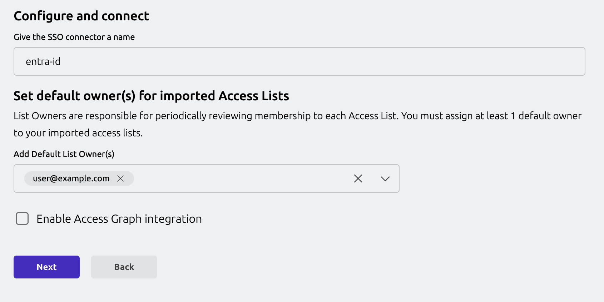
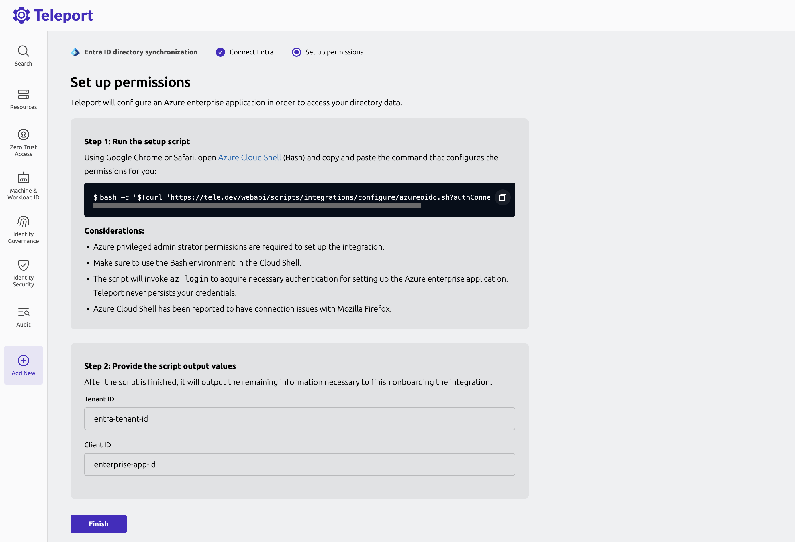

This guide shows how to configure Entra ID integration in a guided configuration set up. 

Teleport will generate a script that will configure your Entra ID tenant with the 
properties required for the Teleport Entra ID integration.

{/* lint ignore page-structure remark-lint */}

## Prerequisites

- Your user must have privileged administrator permissions in the Microsoft Entra ID tenant.
- Choose Microsoft Graph API [authentication method](entra-id.mdx#choosing-the-microsoft-graph-api-authentication-method). 

## Step 1/3: Generate configuration script
<Tabs groupId="entra-guided">
<TabItem default label="Teleport as OIDC provider (Web UI)" name="entra-oidc-ui">

In the Teleport Web UI, from the side-navigation, select “Add New > Integration”.

Next, select the “Microsoft Entra ID” tile. 

In the Teleport Microsoft Entra ID configuration UI, you will notice a default
integration name “entra-id” is already populated for you. You will need to select 
Teleport user(s) that will be assigned as the default owner of Access Lists that 
are created for your Entra ID groups. 



In the next step, you will be provided with a Entra ID configuration script.

</TabItem>

<TabItem label="Teleport as OIDC provider (tctl)" name="entra-oidc-tctl">

To begin integration, run the `tctl plugins install entraid` command.

```code
$ tctl plugins install entraid \
    --name entra-id-default \
    --auth-connector-name entra-id \
    --default-owner=<Var name="Access List Owner"/> \
    --auth-server <Var name="example.teleport.sh:443" /> 
```

The `--name` flag specifies the resource name of the Entra ID plugin. 
The `--auth-connector-name` flag specifies the name of the auth connector this integration will create.
The `--default-owner` flag specifies default owners for the Access Lists that will be created
in Teleport based on the groups imported from the Entra ID.

The command will generate a configuration script in the current directory 
from where the `tctl` is invoked. 

</TabItem>

<TabItem label="System credential (tctl)" name="entra-system-cred-tctl">

You will need to grant Azure Identity with the necessary permissions required for the Entra ID
integration.

In the Azure Portal, find the identities linked to your Teleport Auth Service,
and copy the Principal ID of the identity you wish to update with the new permissions.

After obtaining the Principal ID, open the [Azure Cloud Shell](https://portal.azure.com/#cloudshell/)
in PowerShell mode and run the following script to assign the required permissions to `<Var name="Principal ID" />`.

<details>
<summary>Assign required permissions to Azure Identity</summary>

```powershell
# Connect to Microsoft Graph with the required scopes for directory and app role assignment permissions.
Connect-MgGraph -Scopes 'Directory.ReadWrite.All', 'AppRoleAssignment.ReadWrite.All'

# Retrieve the managed identity's service principal object using its unique principal ID (UUID).
$managedIdentity = Get-MgServicePrincipal -ServicePrincipalId '<Var name="Principal ID" />'

# Set the Microsoft Graph enterprise application object.
# This is a service principal object representing Microsoft Graph in Entra ID with a specific app ID.
$graphSPN = Get-MgServicePrincipal -Filter "AppId eq '00000003-0000-0000-c000-000000000000'"

# Define the permission scopes that we want to assign to the managed identity.
# These are Microsoft Graph API permissions required by the managed identity.
$permissions = @(
  "Application.ReadWrite.OwnedBy"   # Permission to read application
  "Group.Read.All"     # Permission to read groups
  "User.Read.All"        # Permission to read users
)

# Filter and find the app roles in the Microsoft Graph service principal that match the defined permissions.
# Only include roles where "AllowedMemberTypes" includes "Application" (suitable for managed identities).
$appRoles = $graphSPN.AppRoles |
    Where-Object Value -in $permissions |
    Where-Object AllowedMemberTypes -contains "Application"

# Iterate over each app role to assign it to the managed identity.
foreach ($appRole in $appRoles) {
    # Define the parameters for the role assignment, including the managed identity's principal ID,
    # the Microsoft Graph service principal's resource ID, and the specific app role ID.
    $bodyParam = @{
        PrincipalId = $managedIdentity.Id  # The ID of the managed identity (service principal)
        ResourceId  = $graphSPN.Id         # The ID of the Microsoft Graph service principal
        AppRoleId   = $appRole.Id          # The ID of the app role being assigned
    }

    # Create a new app role assignment for the managed identity, granting it the specified permissions.
    New-MgServicePrincipalAppRoleAssignment -ServicePrincipalId $managedIdentity.Id -BodyParameter $bodyParam
}

```

</details>

Your identity principal `<Var name="Principal ID" />` now has the necessary permissions to list Applications,
Directories, and Policies.

Now, to begin integration, run the `tctl plugins install entraid` command.

```code
$ tctl plugins install entraid \
    --name entra-id-default \
    --auth-connector-name entra-id \
    --default-owner=<Var name="Access List Owner"/> \
    --auth-server <Var name="example.teleport.sh:443" /> \
    --use-system-credentials 
```

The `--name` flag specifies the resource name of the Entra ID plugin. 
The `--auth-connector-name` flag specifies the name of the auth connector this integration will create.
The `--default-owner` flag specifies default owners for the Access Lists that will be created
in Teleport based on the groups imported from the Entra ID.
The `--use-system-credentials` flag specifies the plugin will use the system credential configured
for the Auth Service.

The command will generate a configuration script in the current directory 
from where the `tctl` is invoked. 

</TabItem>
</Tabs>

## Step 2/3: Configure Entra ID

(!docs/pages/includes/identity-governance/azure-shell.mdx!)

## Step 3/3: Finish plugin installation

<Tabs groupId="entra-guided">
<TabItem default label="Teleport as OIDC provider (Web UI)" name="entra-oidc-ui">

Copy the Entra ID tenant ID and enterprise application client ID from the script output
and enter it in the Web UI to finish the integration.



</TabItem>

<TabItem label="Teleport as OIDC provider (tctl)" name="entra-oidc-tctl">

Copy the Entra ID tenant ID and enterprise application client ID from the script output
and enter it in the `tctl` to finish the integration.

</TabItem>

<TabItem label="System credential (tctl)" name="entra-system-cred-tctl">

Copy the Entra ID tenant ID and enterprise application client ID from the script output
and enter it in the `tctl` to finish the integration.

</TabItem>
</Tabs>

The integration is now configured and the Teleport Entra ID service will start 
importing resources from Entra ID to Teleport.

## Next steps

- [Configure Access](configure-access.mdx) for Entra ID users.
- Learn more about [Access List](../../access-lists/access-lists.mdx) management.
- Take a deeper look into setting up [Entra ID auth connector](../../../zero-trust-access/sso/entra-id.mdx). 
- Learn how the [Identity Security integration with Entra ID](../../../identity-security/integrations/entra-id.mdx) works. 
- See [FAQs](faq.mdx) related to the Teleport Entra ID integration. 
