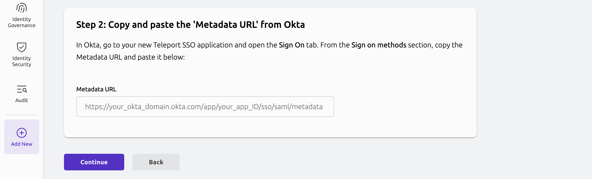

{/* lint disable page-structure remark-lint */}

The Teleport Okta SSO integration allows Teleport users to authenticate using
Okta as an identity provider. Teleport. The guided enrollment flow for the Okta
SSO integration is part of the [guided Okta integration](./okta.mdx). This
guide is a companion to the guided Okta SSO integration, showing you how to
perform required actions within Okta.

If you do not plan to enroll additional components of the guided Okta
integration, you can set up only the Okta SSO integration - called an
authentication connector - by following [Authentication With Okta as an SSO
Provider](../../../zero-trust-access/sso/integrate-idp/okta.mdx).
 
## Prerequisites

(!docs/pages/includes/edition-prereqs-tabs.mdx edition="Teleport Enterprise"!)

- (!docs/pages/includes/tctl.mdx!)
- An Okta organization with admin access.

## Step 1/4. Choose an authentication connector

1. Visit the Teleport Web UI and from the left sidebar, navigate to **Add New** -> **Integration**.

2. Select the **Okta** tile.

   

3. In the **Choose Your Auth Connector** view, select an existing connector or create a new one by selecting an option from the dropdown menu.

You can inspect an existing connector with the `tctl` command. Replace <Var name="okta" /> with the name of your connector.

```code
$ tctl get saml/<Var name="okta" />
```

  If one of your existing connectors is named `okta`, you won't have the option
  to create a new connector. That's because the name of the connector created by
  the integration is hardcoded as `okta`. If you have a connector named `okta`
  and you'd like to use a different one, you'll have to create your connector
  manually following [Authentication With Okta as an SSO Provider
  ](../../../zero-trust-access/sso/integrate-idp/okta.mdx).

<Admonition type="note">
If you are using already configured Okta connector, you can skip Okta app configuration and go to the **Next steps** section of this guide.
</Admonition>

## Step 2/4. Create and configure an Okta app

Okta Integration Network support is still in beta. If unsure please proceed with the Custom SAML 2.0 app.

<Tabs groupId="saml-app" defaultValue="legacy">
<TabItem label="Okta Integration Network" value="oin">

  Add Teleport app to Okta if it hasn't been added previously:

  1. In Okta Console, go to **Applications**.

  2. Click **Browse App Catalog**.

  3. Search for and select **Teleport**, and then click **Add Integration**.

  4. In the *Teleport cluster domain* field, type in your Teleport Proxy Service domain, e.g. `example.teleport.sh` and click **Done**.

  5. Go to the **Sign On** tab and click **Edit** on the top-right corner of the tab.

  6. Scroll down to the `groups` attribute, then select `Match regex` and type in `.*` in the input field.

     {/* NOTE: This image is shared in multiple guides. */}
     

  7. Scroll down and click **Save**.

</TabItem>
<TabItem label="Custom SAML 2.0 app (legacy)" value="legacy">

  <Admonition type="note">
  Please note this is a legacy way of setting up the Teleport SSO app. The preferred way is to use Okta Integration Network app.
  </Admonition>

  1. In Okta Console, go to **Applications**.

  2. Click **Create App Integration**.

  3. Select "SAML 2.0" and click **Next**.

  4. Give your app a name, e.g. "Teleport" and optionally upload a logo and click **Next**.

  5. That will bring you to the "Configure SAML" step where you'll have to provide a several values:

     - Single sign on URL:

       ```
       https://<Var name="example.teleport.sh" />/v1/webapi/saml/acs/okta
       ```

     - Audience URI (SP Entity ID):

       ```
       https://<Var name="example.teleport.sh" />/v1/webapi/saml/acs/okta
       ```

     - Name ID format `EmailAddress`

     - Application username `Okta username` 

     {/* NOTE: This image is shared in multiple guides. */}
     

  6. In the same "Configure SAML" setup screen, scroll down to the **Group Attribute Statements (optional)** section and setup it like so:

     - Name: `groups` | Name format: `Unspecified`
     - Filter: `Matches regex` |  `.*`

     {/* NOTE: This image is shared in multiple guides. */}
     

  7. Click **Next**. That will bring you to the "Feedback" step where you can just click **Finish**.

</TabItem>
</Tabs>

## Step 3/4. Assign user groups

1. In the same Okta Teleport app, go to the **Assignments** tab and click the **Assign** dropdown.
 
2. Select "Assign to Groups" and search for the Okta groups which members will have access to Teleport.
 
3. Click **Assign** next to each selected groups and click **Done**.

   {/* NOTE: This image is shared in multiple guides. */}
   

## Step 4/4. Provide your Okta app metadata to Teleport

1. Go to the **Sign On** tab and scroll down to "Metadata URL".

2. Copy the Metadata URL using the **Copy** button below it.

   {/* NOTE: This is a shared image. When making changes check other guides using this image. */}
   

3. Go back to the Teleport Web UI, make sure you are in the **Step Two** view in the Okta SSO
   connector enrollment flow, paste the metadata URL and click **Continue**.

   

At this point, you have completed the guided flow for the Okta SSO integration. All users assigned
to the Okta app are now able to log in to Teleport.

## Supported features

By default, the Okta SSO integration supports the SP-initiated flow. To enable the IdP-initiated flow you will have to:

 1. Edit the Okta SAML connector with the following command:
   ```code
   $ tctl edit saml/<Var name="okta" />
   ``` 
   
 2. In your editor, set `spec.allow_idp_initiated` to `true`.

## SAML attributes mapping

All attributes sent with the SAML assertion will be stored as [user's external traits](../../../reference/access-controls/roles.mdx#referring-to-external-traits-in-teleport-roles) which then can be used to build RBAC rules.

## Teleport roles assignment

### Access Lists

The preferred way to assign a Teleport role to an Okta SSO user is by adding them as members of [Access Lists](../../access-lists/access-lists.mdx) granting the desired roles. Access List membership can be created before the SSO user is created (i.e. before the user logs in for the first time).

### SAML connector attributes to roles mapping

The alternative is to use SAML connector attributes to roles mapping. The mapping is defined in the SAML connector resource and can be edited either the web UI or `tctl`.

In the web UI:

1. Navigate to the left sidebar, hover over **Zero Trust Access** and then click **Auth Connectors**.
2. Find the Okta SAML connector tile, click three dots in the top-right corner of the tile and click **Edit**.

Using `tctl`:

```
tctl edit saml/<Var name="okta" />
```

In the example below there are 2 mappings:

- The `groups` attribute containing the value `Everyone` is mapped to the Teleport `okta-requester` role.
- The `groups` attribute containing the value `okta-admin` is mapped to the Teleport `editor` role.

At least 1 attribute to role mapping is required however we encourage to use Access Lists for access management instead.

```yaml
kind: saml
metadata:
  name: okta
spec:
  acs: https://teleport.example.com:443/v1/webapi/saml/acs/okta
  attributes_to_roles:
  - name: groups
    roles:
    - editor
    value: okta-admin
  - name: groups
    roles:
    - okta-requester
    value: Everyone
  audience: https://teleport.example.com:443/v1/webapi/saml/acs/okta
  cert: ""
  display: "Okta"
  entity_descriptor: ""
  entity_descriptor_url: https://example.okta.com/app/000000/sso/saml/metadata
  issuer: ""
  service_provider_issuer: https://teleport.example.com:443/v1/webapi/saml/acs/okta
  sso: ""
version: v2
```

## Next steps

After completing the guided enrollment flow for the Okta SSO integration, you
can proceed to one of two guided enrollment flows:

- [Okta SCIM integration](./scim-integration.mdx)
- [Okta user sync integration](./user-sync.mdx)

To learn more about Okta integration and how to manage it see the [Teleport Okta integration](./okta.mdx) overview page.
