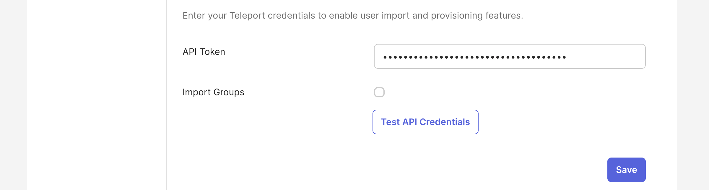
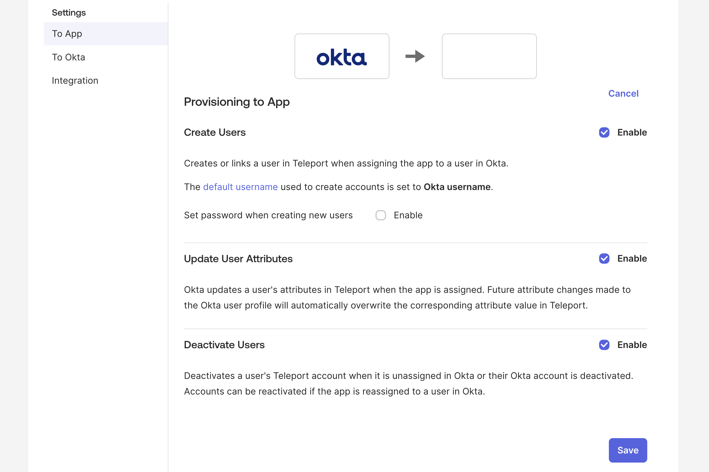
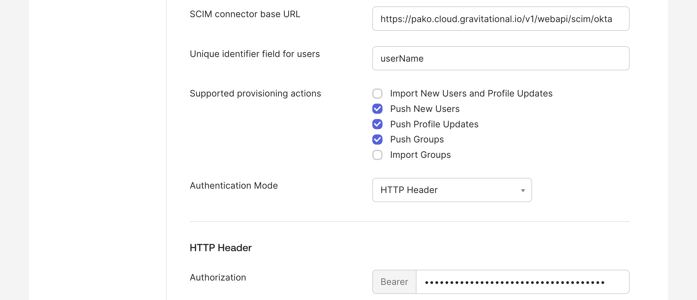
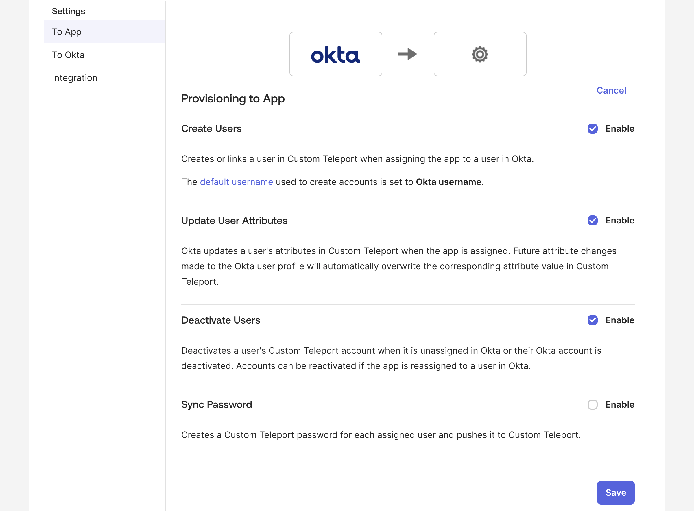

The SCIM (System for Cross-domain Identity Management) integration enables automated user management,
ensuring that user accounts in Teleport are synchronized with the corresponding Okta user profiles.
This integration streamlines the onboarding and offboarding process by automatically creating, updating, and deleting
Teleport user accounts in response to changes within the Okta organization.

The Teleport SCIM integration allows admins to immediately lock users in Teleport when they are deprovisioned in Okta,
stopping all ongoing user Teleport sessions to maintain security and compliance.

## How it works

User provisioning (and de-provisioning) with SCIM requires two Teleport
components working together:

 - A SAML Connector that provides SSO login to Teleport for upstream Okta users
 - A Teleport SCIM plugin integration that provisions and de-provisions Teleport user accounts
   in response to changes in the upstream Okta organization

Both of these Teleport components rely on an Okta SAML application to act as the
interface between Teleport and Okta. For consistency, both of
the Teleport components must use the same Okta application.

When a user is assigned to the Okta app, either directly or via group
membership, a corresponding Teleport user account will be created. If the Okta
user already has a valid temporary Teleport SAML user account (i.e. they have
logged into the cluster via SAML SSO before SCIM provisioning was enabled), the
temporary account will automatically be adopted by the SAML integration and
promoted to a long-lived SCIM-managed account.

<Admonition type="note">
Currently none of the SCIM user profile traits are stored in the Teleport user, although this may change in the future.
</Admonition>

When a user is unassigned from the Okta app, or is deactivated by the Okta admin, Teleport will immediately delete the user in question, and create a lock that will both immediately terminate any existing sessions and prevent that user from re-using any credentials that have already been issued. This lock will be automatically revoked if the user is subsequently re-provisioned via SCIM, otherwise the lock is permanent and will have to be explicitly deleted to remove.

<Admonition type="warning">
Okta does not send SCIM updates to Teleport when a user is suspended. Even though Okta will prevent a suspended user from logging back into the cluster, any existing sessions will not be terminated, and any pre-issued credentials will be valid for their normal lifetimes.
</Admonition>

## Prerequisites

- An Okta authentication connector. Before following the guided SCIM integration, you must have completed the [guided Okta single sign-on integration](./guided-sso.mdx).

<Admonition type="note">

You can skip the guided SCIM integration flow if you want to set up the [guided
user sync integration](./user-sync.mdx) without SCIM. You can enable SCIM later
in the [integration status page](./okta.mdx#managing-integration-components).

</Admonition>

## Step 1/2. Generate SCIM token in Teleport

This step assumes you are still in the **Okta Integration** configuration wizard on the **SCIM** step. If not you can get back there with the instructions provided below.

Editing Okta SCIM configuration

   1. Navigate to **Zero Trust Access** on the left sidebar, then select **Integrations** and click on the **Okta** row.
   2. Click 3-dots on the top-right corner of the **SCIM** tile and select **Enable**.

1. Copy the generated **Bearer Token** and store it for later. It will be required for the Okta Teleport app configuration.

2. Configure the SCIM integration with the generated token by clicking **Save SCIM Configuration** (it can be regenerated by refreshing the page and clicking the button again).

   

## Step 2/2. Configure SCIM details in the Okta app

Okta Integration Network support is still in beta. If unsure please proceed with the Custom SAML 2.0 app.

<Tabs groupId="scim-app" defaultValue="legacy">
<TabItem label="Okta Integration Network" value="oin">

   1. In Okta Console, go to **Applications** and find the Teleport application created during the [guided Okta single sign-on integration](./guided-sso.mdx).

   2. Click on the Teleport application and go to the **Provisioning** tab.

   3. Click **Configure API Integration**, check the **Enable API integration** box and:
      1. Paste the Bearer Token generated in Step 1 of this guide.
      2. Uncheck "Import Groups" box, clicking **Continue** in the pop-up warning.

      

   4. Click **Save**. You may also click **Test API Credentials** first, though the wizard automatically tests API credentials before saving.

   5. Make sure you are in the **To App** section of the **Provisioning** tab and click **Edit** in the top-right corner of the tab.

   6. Enable "Create Users", "Update User Attributes" and "Deactivate Users".

   7. Make sure the "Set password when creating new users" box under **Create Users** is disabled.

      

   8. Click **Save**.

   9. Go back to the Teleport SCIM configuration wizard and click **Continue**.

</TabItem>
<TabItem label="Custom SAML 2.0 app (legacy)" value="legacy">

  <Admonition type="note">
  Please note this is a legacy way of setting up the Teleport SSO app. The preferred way is to use Okta Integration Network app.
  </Admonition>

  1. In Okta Console, go to **Applications** and find the Teleport application created during the [guided Okta single sign-on integration](./guided-sso.mdx).

  2. Click on the Teleport application and go to the **Sign On** tab.

  3. Click **Edit** in the top-right corner of the tab, select "SCIM" in the "Provisioning" section and click **Save**.

     

  4. Go to the newly appeared **Provisioning** tab, click **Edit** in the top-right corner and:

     - Provide SCIM connector base URL, like: `https://example.teleport.sh/v1/webapi/scim/okta`.
     - Unique identifier field for users: `userName`.
     - Enable Supported provisioning actions: "Push New Users", "Push Profile Updates", "Push Groups".
     - Set Authentication Mode to "HTTP Header" and paste the Bearer Token generated in Step 1 of this guide.

     

  5. Click **Save** (it is OK to click **Test API Credentials** but it's done regardless while clicking **Save**).

  6. Make sure you are in the **To App** section of the **Provisioning** tab and click **Edit** in the top-right corner of the tab.

  7. Enable "Create Users", "Update User Attributes" and "Deactivate Users".

     

  8. Click **Save**.

  9. Go back to the Teleport SCIM configuration wizard and click **Continue**.

</TabItem>
</Tabs>

At this point your Teleport Okta SCIM integration is complete. Users newly assigned/unassigned to the Okta Teleport app should be created/deleted in Teleport nearly instantly. 

If you have users assigned to the Okta Teleport app before enabling SCIM, you may notice there are red question marks next to each user in the *Assignments* tab. To learn more about that read the **Retrospective user provisioning** section below.

## Supported features

Teleport supports only *To App* (Okta -> Teleport) provisioning and does not support importing from Teleport to Okta.

Supposed *To App* provisioning features:

- **Create Users** - Creates a user in Teleport when assigning the SAML app to a user in Okta.
  - The **Set password when creating new users** option **is not** supported.
- **Update User Attributes** - Okta updates a user's attributes in Teleport when the SAML app is assigned. Future attribute changes made to the Okta user profile will automatically overwrite the corresponding attribute value in Teleport.
- **Deactivate Users** - Deletes the Teleport user when it is unassigned in Okta or their Okta account is deactivated. A session lock for the user is created for the maximum session duration. The Teleport user will be recreated if the SAML app is reassigned to a user in Okta.
 
Please note Teleport doesn't display SCIM attributes in the UI. They are stored in an internal user label which is a subject to change. The attributes are currently only used to construct compliant SCIM resource responses. All attributes sent to Teleport are stored and then replied in the subsequent SCIM resource responses. The only exception is the "password" attribute.

## Retrospective user provisioning

If your Okta app has assigned users in Teleport before SCIM provisioning is
enabled, you will need to trigger their provisioning explicitly. This can be
done by selecting the **Provision Users** button on the Okta app assignments page.

If your Okta instance is missing the **Provision Users** button, you can force
user provisioning by removing and re-adding users to the app.

## Next steps

After completing the guided enrollment flow for the Okta SCIM integration, you
can proceed to the [Okta user sync integration](./user-sync.mdx).
