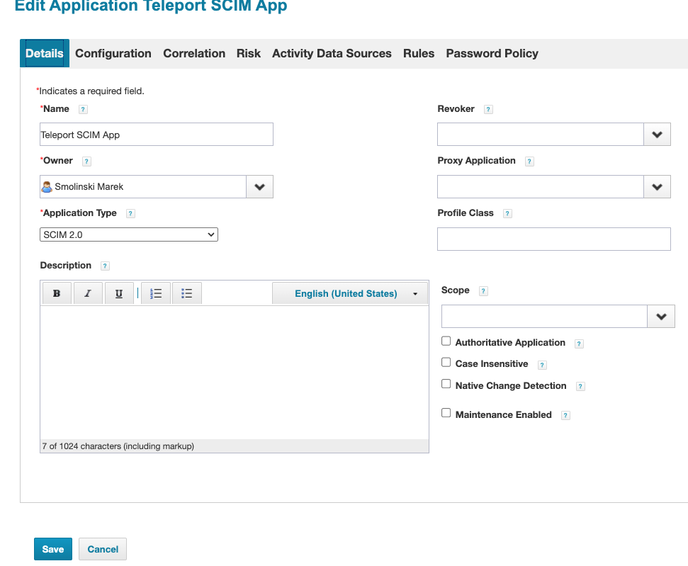
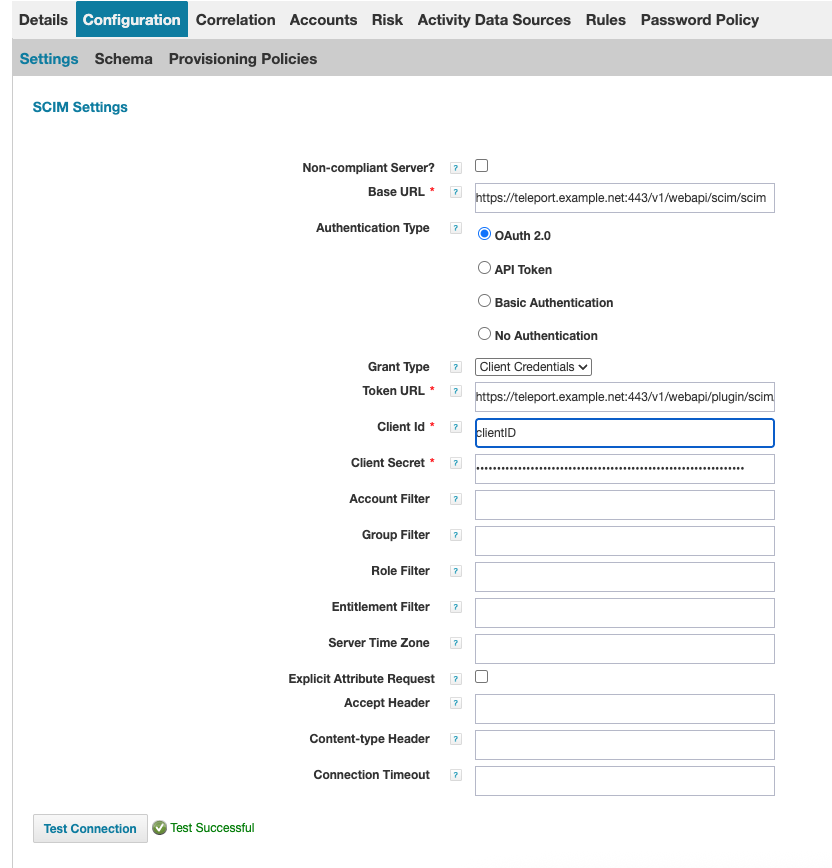
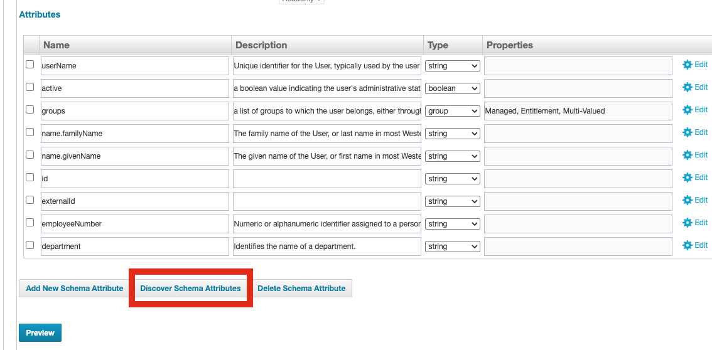
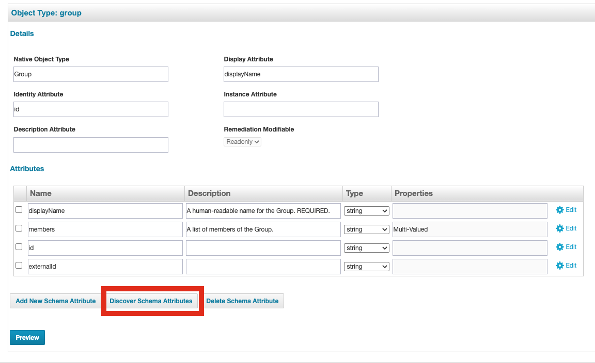
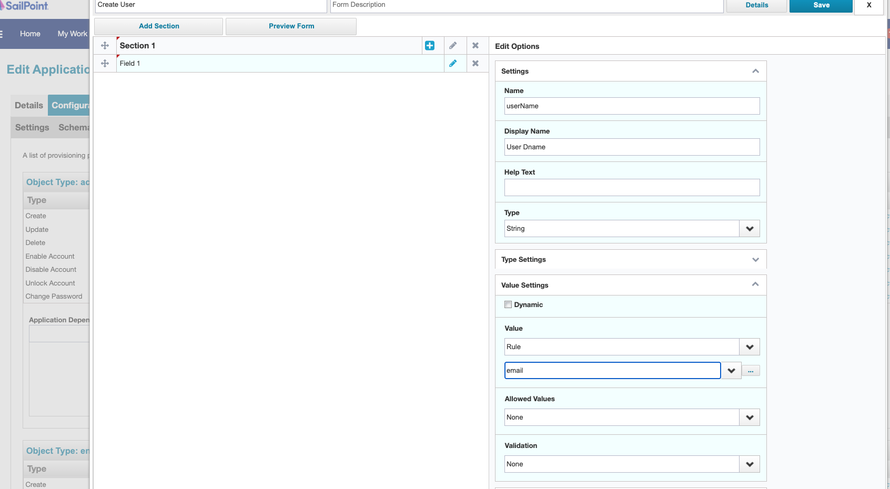
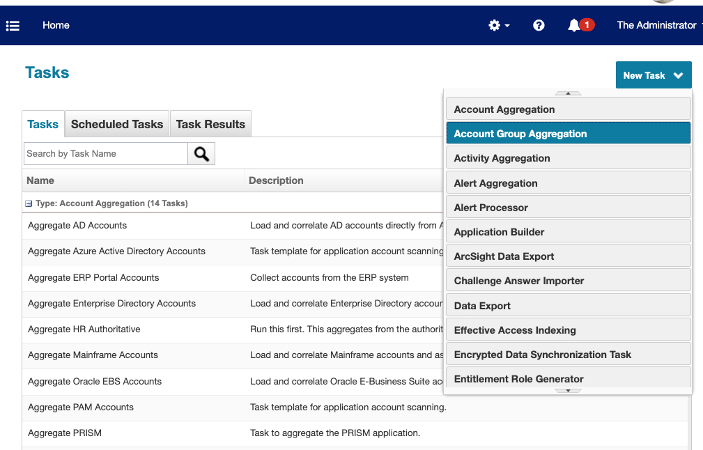
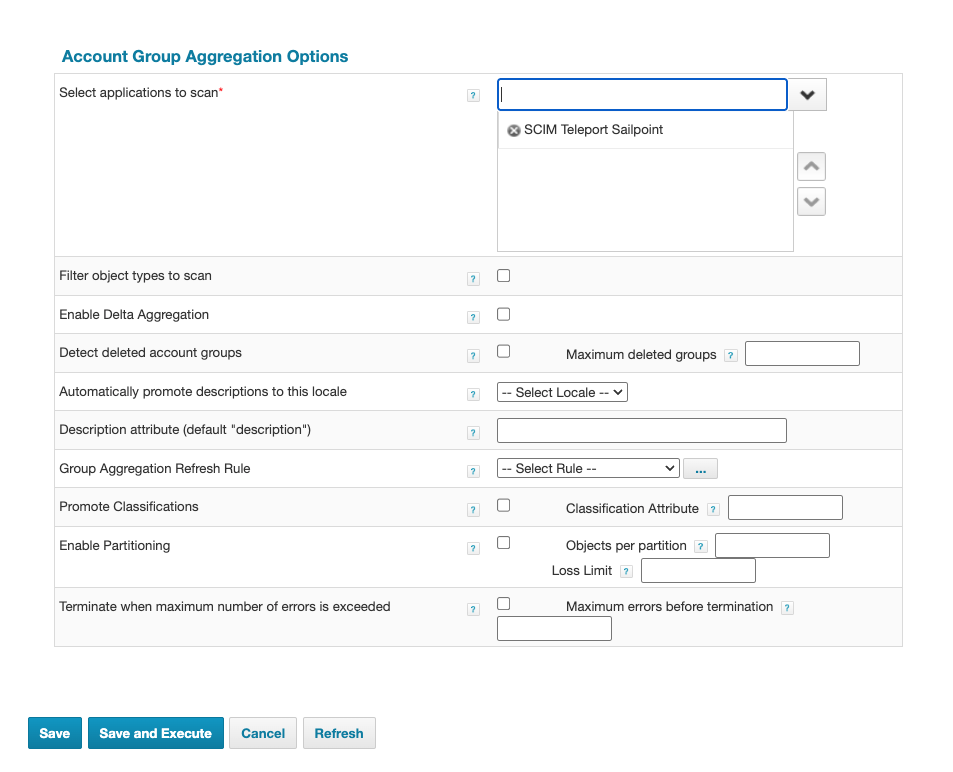
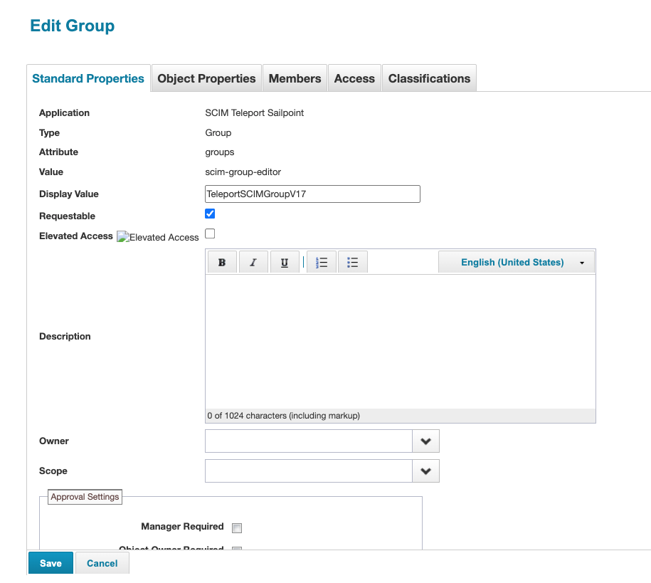
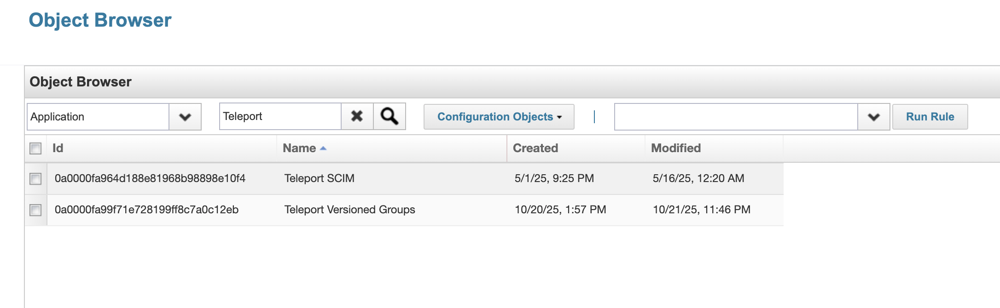
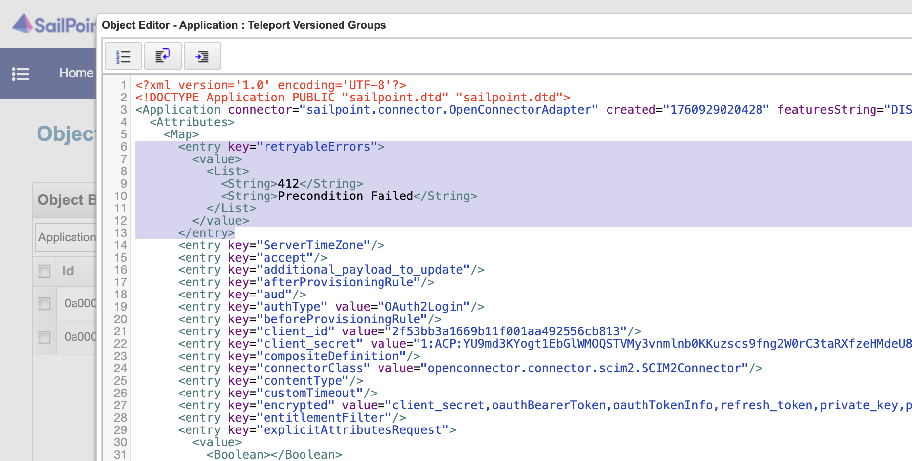

SailPoint provides a SCIM identity management connector that allows you to manage Teleport Access List membership
through SailPoint IdentityNow or SailPoint IdentityIQ.

{/* lint ignore page-structure remark-lint */}

## Prerequisites
- Teleport SCIM plugin setup: [SCIM Plugin Installation](./scim.mdx)

## Step 1/2: Configure a SCIM 2.0 Teleport connector in SailPoint

To integrate Teleport with SailPoint using SCIM, you need to configure a SCIM connector in SailPoint IdentityNow or SailPoint IdentityIQ.
The exact configuration steps may vary slightly depending on your version of SailPoint, but the general process is as follows.

### Configure SCIM in SailPoint

Create a new SCIM connector in SailPoint at: Applications > Application Definition > Add New Application.
Select **SCIM 2.0** as the application type and provide the required configuration details:



Navigate to the Teleport SCIM Integration page and copy the OAuth 2.0 details and the SCIM base URL.
<Admonition type="info">
    If the Teleport SCIM integration has not been set up, follow the [SCIM Plugin Installation](./scim.mdx)  guide before proceeding.
</Admonition>

In the SailPoint SCIM application configuration view, populate the configuration settings using the values obtained from the Teleport SCIM integration:
* SCIM Base URL: Paste the SCIM Base URL copied from SCIM Teleport Integration page
* Authentication Type: Pick "OAuth 2.0"
* Token URL: Paste the Token UR copied from SCIM Teleport Integration page
* Grant Type: Pick "Client Credentials"
* Client ID: The Client ID copied from SCIM Teleport Integration page

Click **Test Connection** to verify that the connection is successful:



### Configure SCIM schema discovery

Under  **Configuration -> Schema**, click **Discover Schema Attributes** on both the **Accounts** and **Groups** tabs to retrieve the schema attributes:


Go to the **Provisioning Policy** section, and create a **Create Policy** that maps the `userName` SCIM attribute to the user’s email address:

Save all changes.

#### Configure SCIM group aggregation in SailPoint

SailPoint group aggregation enables the retrieval of SCIM-type Access Lists into SailPoint as Application Group Entitlements.
This allows you to import Teleport Access Lists into SailPoint and manage membership directly through SailPoint with the changes being reflected in Teleport Access Lists.

Navigate to **Setup > Tasks -> New Task -> Group Aggregation** in SailPoint.

Select the **Teleport SCIM Connector**, then click **Save and Execute** to run the aggregation task.

If the aggregation completes successfully,
you should see the imported Access Lists `type: "scim"` from Teleport in SailPoint under: **Applications > Entitlement Catalog**



#### Configure SCIM retries in SailPoint

On a busy SailPoint instance, it is possible for SailPoint to issue concurrent
updates to a Teleport Group via SCIM.

Without special handling, concurrent updates can leave a SCIM Group (and its
corresponding Teleport Access List) in an indeterminate state. When the Teleport
SCIM server detects a concurrent Group update, or an update based on a now-obsolete
revision of the SCIM group, Teleport will block the update and return the HTTP
stats code `412 Precondition Failed`. By default, the SailPoint SCIM provisioner
does not automatically re-try an update when it encounters a conflict like this,
and considers it an error.

You can, however, [add retry configurations to the SCIM provisioner](https://documentation.sailpoint.com/connectors/scim_2_0/help/integrating_scim2/retry_configurations.html)
either via the SailPoint REST API, or the SailPoint debug interface. We will use
the debug interface. 

<Admonition type="warning">
Editing SailPoint configuration via the debug interface is an inherently
dangerous operation. Please ensure you are editing the correct resource and make
a backup copy for the resource XML in order to roll back your change if
necessary.
</Admonition>

Navigate to the SailPoint debug interface for your SailPoint instance, which
will be hosted at `${YOUR_SAILPOINT_HOST}/identityiq/debug`. In the Sailpoint 
Object Browser select Object Type "Application" from the drop-down list, and
then locate the SCIM application you created above. 



Clicking on the Application in the object browser will bring up the XML
configuration for your SCIM application. In the application attribute map, add
the `retryableErrors` attribute.

```xml
<entry key="retryableErrors">
  <value>
    <List>
      <String>412</String>
      <String>Precondition Failed</String>
    </List>
  </value>
</entry>
```

Your application XML should now look something like this:



Save your changes to the XML using the Save Button at the bottom of the XML
editor, and navigate back to your normal SailPoint dashboard. SailPoint will 
now retry provisioning when it encounters a `412 Precondition Failed` response
from the Teleport SCIM server. The retry cycle includes fetching a fresh
representation of the target Group from teleport, ensuring that SailPoint has
the latest version of the Group to work with when provisioning the Group a
second time.

<Admonition type="info">
If you are updating a previously-configured integration to retry provisioning on
version conflicts, you will also need to repeat the _Discover Schema Attributes_
step in the [Configure SCIM schema discovery](#configure-scim-schema-discovery)
section above. This will make the SailPoint SCIM provisioner fetch and preserve
the resource versions.
</Admonition>

## Step 2/2: Submit Access Requests to SailPoint Group Entitlement (Optional)

Go to **Manage > Manage User Access > Manage User Access** in SailPoint.
Submit an Access Request for a mapped Access List (as represented by a group
entitlement in SailPoint).

Once the request is approved, the user will be added to the appropriate Access List in Teleport.
