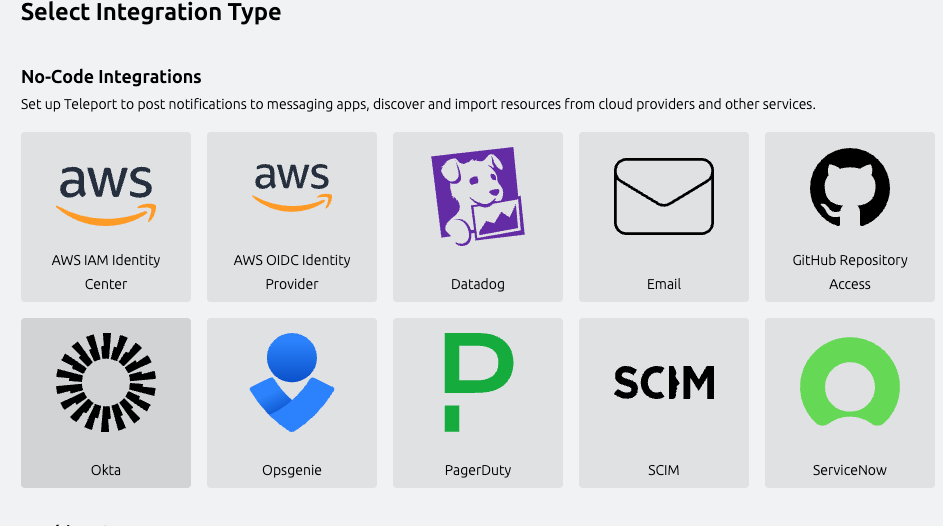
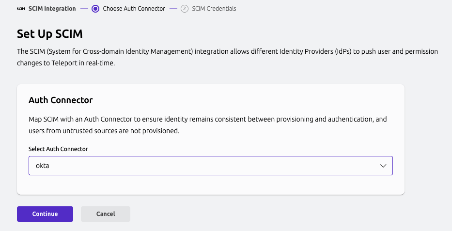

The SCIM integration between **SCIM providers** and **Teleport** enables automated
synchronization of SCIM group memberships and Teleport Access List memberships.
This integration supports centralized identity governance in
external Identity Management System (like SailPoint) while Teleport enforces
fine-grained access controls defined by Access Lists membership grants types.

User permissions in Teleport are defined through Access Lists. While role definitions
live in Teleport, group membership is dynamically managed by SCIM Provider via SCIM group
membership. This ensures users have up-to-date access aligned with organizational
policies.

## How it works

The SCIM integration uses a 1:1 mapping between SCIM group and Teleport
Access Lists

- Each SCIM group `displayName` must match the `spec.title` of a Teleport
Access List.
- SCIM-type Access Lists must be created in advance in Teleport. In this guide we're creating them using Terraform.
- Only Access Lists of type `scim` can be managed by SCIM providers.
- Role assignments are handled in Teleport, while group membership is delegated to External Identity Management System (like SailPoint).

## Prerequisites
- Teleport Enterprise v17.6.1, v18.0.3 or higher.
- Teleport Terraform Provider v17.6.1, v18.0.3 or higher.
- A running Teleport cluster with SSO enabled (e.g. Okta SAML connector)
- Identity Management System (like SailPoint) with SCIM support
- SCIM Provider with OAuth 2.0 Client Credentials grant type support

## Step 1/3: Create an SCIM-Managed Access List in Teleport

Create a new Access List in Teleport using Terraform. Be sure to set `type = "scim"`
and match `spec.title` to the name of `displayName` of  SCIM group that we be provided to Teleport:


```hcl
resource "teleport_access_list" "acl-group-requester" {
  header = {
    version = "v1"
    metadata = {
      name = "scim-group-requester"
    }
  }
  spec = {
    title = "GroupRequester"
    type = "scim"
    grants = {
      roles  = ["requester"]
      traits = []
    }
    owners = [
      {
        name = "alice"
      }
    ]
    membership_requires = {
      roles = []
    }
    ownership_requires = {
      roles = []
    }
    audit = {
      recurrence = {
        frequency    = 3
        day_of_month = 15
      }
    }
  }
}
```

<Admonition type="info">
    The SCIM group name (displayName) in SCIM Provider must exactly match
    `spec.title` in the Teleport Access List.
</Admonition>


## Step 2/3. Configure SCIM Integration
Teleport provides a guided Web UI-based configuration flow for the SCIM integration.

In the Teleport Web UI, go to **"Add new integration"** and select **SCIM**.




Select the **SAML connector** to associate SCIM-provisioned users with SSO logins.

- By default, SSO users in Teleport are ephemeral.
- SCIM provisioning ensures users are persistently created and managed by External Identity management system via SCIM protocol.




Click **Continue** to proceed to the **SCIM Credentials** screen.

- Teleport uses OAuth 2.0 Bearer Tokens for SCIM authentication.
- Copy the **Client ID**, **Client Secret**, and **Base URL** — you'll use them
  when configuring your Identity Provider in the next step.

## Step 3/3. Configure SCIM integration with your Identity Management SCIM provider

SCIM configuration may differ depending on your IdP. The integration has been officially tested with the following providers:

- [SailPoint Teleport SCIM connector setup](./sailpoint.mdx)

In case of other SCIM providers, please refer to their documentation for setting up a SCIM integration.
