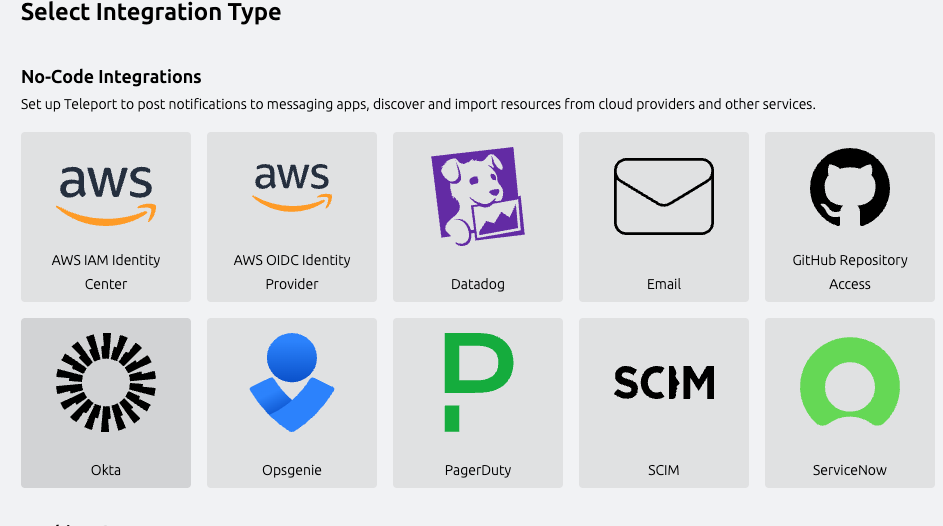
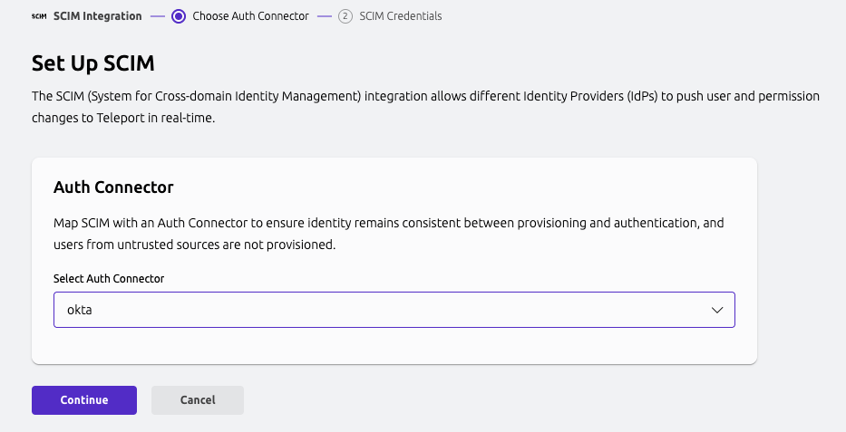

The SCIM integration between **SCIM providers** and **Teleport** enables automated
synchronization of SCIM group memberships and Teleport Access List memberships.
This integration supports centralized identity governance in
external Identity Management System (like SailPoint) while Teleport enforces
fine-grained access controls defined by Access Lists membership grants types.

User permissions in Teleport are defined through Access Lists. While role definitions
live in Teleport, group membership is dynamically managed by SCIM Provider via SCIM group
membership. This ensures users have up-to-date access aligned with organizational
policies.

## How it works

The SCIM integration uses a 1:1 mapping between SCIM group and Teleport
Access Lists:

- Each SCIM group `displayName` must match the `spec.title` of a Teleport
Access List.
- SCIM-type Access Lists must be created in advance in Teleport. In this guide we're creating them using Terraform.
- Only Access Lists of type `scim` can be managed by SCIM providers.
- Role assignments are handled in Teleport, while group membership is delegated to External Identity Management System (like SailPoint).

## Prerequisites
- Teleport Enterprise v17.6.1, v18.0.3 or higher.
- Teleport Terraform Provider v17.6.1, v18.0.3 or higher.
- A running Teleport cluster with SSO enabled (e.g. Okta SAML connector)
- Identity Management System (like SailPoint) with SCIM support
- SCIM Provider with OAuth 2.0 Client Credentials grant type support

## Step 1/3: Create an SCIM-Managed Access List in Teleport

Create a new Access List in Teleport using Terraform. Be sure to set `type = "scim"`
and match `spec.title` to the name of `displayName` of the SCIM group that will be provided to Teleport:


```hcl
resource "teleport_access_list" "acl-group-requester" {
  header = {
    version = "v1"
    metadata = {
      name = "scim-group-requester"
    }
  }
  spec = {
    title = "GroupRequester"
    type = "scim"
    grants = {
      roles  = ["requester"]
      traits = []
    }
    owners = [
      {
        name = "alice"
      }
    ]
    membership_requires = {
      roles = []
    }
    ownership_requires = {
      roles = []
    }
    audit = {
      recurrence = {
        frequency    = 3
        day_of_month = 15
      }
    }
  }
}
```

<Admonition type="info">
    The SCIM group name (displayName) in SCIM Provider must exactly match
    `spec.title` in the Teleport Access List.
</Admonition>


## Step 2/3: Configure SCIM Integration
Teleport provides a guided Web UI-based configuration flow for the SCIM integration.

In the Teleport Web UI, go to **"Add new integration"** and select **SCIM**.




Select the **SAML connector** to associate SCIM-provisioned users with SSO logins.

- By default, SSO users in Teleport are ephemeral.
- SCIM provisioning ensures users are persistently created and managed by External Identity management system via SCIM protocol.




Click **Continue** to proceed to the **SCIM Credentials** screen.

- Teleport uses OAuth 2.0 Bearer Tokens for SCIM authentication.
- Copy the **Client ID**, **Client Secret**, and **Base URL** — you'll use them
  when configuring your Identity Provider in the next step.

## Step 3/3: Configure SCIM integration with your Identity Management SCIM provider

SCIM configuration may differ depending on your IdP. The integration has been officially tested with the following providers:

- [Okta Teleport SCIM Integration](../okta/scim-integration.mdx)
- [SailPoint Teleport SCIM connector setup](./sailpoint.mdx)

In case of other SCIM providers, please refer to their documentation for setting up a SCIM integration.

<Admonition type="tip">
Teleport can use provisioned SCIM name and email attributes to show [display
names](../../../reference/access-controls/user-display-names.mdx) in the
Web UI.
</Admonition>

## Rate limiting

The Teleport SCIM server enforces rate limits on incoming SCIM
requests. Limits apply uniformly to all SCIM operations (`GET` for retrieve
and search, `POST` for create, `PUT` for replace, `PATCH` for modify, and
`DELETE`).

There are two independent limits:

- A **token-bucket request limit** that caps the average and burst request rate
  over a sliding window. This limit applies to every SCIM request.
- A **concurrency limit** that caps the number of simultaneous mutating
  operations (`POST`, `PUT`, `PATCH`, `DELETE`) in flight. `GET` (retrieve and
  search) requests are not counted toward this limit.

<Admonition type="note">
Each Auth Service instance enforces these limits independently. Limits are
not shared between Auth Service instances.
</Admonition>

### Defaults

If no rate-limit configuration is set on the SCIM plugin, the server applies
the following defaults:

| Setting                     | Default | Description                                                                   |
|-----------------------------|---------|-------------------------------------------------------------------------------|
| `average`                   | `600`   | Average requests permitted per `period_seconds` window.                       |
| `burst`                     | `1200`  | Maximum burst above the average within the window.                            |
| `period_seconds`            | `60`    | Length of the rate-limit window, in seconds.                                  |
| `max_concurrent_operations` | `300`   | Maximum simultaneous mutating operations.                                     |

### Behavior on limit exceeded

When a SCIM request is rejected because the rate limit is exceeded, Teleport
responds with HTTP `429 Too Many Requests` and sets the standard
[`Retry-After`](https://developer.mozilla.org/en-US/docs/Web/HTTP/Headers/Retry-After)
header to the number of seconds the client should wait before retrying:

- For the **request rate limit**, `Retry-After` is the time until the next
  token becomes available, rounded up to the nearest second.
- For the **concurrency limit**, `Retry-After` equals the configured
  `period_seconds`.

SCIM clients should honor the `Retry-After` header and back off accordingly
before retrying.

### Configuring custom limits

Each SCIM plugin can override individual defaults by setting `rate_limit` on
its SCIM spec. Any field left at `0` falls back to the server default — only
set the fields you want to change.

Use `tctl edit` to open the SCIM plugin resource in your editor and update
the `spec.scim.rate_limit` section. The changes are applied when you save
and exit:

```code
$ tctl edit plugin/scim
```

Example `rate_limit` block:

```yaml
kind: plugin
version: v1
metadata:
  name: scim
spec:
  scim:
    rate_limit:
      # Permit 1200 requests on average per 60s window, with bursts up to 2000.
      average: 1200
      burst: 2000
      period_seconds: 60
      # Max ongoing concurrent operations.
      max_concurrent_operations: 50
```

Updates to `rate_limit` take effect on the next request — the SCIM server
rebuilds the per-plugin limiter when it detects a configuration change.
