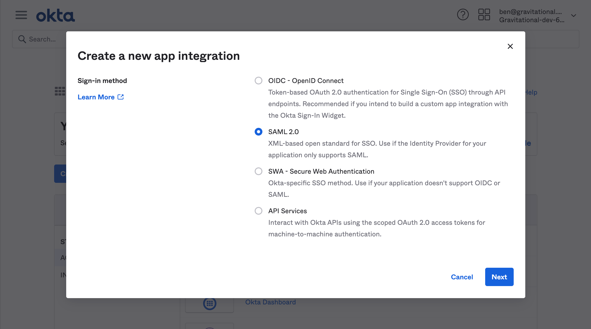
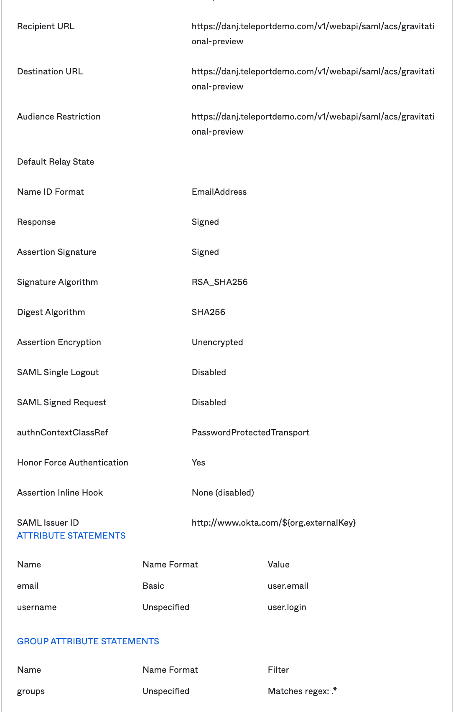
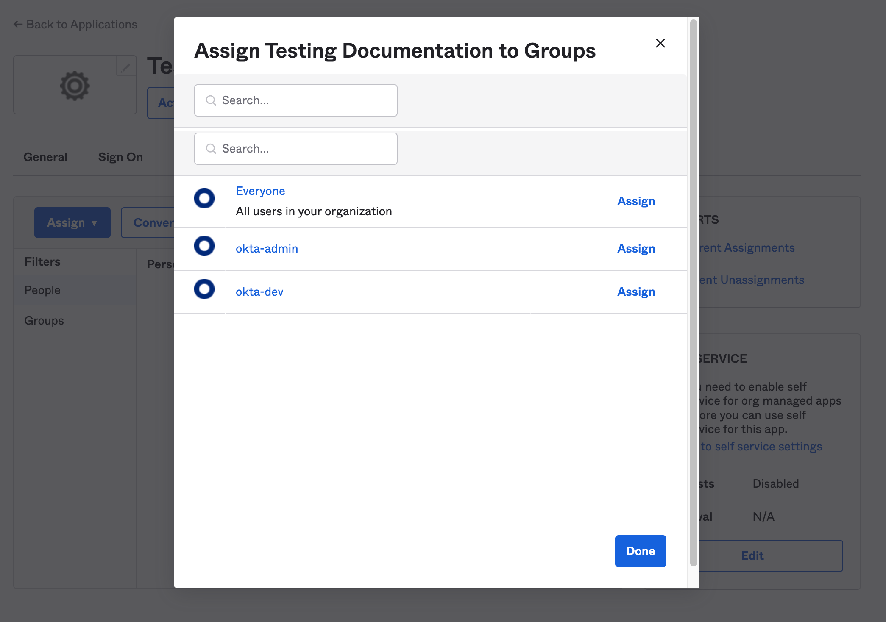
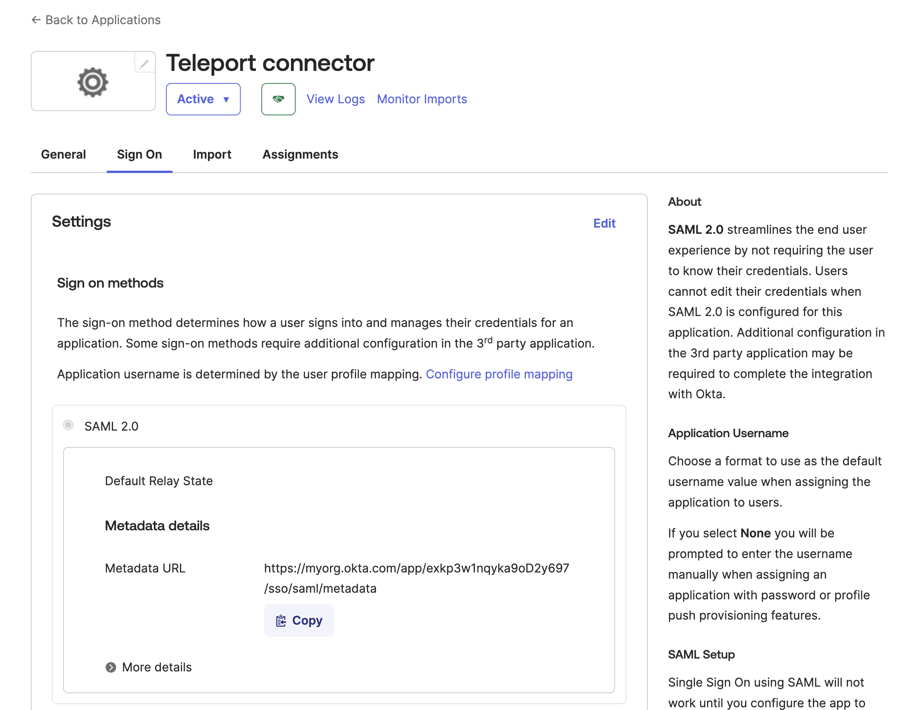

The Teleport Okta SSO integration allows Teleport users to authenticate using
Okta as an identity provider. Teleport. The guided enrollment flow for the Okta
SSO integration is part of the [guided Okta integration](./okta.mdx). This
guide is a companion to the guided Okta SSO integration, showing you how to
perform required actions within Okta.

If you do not plan to enroll additional components of the guided Okta
integration, you can set up only the Okta SSO integration - called an
authentication connector - by following [Authentication With Okta as an SSO
Provider](../../admin-guides/access-controls/sso/okta.mdx).
 
## Prerequisites

(!docs/pages/includes/commercial-prereqs-tabs.mdx!)

- Familiarity with the [Okta guided integration flow](./okta.mdx).

- (Optional) An Okta authentication connector. If you do not have one, you can
  follow the guided Okta SSO integration flow to set one up.

  If one of your existing connectors is named `okta`, you won't have the option
  to create a new connector. That's because the name of the connector created by
  the integration is hardcoded as `okta`. If you have a connector named `okta`
  and you'd like to use a different one, you'll have to create your connector
  manually following [Authentication With Okta as an SSO Provider
  ](../../admin-guides/access-controls/sso/okta.mdx).

- (!docs/pages/includes/tctl.mdx!)

- An Okta organization with admin access.

## Step 1/5. Choose an existing authentication connector

In the **Choose Your Auth Connector** view, select an existing connector from
the dropdown menu.

To see the full authentication connector resource before selecting it, run the
following command, assigning <Var name="okta" /> to the name of the resource as
shown in the dropdown menu:

```code
$ tctl get saml/<Var name="okta" />
```

If this is the correct authentication connector, select it. In this case, you
can now proceed with the next component of the guided Okta enrollment flow:

- [Okta SCIM integration](./scim-integration.mdx)
- [Okta user sync integration](./user-sync.mdx)

Otherwise, select the option to create a new connector. Continue following the
guided enrollment flow for the Okta SSO integration.

## Step 2/5. Create an Okta app

Create an Okta SAML application that allows Teleport to receive SAML messages
from Okta.

1. From the main navigation menu, select **Applications** -> **Applications**,
   and click **Create App Integration**. Select SAML 2.0, then click **Next**.

   

1. On the next screen (**General Settings**), provide a name and optional logo
   for your new app, then click **Next**. This will bring you to the **Configure
   SAML** section.

## Step 3/5. Configure the app

Provide the following values to their respective fields:

**General:**

- Single sign on URL: `https://<cluster-url>:<port>/v1/webapi/saml/acs/okta`
- Audience URI (SP Entity ID): <nobr>`https://<cluster-url>:<port>/v1/webapi/saml/acs/okta`</nobr>
- Name ID format `EmailAddress`
- Application username `Okta username`

Replace `<cluster-url>` with your Teleport Proxy Service address or Enterprise
Cloud account (e.g. `example.teleport.sh`). Replace `<port>` with your Proxy
Service listening port (`443` by default).

**Attribute statements:**

- Name: `username`  | Name format: `Unspecified` | Value: `user.login`

**Group attribute statements:**

We will map our Okta groups to SAML attribute statements (special signed metadata
exposed via a SAML XML response), so that Teleport can discover a user's group
membership and assign matching roles.

- Name: `groups` | Name format: `Unspecified`
- Filter: `Matches regex` |  `.*`

The configuration page should now look like this:



Notice that we have set "NameID" to the email format and mapped the groups with
a wildcard regex in the Group Attribute statements. We have also set the
"Audience" and SSO URLs to the same value. This is so Teleport can read and use
Okta users' email addresses to create their usernames in Teleport, instead of
relying on additional name fields.

<Admonition type="warning" >
The "Matches regex" filter requires the literal string `.*` in order to match all
content from the group attribute statement.
</Admonition>

Once you've filled the required fields, click **Next**, then finish the app creation wizard.

## Step 4/5. Assign user groups

From the **Assignments** tab of the new application page, click **Assign**.  Assign the user groups
which can access to the app. Users being members of those groups will have the SSO access to
Teleport once the Auth Connector is configured.



## Step 5/5. Provide your Okta app metadata to Teleport

Provide metadata about the Okta application you created so Teleport can trust
its SAML messages.

1. In the Okta administrator web UI, navigate to **Applications** ->
   **Applications** and find your app. Then go to the **Sign On** tab and copy
   the metadata URL. Paste this somewhere that you can refer to as you work
   through the guided flow.

   

1. In the Teleport Web UI, make sure you are in the **Step Two** view in the
   Okta SSO connector enrollment flow.

1. Paste the SAML metadata URL into the form in the **Step Two** view. 

At this point, you have completed the guided flow for the Okta SSO integration.

## Next steps

After completing the guided enrollment flow for the Okta SSO integration, you
can proceed to one of two guided enrollment flows:

- [Okta SCIM integration](./scim-integration.mdx)
- [Okta user sync integration](./user-sync.mdx)
