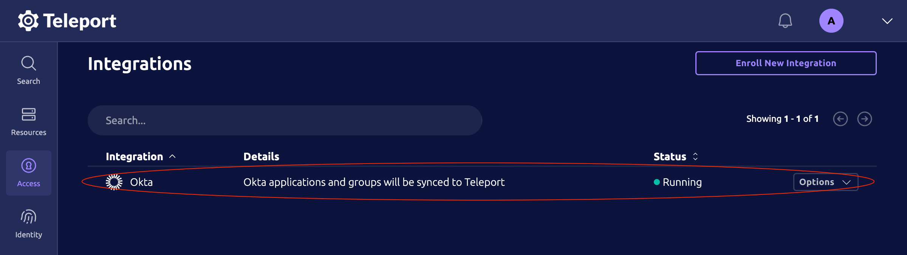
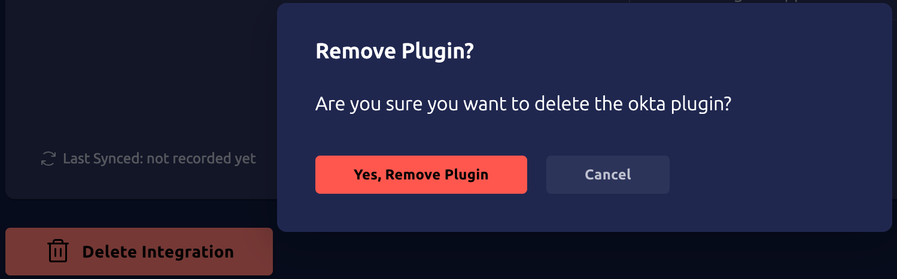

The Teleport Okta integration can import and grant access to resources from an
Okta organizations, such as user profiles, groups and applications. Teleport can
provision user accounts based Okta users, Okta applications can be accessed
through Teleport's application access UI, and access to these applications along
with user groups can be managed by Teleport's RBAC along with Access Requests.

This guide shows you how to set up the Teleport Okta integration.

## How it works

Enrolling the Okta integration is a guided process and contains four components:

1. **Single sign-on (SSO) integration:** Configures Teleport authentication with Okta as an
   identity provider.
2. **System for Cross-domain Identity Management (SCIM) integration:** Uses the
   [SCIM standard](https://developer.okta.com/docs/concepts/scim/) to
   allow nearly instant provisioning of Okta users in Teleport. This is
   available only if Teleport Identity Governance is enabled. The SCIM
   integration is optional for enabling user, application, and group sync.
3. **User sync:** Imports Okta users as Teleport users via a continuous
   reconciliation loop. It is usually slower than SCIM, but but more reliable,
   and does not require a publicly accessible Teleport cluster. Combined with
   SCIM, it provides both speed and reliability.
4. **Application and group sync:** imports Okta applications and groups as Teleport
   Access Lists. This enables you to manage access to Okta applications and user
   groups via Teleport RBAC, including Access Requests.

The Okta SSO integration is required for all other components of the Okta
integration. User sync is required for application and group sync.

Teleport manages Okta application group assignments using a declarative state
approach. If an assignment is created via Teleport and subsequently removed via
the Okta UI, Teleport will re-evaluate and potentially overwrite Okta UI changes
to align with the state defined by Teleport's RBAC configuration.

## Get started

To start the enrolment, visit the Teleport Web UI and click **Access** and then
**Integrations** on the menu bar at the left of the screen. Then click **Enroll
New Integration** and select **Okta** tile.


This will bring you to the SSO integration configuration screen. Read [Guided
Okta SSO Integration](./guided-sso.mdx) for supplementary instructions as you
work through the guided flow.

## Guides

For supplemental information on the guided process, such as instructions on
making changes in Okta, review the documentation in this section:

<DocCardList />

## Syncing System Logs and API Keys with Teleport Identity Security Activity Center

(!docs/pages/includes/policy/identity-activity-center.mdx!)

### How Teleport Identity Security's Okta Integration works

Identity Activity Center automatically retrieves Okta System Logs through
minute-by-minute polling, then processes and standardizes this data
before storing it for long-term analysis and retention.

Additionally, the Okta integration maps access paths for existing
Okta API keys, tracking which users own them and what permissions
they have within the organization.

### How to enable Identity Security's Okta Integration

Users with an existing Okta setup in Teleport can enable the Identity
Security Integration directly from the status page.
When configuring a new integration, the setup wizard provides a
dedicated Identity Security step with guided configuration instructions.


## Managing integration components

At any point in the guided flow, you can return to the integration status page
to manage any component of the integration. To open the integration status page
in the Teleport Web UI, navigate to **Access** -> **Integrations** and click
anywhere on the Okta integration row.



## Deleting the Okta integration

You can delete the Okta integration by taking the following steps:

1. Clean up user accounts created by the Okta integration. To do so, un-assign
   all Okta users from the Okta SAML Application Teleport uses as its identity
   provider, and wait for the sync process and/or SCIM provisioning to delete
   the corresponding Teleport accounts. Once the Teleport accounts have been
   automatically deleted you can proceed to delete the integration.

1. Navigate to **Access** -> **Integrations** and click anywhere on the Okta
   integration row to visit the integration status page. 

1. Click **Delete Integration** .

   

1. Permanently delete the SAML connector created as part of the integration.
   Navigate to the **Auth Connectors** page in the Teleport UI and select the
   option to delete it.

  The SAML connector created during the enrollment process is ***not*** deleted
  when the hosted Okta integration is deleted, and will automatically be re-used
  if the Okta integration is re-enrolled.

1. Clean up Access Lists created by the Okta integration. These are not deleted
   when the Okta integration is deleted. To delete Okta-sourced Access Lists,
   run the following command:

   ```code
   $ tctl plugins cleanup okta
   ```

   If any Access Lists created by the integration are nested members or owners
   of Teleport-created Access Lists, cleanup will fail. Any nested Access Lists
   need to be unassigned before you can perform a cleanup.

   <Admonition type="warning">
   If the Okta integration is still active, removing Okta-sourced Access Lists
   could revoke Okta access from users in your organization. Exercise caution
   when cleaning up Access Lists.
   </Admonition>

Once the integration is deleted, you can manually remove any remaining user
accounts with `tctl`.
