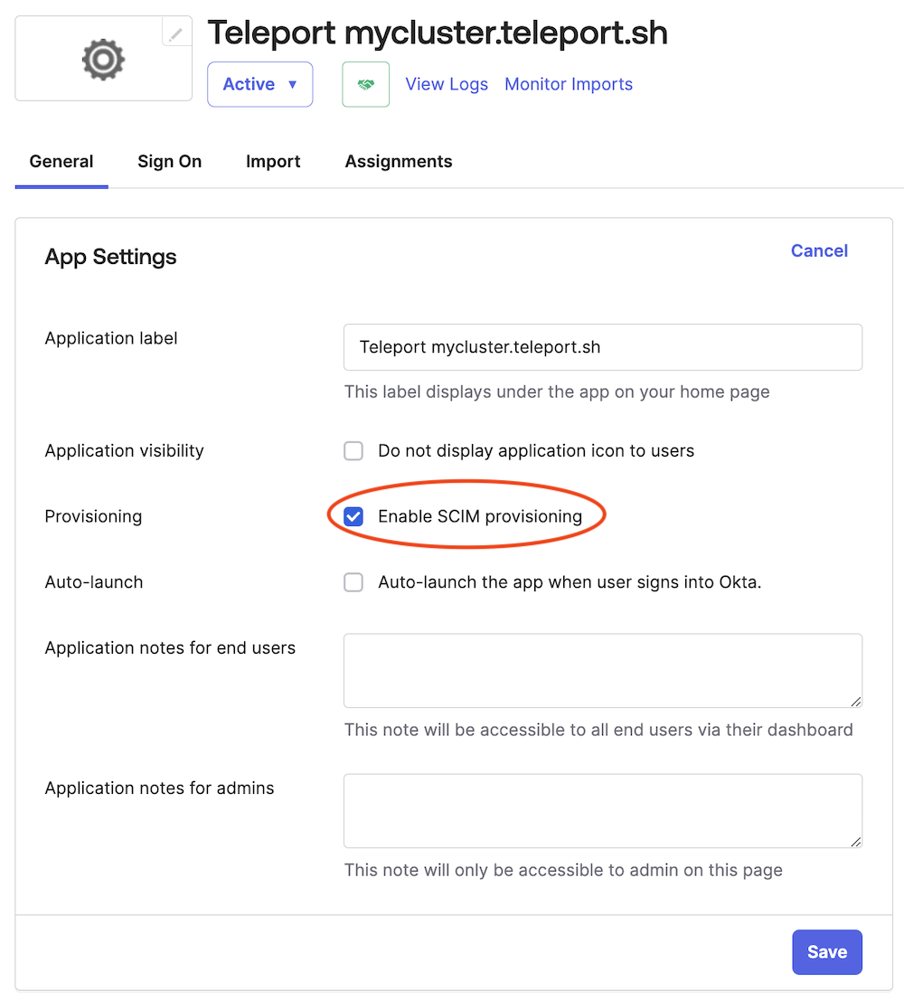
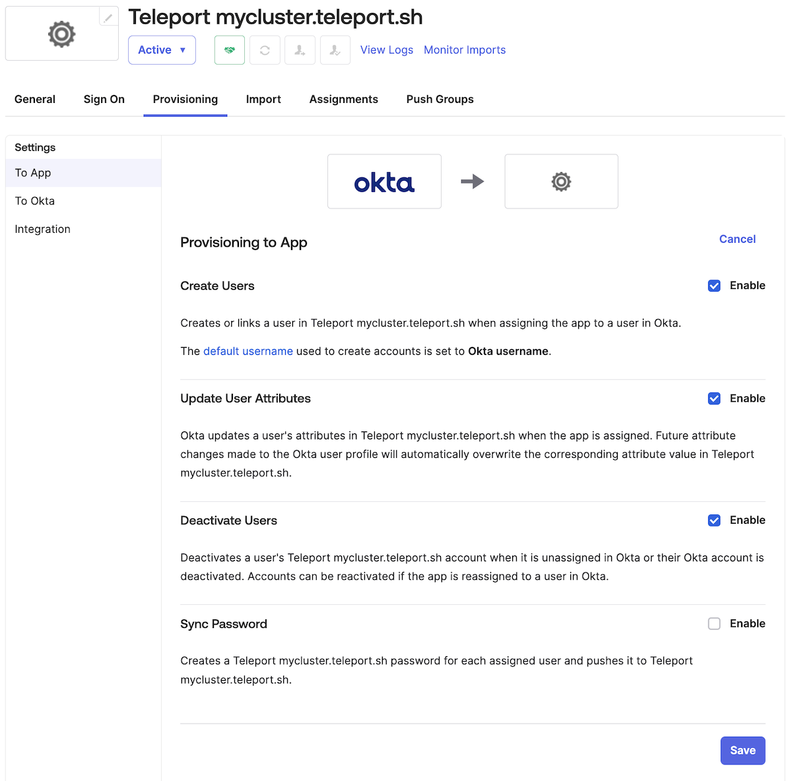

The SCIM (System for Cross-domain Identity Management) integration enables automated user management,
ensuring that user accounts in Teleport are synchronized with the corresponding Okta user profiles.
This integration streamlines the onboarding and offboarding process by automatically creating, updating, and deleting
Teleport user accounts in response to changes within the Okta organization.

The Teleport SCIM integration allows admins to immediately lock users in Teleport when they are deprovisioned in Okta,
stopping all ongoing user Teleport sessions to maintain security and compliance.

## How it works

User provisioning (and de-provisioning) with SCIM requires two Teleport
components working together:

 - A SAML Connector that provides SSO login to Teleport for upstream Okta users
 - A Teleport SCIM plugin integration that provisions and de-provisions Teleport user accounts
   in response to changes in the upstream Okta organization

Both of these Teleport components rely on an Okta SAML application to act as the
interface between Teleport and Okta. For consistency, both of
the Teleport components must use the same Okta application.

When a user is assigned to the Okta app, either directly or via group
membership, a corresponding Teleport user account will be created. If the Okta
user already has a valid temporary Teleport SAML user account (i.e. they have
logged into the cluster via SAML SSO before SCIM provisioning was enabled), the
temporary account will automatically be adopted by the SAML integration and
promoted to a long-lived SCIM-managed account.

<Admonition type="note">
Currently none of the SCIM user profile traits are stored in the Teleport user, although this may change in the future.
</Admonition>

When a user is unassigned from the Okta app, or is deactivated by the Okta admin, Teleport will immediately delete the user in question, and create a lock that will both immediately terminate any existing sessions and prevent that user from re-using any credentials that have already been issued. This lock will be automatically revoked if the user is subsequently re-provisioned via SCIM, otherwise the lock is permanent and will have to be explicitly deleted to remove.

<Admonition type="warning">
Okta does not send SCIM updates to Teleport when a user is suspended. Even though Okta will prevent a suspended user from logging back into the cluster, any existing sessions will not be terminated, and any pre-issued credentials will be valid for their normal lifetimes.
</Admonition>

## Prerequisites

(!docs/pages/includes/commercial-prereqs-tabs.mdx!)

- Teleport Identity Governance enabled on your account.

- An Okta authentication connector. 

  <Admonition>
  Before following the guided SCIM integration flow, you must have completed the
  [guided Okta single sign-on flow](./guided-sso.mdx).
  </Admonition>

- (!docs/pages/includes/tctl.mdx!)

- An Okta organization with admin access.

<Admonition type="note">

You can skip the guided SCIM integration flow if you want to set up the [guided
user sync integration](./user-sync.mdx) without SCIM. You can enable SCIM later
in the [integration status page](./okta.mdx#managing-integration-components).

</Admonition>

## Step 1/3. Enable SCIM in Okta

1. In the **Configure SCIM in Okta’s Admin Console** view of the Teleport Web
   UI, follow the instructions in **Step 1**. In Okta, you should see that SCIM
   has been enabled for your application:

   

1. In Okta, viewing the SAML application configuration menu, click **Save**.

## Step 2/3. Configure SCIM details in Okta

1. In Okta, viewing the SAML application configuration menu, navigate to the
   **Provisioning** tab.

1. Navigate to the Teleport Web UI. In the **Configure SCIM in Okta’s Admin
   Console** view, copy the values provided in **Step 2** to the **SCIM
   Connection** menu in Okta:

   

1. Navigate to the Teleport Web UI. In the **Configure SCIM in Okta’s Admin
   Console** view, click **Save SCIM Configuration**.

1. In Okta, click **Test Connector Configuration** to confirm all of the details
   are set up correctly, and then click **Save**.

## Step 3/3. Configure SCIM provisioning permissions in Okta

1. In Okta, viewing the SAML application configuration menu, ensure that you are
   viewing the **Provisioning** tab. On the left sidebar, navigate to **To App**.

1. Ensure that the following items have **Enable** checked:
   - **Create Users**
   - **Update User Attributes**
   - **Deactivate Users**

   You should see the following settings selected in Okta:

   

1. Return to the Teleport Web UI. You should see the **Configure SCIM in Okta’s
   Admin Console** view. Click **Continue** to finish setting up the SCIM
   integration.

## Retrospective user provisioning

If your Okta app has assigned users in Teleport before SCIM provisioning is
enabled, you will need to trigger their provisioning explicitly. This can be
done by selecting the **Provision Users** button on the Okta app assignments page.

If your Okta instance is missing the **Provision Users** button, you can force
user provisioning by removing and re-adding users to the app.

## Hiding profile data from Teleport

If you have data in your Okta user profile that you don’t wish to share with
your Teleport cluster, you can edit the Okta application user profile to present
Teleport with a subset and/or mapped version of the full user profile.

## Next steps

After completing the guided enrollment flow for the Okta SCIM integration, you
can proceed to the [Okta user sync integration](./user-sync.mdx).
