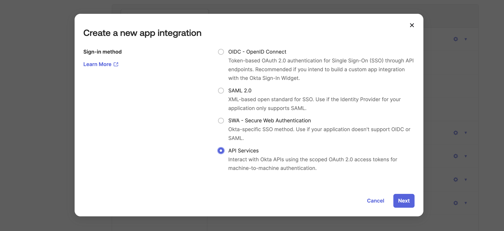
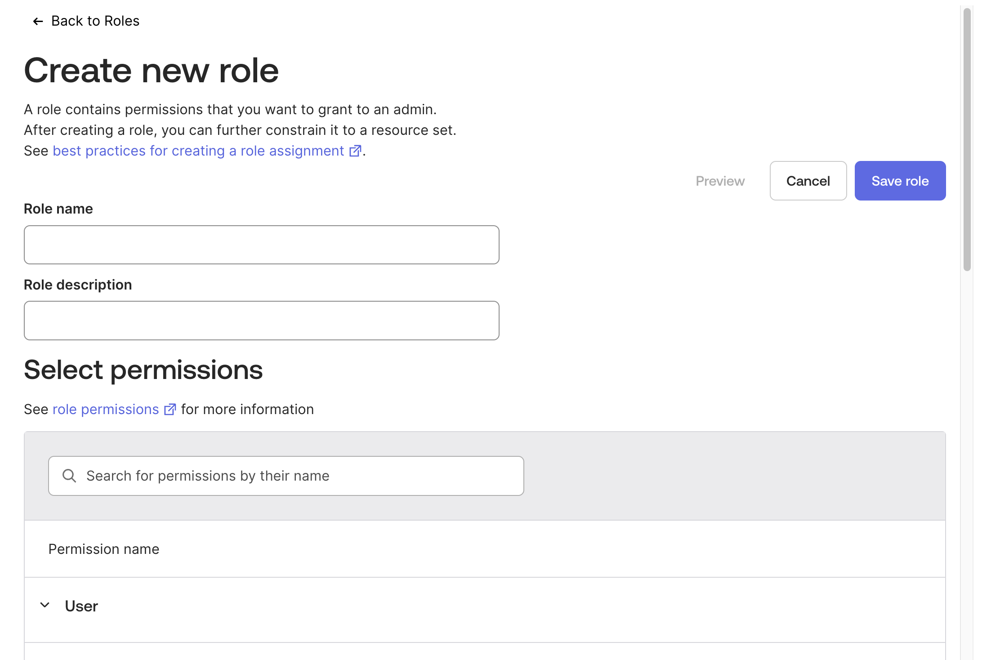
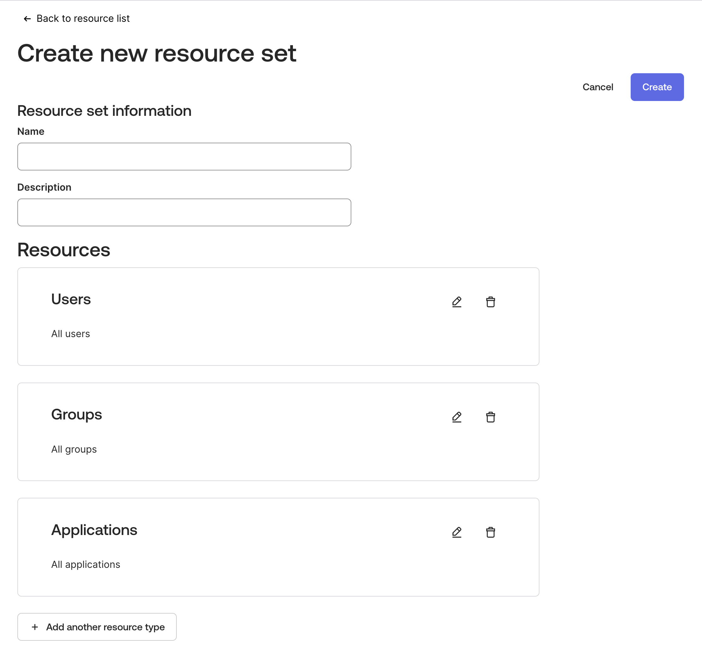
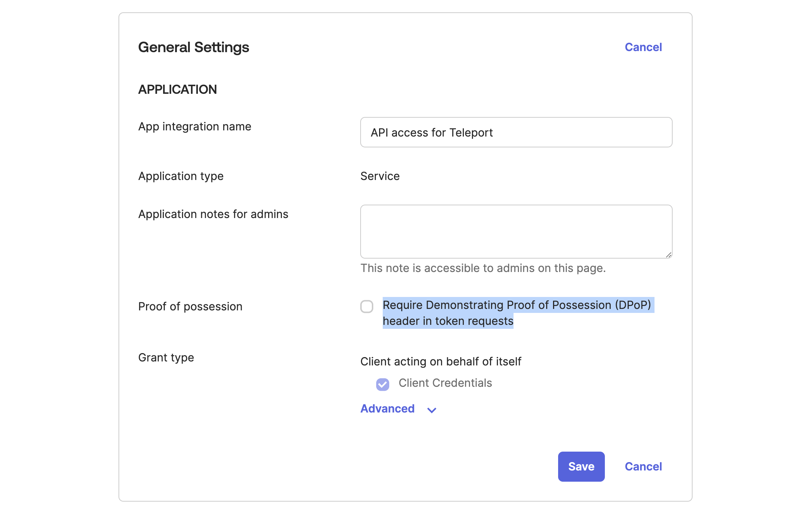
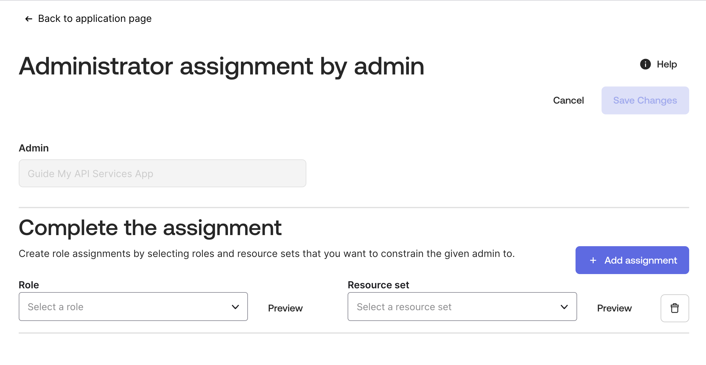
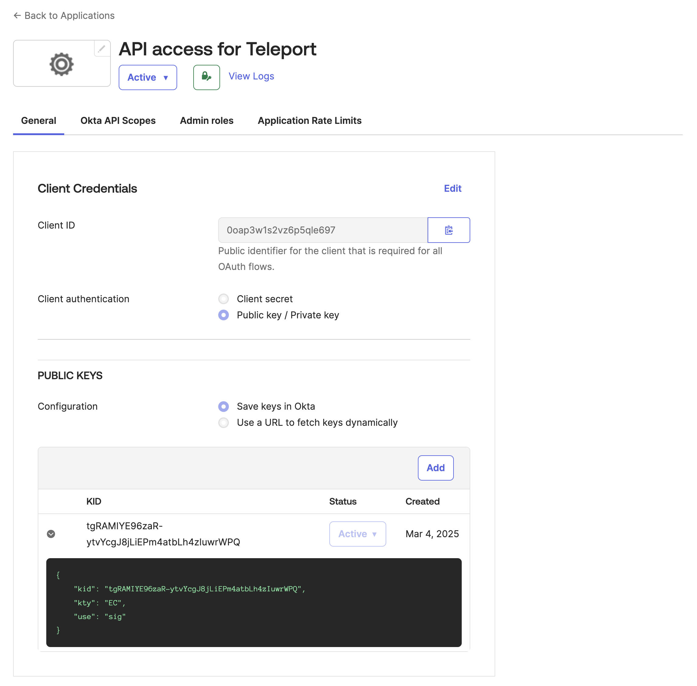
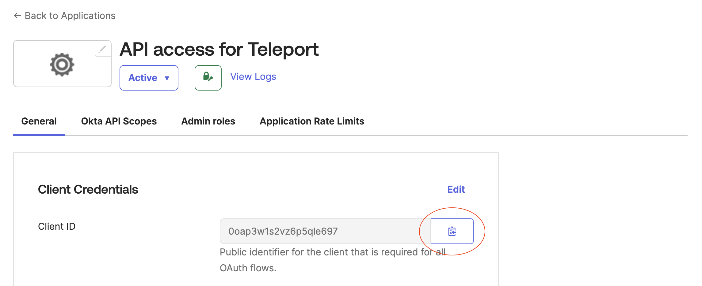

Okta user sync imports Okta users as Teleport users via a continuous
reconciliation loop. User sync works in tandem with the Teleport [SCIM
integration](./scim-integration.mdx#how-it-works). 

Unlike the SCIM integration, user sync is initiated from the Teleport side, and
therefore requires API access to Okta. It is also slower than SCIM. However, it
fetches Okta users configured before SCIM was enabled, captures changes if a
SCIM request does not reach your Teleport cluster, and works with Teleport
clusters that are inaccessible over the public internet. User sync is required
for application and group sync.

This guide shows you how to set up Okta user sync with the guided Okta
integration enrollment flow.

## Prerequisites

(!docs/pages/includes/commercial-prereqs-tabs.mdx!)

- An Okta authentication connector. 

  <Admonition>
  Before following the guided user sync integration flow, you must have
  completed the [guided Okta single sign-on flow](./guided-sso.mdx).
  </Admonition>

- (Optional) The Okta SCIM integration. To set up the SCIM integration, you can
  follow the [guided integration flow](./scim-integration.mdx).

- (!docs/pages/includes/tctl.mdx!)

- An Okta organization with admin access.

Enabling the Okta integration will make Teleport take ownership over app and
group assignments in Okta and can make changes within Okta based on your
Teleport RBAC configuration. To limit the scope of the integration, ensure that:

- In the Teleport roles you have assigned to users, no role contains an
  [app_labels](../../enroll-resources/application-access/controls.mdx) field
  with a wildcard value. Since Teleport uses this field to govern access to Okta
  applications, wildcard values will grant Teleport users access to all Okta
  applications. 
- (Optional) You have organized your Okta applications and groups into [Okta
  resource
  sets](https://help.okta.com/en-us/content/topics/security/custom-admin-role/create-resource-set.htm),
  which allow you to limit the scope your Okta access token.

## Step 1/3. Create an Okta API Services app

Okta API services app provides credentials for Teleport to access Okta API. This
app will have [Okta custom admin
role](https://help.okta.com/en-us/content/topics/security/custom-admin-role/custom-admin-roles.htm)
and [Okta resource
set](https://help.okta.com/en-us/content/topics/security/custom-admin-role/create-resource-set.htm)
assigned to it allowing limiting Teleport access to the Okta organization
resources.

### Create an app with a custom admin role

1. Create Okta API Services app. From the main navigation menu, select
   **Applications** -> **Applications**, and click **Create App Integration**.
   Select API Services, then click **Next**.

   

1. Create an admin role for the app. Okta API Services apps require assigning
   admin roles to be able to provide access to Okta resources. From the main
   navigation menu, select **Security** -> **Administrators**, then go to the
   **Roles** tab and click **Create new role**:

   

1. Type in the role name and optionally the description and select the following permissions for the role:

   **User**
   
   - View users and their details
   - Edit users' group membership
   - Edit users' application assignments
   
   **Group**
   
   - View groups and their details
   - Manage group membership
   
   **Application**
   
   - View application and their details
   - Edit application's user assignments 

1. And finally click **Save role**.

### Create a resource set for the app

Create an [Okta resource
set](https://help.okta.com/en-us/content/topics/security/custom-admin-role/create-resource-set.htm),
which we will need to assign the custom admin role created in the previous
section.

1. Navigate to **Security** -> **Administrators**, then go to the **Resources**
   tab and click **Create new resource set**.

1. Click **+ Add Resource** to add 3 resource types: *Users*, *Groups* and *Applications*.

   

   You can limit Teleport's access to Okta resources by adjusting the resources
   in the set. Remember to include the Okta SAML 2.0 application that you
   created as a prerequisite to the user sync integration.

1. After setting up the resources and filling out the name and optional
   description click **Create** and proceed.

### Configure app permissions

1. Disable proof of possession. Teleport does not support DPoP when using OAuth
   authorization for an Okta API Services app. 

   To disable DPoP, stay in the **General** tab, scroll down to the **General
   Settings** section and click **Edit** in the top-right corner of the section.
   Then uncheck the "Require Demonstrating Proof of Possession (DPoP) header in
   token requests" checkbox and click **Save**.

   

2. Set up Okta API scopes. In the **Okta API Scopes** tab grant the following
   scopes: 

   - `okta.apps.read`
   - `okta.apps.manage`
   - `okta.groups.read`
   - `okta.groups.manage`
   - `okta.users.read`
   - `okta.users.manage`

   

3. Assign an admin role to the app. Navigate to the **Admin roles**, and click
   **Edit assignments**.

   

4. Select the custom admin role and the resource set created earlier and click
   **Save changes**.

## Step 2/3.Configure the app to trust Teleport JWTs

To allow Teleport access to Okta, the Okta API Services app created in the
previous step must be able to verify the JWT tokens issued by Teleport. In order
to do this, you will configure the app with the Teleport public key for Okta.

The procedure varies slightly depending on whether you Teleport cluster is
accessible over the public internet:.

<Tabs>
<TabItem label="Public Teleport cluster">

1. Copy the JWKS URL displayed in the **Step 2** of the integration enrollment
   screen.

1. In the Okta admin UI, in **Applications** -> **Applications**, find your Okta
   API services app. In the app settings, in the **General** tab, click on
   **Edit** on the top right corner in the **Client Credentials** section and
   change Client authentication to "Public key / Private key".

1. In the same section, in the **PUBLIC KEYS** subsection, select "Use a URL to
   fetch keys dynamically" and paste the Teleport JWKS URL for Okta. Click
   **Save**.

   

</TabItem>
<TabItem label="Private Teleport cluster">

1. Click on **If your cluster is private** in **Step 2** of the integration
   enrollment screen. It will display a JSON document containing the cluster's
   public key.

1. Copy the public key JSON.

1. In the Okta admin UI, navigate to **Applications** -> **Applications**. Find
   your Okta API services app. In the app settings, in the **General** tab,
   click on **Edit** on the top right corner in the **Client Credentials**
   section and change Client authentication to "Public key / Private key".

1. In the **PUBLIC KEYS** subsection, select "Save keys in Okta", and click **Add key**.

1. Paste the public key JSON and click **Done**.

1. Click **Save** in the previous screen. Disregard the "Invalid DateTime"
   message in the *Created* column. This value will become a valid date once you
   click **Save**.

   

</TabItem>
</Tabs>

## Step 3/3. Provide your client ID

1. In the Okta admin UI, in **Applications** -> **Applications**, find your Okta
   API services app. In the app settings in the **General** tab you will find
   the client ID.

   

1. Paste the client ID to the **App Sync** enrollment screen and click **Update**.

   

1. Click **Update** to finish configuring user sync.

## User import

During synchronization, the Okta integration will create Teleport user accounts
for all users assigned to the Okta SAML app for the Teleport auth connector used
to enroll the Okta integration. 

The Teleport users created by the synchronization process or SCIM provisioning
all inherit their username from the upstream Okta organization, and are given a
default role of `okta-requester`.

The `okta-requester` role allows the user to log into Teleport, but grants no
default access to Teleport resources. The Teleport admin can use Access Requests
and Access Lists to grant access to Teleport resources as they see fit, once the
user is imported.

## User traits

All non-empty values in the Okta User/AppUser profile are converted to Teleport
user traits. For example, an imported Okta user might look like this:

```yaml
kind: user
metadata:
  name: hiro@enzos-pizza.com
  labels:
    okta/org: https://enzos-pizza.okta.com
    teleport.dev/origin: okta
roles:
  - okta-requester
spec:
  traits:
    okta/email:
      - hiro@enzos-pizza.com
    okta/firstName:
      - Hiro
    okta/lastName:
      - Protagonist
    okta/login:
      - hiro@enzos-pizza.com
```

Teleport administrators can then use these traits as conditions in Access Lists
in order to grant (or deny) the Okta-derived Teleport users access to Teleport
resources.

## User deletion

Given a case where
 1. the synchronization process detects that an Okta user has been deactivated,
    deleted or removed from the Okta App, or
 1. the Okta organization explicitly disables the account via SCIM,

The Okta integration will immediately delete the corresponding Teleport
account and create a temporary Teleport user lock. The user lock will
 - terminate any active Teleport sessions, and
 - prevent the disabled user from accessing any Teleport resources with
   credentials issued before their Teleport account was deleted.

The user lock will expire after the maximum possible credential lifetime, plus
a small safety margin.

<Admonition type="warning">
Suspended Okta users will not be locked by Teleport.

When a user is suspended in Okta, Okta does not communicate the suspension to
Teleport and so Teleport will not automatically lock and remove that user.

Be sure to either deactivate the user, or unassign them from the Okta SAML
Application in order to make sure their status is updated in Teleport.
</Admonition>

## Next steps

After completing the guided enrollment flow for the Okta SCIM integration, you
can proceed to the [Okta app and group sync
integration](./app-and-group-sync.mdx).
