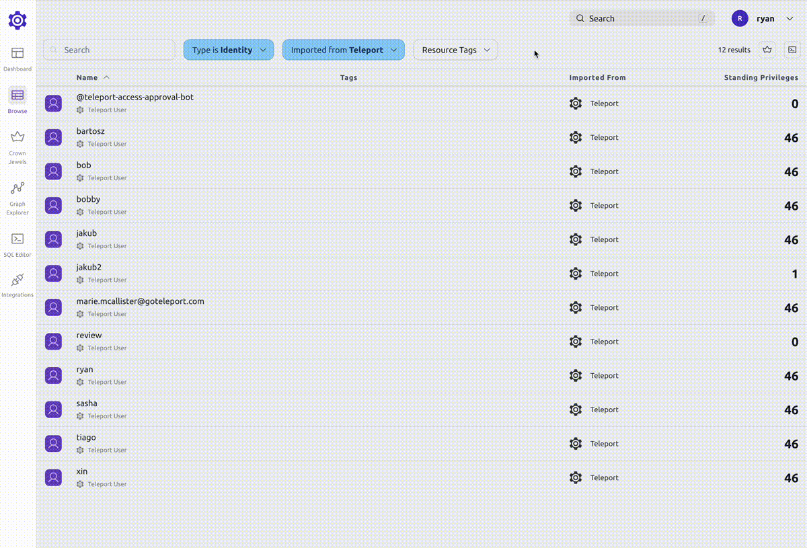
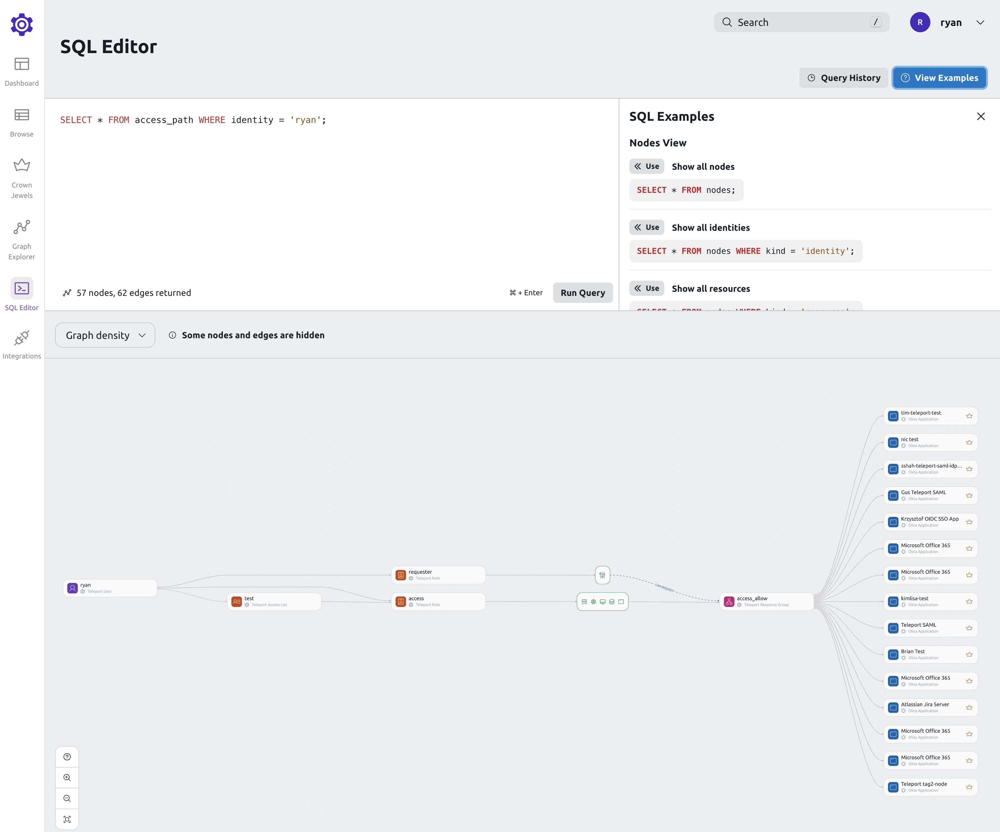

Teleport Identity Security helps teams expose and eliminate hidden risk in their infrastructure. 

These are some use cases for Teleport Identity Security:  

- Find users with the highest standing privilege with the Standing Privilege Dashboard.
- Visually understand which resources a user can access and which users and bots can access a resource. 
- Quickly query key access pathways with SQL Editor.
- Know when access pathways change for a critical asset with Crown Jewel Alerting.
- Investigate identity breaches by correlating audit logs with Identity Activity Center. 

## How to use Identity Security Graph Explorer 

Identity Security with Access Graph feature can help you to answer questions like:

- Who can access a specific resource?

Determine who has access to resources and understand the pathways that grant access:


- What resources can a specific user access?

At a glance, you can view all the resources a user can access:



## Dashboard: Standing Privileges

The Identity Security with Access Graph dashboard provides a high-level overview of standing privileges across 
your infrastructure.  Standing privileges are the number of resources that an identity can access 
without creating an Access Request. Details about standing privileges can be found by clicking on the
user or bot. 


## Identity Activity Center Investigate View

The Identity Security with Identity Activity Center dashboard provides an overview of recent identity activity
across your infrastructure. Ingest and correlate data between IdPs (Okta), Code ([GitHub](./integrations/github.mdx)), Cloud Providers ([AWS](./integrations/aws-sync.mdx)) and 
Teleport Audit Log. 


## Graph View

Graph view is the main view that shows the connections between identities and resources.

By default, an aggregated view of access paths grouped by identity is shown.

## Search

To search for a graph node, use the search bar at the top of the page or press `/`.

This will bring up the global search, where you can search for nodes, pages and access paths.


Clicking on a node will open a drawer with more details about that node.


Viewing a node's access path will open up the graph explorer view with the selected node.


## Access path view

A node's access path shows all the resources that the node can access.

When viewing an access path, you can filter down the graph to show only the nodes that you are interested in.

For example, if you are viewing a user's access path and want to see what access is given to that user through a certain role, you can right-click the role and select "Add to search".


This will narrow down the graph to show you only the access paths that include that role.


## Graph nodes

Access Graph divides your infrastructure into six main components:

1. Identities


Identities are the actors that can access your infrastructure. They can be employees, contractors, machines or bots.

The number on the right hand side shows **standing privileges**. The standing privileges metric indicates the number of
resources that an identity can access without creating an Access Request.

2. User Groups


Identity Groups are collections of identities. They can be used to organize users
based on their role or team, and they can be nested.

3. Actions


Actions are the things that identities can or cannot do. Actions are related to resources.
For example, a user can SSH into a node.

4. Deny Actions


Deny Actions are the things that identities cannot do. Deny Actions are related to resources.
For example, a user cannot SSH into a node.

5. Resource Groups


Resource Groups are collections of resources. They can be used to organize resources based on their role or team.

The number on the right hand side shows the number of resources that a resource group contains.

6. Resources


Resources are the things that users can or cannot access. They can be servers, databases, or Kubernetes clusters.

## SQL Editor

Access Graph allows creating SQL like queries to explore the graph.



The query language allows to create different views of the graph, ex:

Show only allowed paths:

```sql
SELECT * FROM access_path WHERE kind = 'ALLOWED';
```

Show only denied paths:
```sql
SELECT * FROM access_path WHERE kind = 'DENIED';
```

Show all access paths for a user:
```sql
SELECT * FROM access_path WHERE identity = 'bob';
```

Show all access paths for a user AND a resource:
```sql
SELECT * FROM access_path WHERE identity = 'bob' AND resource = 'postgres';
```

Show all access paths for resources with specific labels:
```sql
SELECT * FROM access_path WHERE resource_labels @> '{"key": "value"}';
```

Show all SSH Keys from SSH Key Scanning:

```sql
SELECT * FROM ssh_keys;
```

You can view more SQL examples in the editor.
