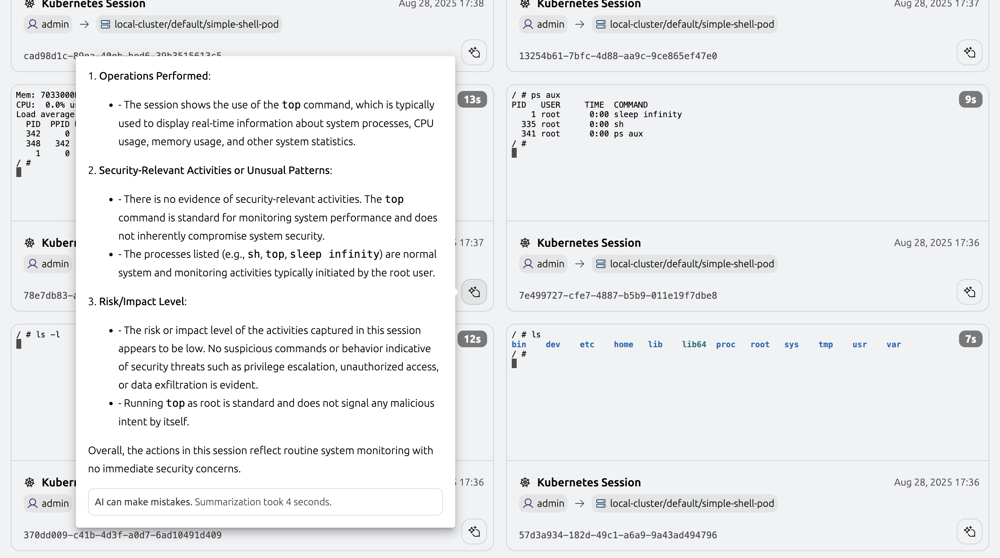

Teleport Identity Security allows you to generate and view session recording
summaries for shell and database sessions. This allows you to see at a glance
what your users do and estimate legitimacy of their actions before digging
deeper and reviewing the entire recording.

<Admonition type="note">
**Session Recording Summaries and AI Usage**
Session Recording Summaries are available to Teleport Enterprise customers with Teleport Identity Security.

**Important**: AI-powered summarization is **disabled by default** in all
Teleport deployments (both self-hosted and cloud). No AI processing occurs
unless you explicitly enable this feature. This ensures you have complete
control over whether and how AI is used with your session recordings.

When you choose to enable summarization, the following options are available:

| Integration mode | Self-hosted Teleport Enterprise | Teleport Enterprise Cloud |
| --- | --- | --- |
| Using OpenAI with your own OpenAI key | ✅ | ✅ |
| Using OpenAI-compatible LLM gateways such as LiteLLM  | ✅ | ✅ (*) |
| Using Amazon Bedrock models provided by your own AWS account | ✅ | ❌ (**) |
| Using an Amazon Bedrock model provided by Teleport | ❌ | ❌ (**) |

(*) In case of Teleport Cloud, the Teleport Auth Service must be able to reach
the LLM gateway. It means the gateway needs to be publicly accessible and
properly secured. Access to the gateway should be guarded by the equivalent of
OpenAI API key (e.g. LiteLLM master key).

(**) Amazon Bedrock will be available in Teleport Enterprise
Cloud later this year.

Existing customers will never have AI features automatically enabled without explicit consent.
Learn more about the features included in [Teleport Identity Security](https://goteleport.com/platform/identity-security/).
</Admonition>

## How it works

Teleport can automatically summarize any recorded interactive SSH or Kubernetes
session, as well as any recorded database session.

After each session finishes, Teleport decides if it should be summarized by
matching it against a set of policies which route sessions to LLMs. Exactly
which sessions are summarized and which model is used can be decided on using
session, resource, and user metadata, such as session kind, session
participants, resource labels, user traits, etc.

If a match is found, Teleport proceeds to summarize the session recording. It
uses an inference model configuration indicated by the policy to generate a
summary using an external inference provider, such as OpenAI or Amazon Bedrock.
There is no way to run this process on demand.

There are three fundamental concepts to that underpin session summarization:

- **Inference providers** (OpenAI, Amazon Bedrock) do the heavy lifting of
  summarization.
- **Inference models** indicate *how* sessions get summarized: they are
  Teleport configuration resources that provide model settings.
- **Inference policies** indicate *what* gets summarized and which inference
  model is used in given case.

<Admonition type="warning">
This feature is powered by AI leveraging a Large Language Model, and as such,
its accuracy may vary.

Teleport doesn't currently support any spend controls; controlling the LLM
token budget is your responsibility.
</Admonition>

## Prerequisites

- A running Teleport Enterprise (Self-Hosted) cluster v18.2.0 or later with Identity 
  Security enabled.
- Access to an LLM API. This can be:
  - OpenAI or OpenAI-compatible inference API, either public or self-hosted.
  - Amazon Bedrock (available in self-hosted mode only; see the availability
    table above).

## Step 1/5: Configure access to inference configuration

In order to manage the summary inference configuration, you need a write access
to `inference_model`, `inference_secret`, and `inference_policy` resources,
which is granted by default through the preset `editor` role.

Alternatively, you can create a new role to make sure you have
access to all necessary resources. To create a new role:

1. Create a `summarizer-admin.yaml` file with the following content:

   ```yaml
   kind: role
   metadata:
     name: summarizer-admin
   spec:
     allow:
       rules:
       - resources:
         - inference_model
         - inference_secret
         - inference_policy
         verbs:
         - read
         - list
         - create
         - update
         - delete
   version: v7
   ```

1. Apply your changes:

   ```code
   $ tctl create -f summarizer-admin.yaml
   ```

   (!docs/pages/includes/create-role-using-web.mdx!)

1. (!docs/pages/includes/add-role-to-user.mdx role="summarizer-admin"!)

## Step 2/5 : Configure the inference model

In this step, you will create an `inference_model` resource. It tells Teleport
how to summarize a session by pointing it to a large language model (LLM) API.
In particular, it contains an API-specific model name. Note that the *Teleport
inference model name* and *API-specific model name* are two different things.
This allows, for example, using the same model from providers like OpenAI or
Amazon Bedrock with different temperature settings, or routing to different API
gateways by creating multiple Teleport inference models that reference the same
underlying API-specific model name

<Tabs>
<TabItem label="OpenAI">
To communicate with OpenAI, an inference model needs an API key. It's stored
separately in an `inference_secret` resource and referenced by the
`inference_model`'s `spec.openai.api_key_secret_ref` field.

<Admonition type="warning">
To protect your API key, once written, an `inference_secret` value cannot be
retrieved through `tctl` or Teleport API. It can only be updated or deleted.
</Admonition>

1. Create an `inference-model.yaml` file with the following content:

   ```yaml
   kind: inference_model
   version: v1
   metadata:
     name: shell-summary-model
   spec:
     openai:
       # In this scenario, where we connect to OpenAI directly, openai_model_id
       # needs to be a valid OpenAI model name.
       openai_model_id: gpt-4o
       # This value refers to the `inference_secret` resource name.
       api_key_secret_ref: openai-key
     # It's a good idea to limit the session length to prevent incurring cost for
     # sessions that were too long anyway to fit in the model's context window.
     # If unset, defaults to 200kB. See the Limitations section for more details.
     max_session_length_bytes: 190000

   ---

   kind: inference_secret
   version: v1
   metadata:
     name: openai-key
   spec:
     value: '<paste-your-openai-api-key-here>'
   ```

1. Apply your changes:

   ```code
   $ tctl create -f inference-model.yaml
   ```

</TabItem>

<TabItem label="Amazon Bedrock">

### Pick a model

Depending on the model that you'd like to use, you may need to use an existing
inference profile in Amazon Bedrock (not to be confused with Teleport inference
policy) or create a new one. If the model in question supports on-demand
invocation, an inference profile is not required. As of time of writing, Claude
3.5 Haiku and Claude 3.5 Sonnet are examples of models that don't require
creating Amazon Bedrock inference profiles and can be used as is. Use the
following command to list models that support on-demand invocation:

```sh
aws bedrock list-foundation-models --by-inference-type=ON_DEMAND --query='modelSummaries[*].modelId'
```

Refer to Amazon Bedrock documentation for details on inference pricing for
various models.

### Find or create an Amazon Bedrock inference profile

If you'd like to use a model that doesn't support on-demand invocation, you
need to first find a system-defined inference profile for that model or create
your own one. If the model supports on-demand invocation, you can skip this
part.

To pick a system-defined inference profile for the model of your choosing,
start by listing all available models and pick a model ARN.

```sh
aws bedrock list-foundation-models --query='modelSummaries[*].modelArn'
```

Next, find an inference profile for that model, replacing <Var
name="bedrock-model-arn"/> with the model ARN:

```sh
aws bedrock list-inference-profiles --query "inferenceProfileSummaries[?contains(@.models[*].modelArn, '<Var name="bedrock-model-arn"/>')].inferenceProfileArn"
```

Now that you have an inference profile ARN, you can move on to creating the
actual model configuration on the Teleport side.

### Ensure that Teleport can invoke models

The Teleport Auth Service must be able to read AWS credentials in order to
authenticate to Amazon Bedrock.

(!docs/pages/includes/aws-credentials.mdx service="the Teleport Auth Service"!)

In case of invoking a model directly, attach the following AWS IAM policy (not
to be confused with Teleport inference policy) to the IAM role that is used by
Teleport to authenticate to Amazon Bedrock:

```yaml
{
  "Version": "2012-10-17",
  "Statement": [
    {
      "Effect": "Allow",
      "Action": "bedrock:InvokeModel",
      "Resource": "<Var name="bedrock-model-arn"/>"
    }
  ]
}
```

Replace <Var name="bedrock-model-arn"/> with the ARN of the Amazon Bedrock
model.

If you're using an inference profile, the `Resource` field must instead specify
the inference profile ARN, as well as ARNS of *all* of the models that given
inference profile may end up calling. These can be given either as an array of
specific elements or using wildcards. For more details, see [the Amazon Bedrock
documentation on prerequisites for using inference
profiles](https://docs.aws.amazon.com/bedrock/latest/userguide/inference-profiles-prereq.html).

The exact procedure for attaching this policy is different depending on the
details of your infrastructure; for example, if you are running Teleport on an
EC2 instance, you should navigate to that instance in the AWS Console, and
modify the role specified in the **IAM Role** section of the instance summary.
(If there's no IAM role set, use **Actions -> Security -> Modify IAM role**.) 

### Create an `inference_model` resource

1. Create an `inference-model.yaml` file with the following content:

   ```yaml
   kind: inference_model
   version: v1
   metadata:
     name: shell-summary-model
   spec:
     bedrock:
       # Indicates a region where the inference will be performed. See below
       # for more details.
       region: <Var name="region"/>
       bedrock_model_id: <Var name="bedrock-model-or-inference-profile-arn"/>
     # It's a good idea to limit the session length to prevent incurring cost for
     # sessions that were too long anyway to fit in the model's context window.
     # If unset, defaults to 200kB. See the Limitations section for more details.
     max_session_length_bytes: 190000
   ```
   
   Replace <Var name="bedrock-model-or-inference-profile-arn"/> with an ARN of
   the Amazon Bedrock foundation model or an inference profile. A Bedrock model
   ID can also be used.

   If a foundation model is directly invoked (i.e. `bedrock_model_id` points to
   a model, not an inference profile), <Var name="region"/> should be replaced
   with one of the supported regions for a given model. Consult the [table of
   model support by AWS
   region](https://docs.aws.amazon.com/bedrock/latest/userguide/models-regions.html)
   from the official AWS documentation.
   
   If `bedrock_model_id` refers to an inference profile, <Var name="region"/>
   needs to point to a region specified in the inference profile ARN.

1. Apply your changes:

   ```code
   $ tctl create -f inference-model.yaml
   ```

</TabItem>
</Tabs>

## Step 3/5: Set up an inference policy

In this step, you will add an `inference_policy` resource that routes sessions
to inference models using session kinds and optional custom filters. Only one
policy is allowed to match a given session to guarantee that its recording will
be summarized at most once. Policies are checked in alphabetical order of names
and the first one that matches is used. Here are some example scenarios that
can be expressed using inference policies:

- Only summarize sessions to your production resources using resource labels.
- Use different models for summarizing shell and database sessions.

See [Session matching examples](#session-matching-examples) for details on how
to configure Teleport to achieve these goals.

To create the required configuration resources:

1. Create an `inference-policy.yaml` file with the following content:

   ```yaml
   kind: inference_policy
   version: v1
   metadata:
     name: shell-sessions
     description: Summarize all sessions using OpenAI
   spec:
     # Session kinds affected by this policy. Allowed values: "ssh", "k8s", "db".
     kinds:
     - ssh
     - k8s
     - db
     # Name of the `inference_model` resource that will be used for summarizing
     # these sessions.
     model: shell-summary-model
   ```

1. Create the inference policy in the backend:

   ```code
   $ tctl create -f inference-policy.yaml
   ```

For full description of the inference configuration resources, see appropriate
sections of [Teleport Resources Reference](../reference/infrastructure-as-code/teleport-resources/teleport-resources.mdx):

- [`inference_model`](../reference/infrastructure-as-code/teleport-resources/inference-model.mdx)
- [`inference_secret`](../reference/infrastructure-as-code/teleport-resources/inference-secret.mdx) (only for OpenAI and compatible APIs)
- [`inference_policy`](../reference/infrastructure-as-code/teleport-resources/inference-policy.mdx)

## Step 4/5: Configure access to session summaries

Every user who has access to
[given session recording](../reference/access-controls/roles.mdx#rbac-for-session-recordings)
also has access to its summary through a `session` resource kind. The preset
`access` role allows users to only view their sessions; in order to allow a
user to view all recordings and summaries, it's easiest to use the preset
`auditor` role.

You can either use the built-in roles or create a new one to make sure you have
access to all recordings. To create a new role:

1. Create a `summary-auditor.yaml` file with the following content:

   ```yaml
   kind: role
   metadata:
     name: summary-auditor
   spec:
     allow:
       rules:
       - resources:
         - session
         verbs:
         - read
         - list
   version: v7
   ```

1. Apply your changes:

   ```code
   $ tctl create -f summary-auditor.yaml
   ```

1. (!docs/pages/includes/add-role-to-user.mdx role="summary-auditor"!)

## Step 5/5: Conduct a session and view its summary

That's it! We are ready to conduct a test session. Connect to any of your
cluster resources using `tsh ssh`, `kubectl exec`, `tsh db connect`, or a web
terminal. Start an interactive session and execute any command, quit the
session, and go to **Audit -> Session Recordings**. You should see the
corresponding recording tile with a summary button
. Clicking the
summary button will show the summary.



<Admonition type="info">
It can take a while to generate a summary, and the time depends on multiple
factors, including session size, model, and its temperature. Usually it should
appear up to a minute after the session is uploaded to the Auth service.
</Admonition>

## Limitations

Currently, Teleport doesn't attempt to summarize sessions that are larger than
the model's context window. If after tokenization, the session turns out to be
larger than that, OpenAI will simply reject the request; the input tokens used
will be wasted. To prevent this, Teleport allows you to customize the maximum
size of session that may be sent to the inference provider by using the
`spec.max_session_length_bytes` field of the `inference_model` resource. Note
that there's no way to provide an exact number of bytes for a given model here;
in our experiments, we observed between 2 and 4 bytes per token, depending on
the model and input.

## Selecting sessions to summarize

Indiscriminately summarizing all sessions in your cluster can increase
costs, so it's recommended to be specific about which sessions will be
summarized and which model will be used for inference. One of these mechanisms
— selecting sessions by kind — was mentioned already in the above example. In
addition to matching by kind, it's also possible to add a custom filter to each
inference policy, which can be used to summarize only sessions that target
production resources, are attended by certain users, etc.

Filters are expressed using the [Teleport predicate language](#predicate-language).
If an inference policy contains a filter, it will match only sessions that
match one of the indicated kinds *and* the specified filter.

### Session matching examples

A typical case would be to pick only production resources for summarizing. The
following example policy only matches Kubernetes sessions in any of the
production clusters, picked by matching cluster labels:

```yaml
kind: inference_policy
version: v1
metadata:
  name: prod-k8s-sessions
  description: Summarize production Kubernetes sessions
spec:
  kinds:
  - k8s
  filter: 'equals(resource.metadata.labels["env"], "prod")'
  model: shell-summary-model
```

The following example uses two policies to route shell and database sessions to
two different models. It assumes that there are two `inference_model` resources
created: `database-summary-model` and `shell-summary-model`.

```yaml
kind: inference_policy
version: v1
metadata:
  name: shell-policy
spec:
  kinds: ['ssh', 'k8s']
  model: shell-summary-model

---

kind: inference_policy
version: v1
metadata:
  name: db-policy
spec:
  kinds: ['db']
  model: db-summary-model
```

### Predicate Language

Inference policy filters are expressed using Teleport predicate language. In
this case, the language supports the following operators:

| Operator | Meaning                             | Example                                                  |
| -------- | ----------------------------------- | -------------------------------------------------------- |
| &&       | and (all conditions must match)     | `contains(field1, field2) && equals(field2, "val")`      |
| \|\|     | or (any one condition should match) | `contains(field1, field2) \|\| contains(field1, "val2")` |
| !        | not (used with functions)           | `!equals(field1, field2)`                                |
| ==       | equal to                            | `resource.metadata.labels["env"] == "prod"`              |
| !=       | not equal to                        | `resource.metadata.labels["env"] != "prod"`              |

The language also supports the following functions:

| Functions                         | Return type | Description                                                                                                                                |
| --------------------------------- | ----------- | ------------------------------------------------------------------------------------------------------------------------------------------ |
| `all_end_with(a, suffix)`         | `Boolean`   | If `a` is a list, returns true if all strings in the `a` end with `suffix`. If `a` is a string, returns true if `a` ends with `suffix`.    |
| `all_equal(a, b)`                 | `Boolean`   | If `a` is a list, returns true if all items in `a` are equal to `b`. If `a` is a string, returns true if it's equal to `b`.                |
| `contains(list, item)`            | `Boolean`   | Returns true if `item` is included in the `list`                                                                                           |
| `contains_all(list, items)`       | `Boolean`   | Returns true if all `items` are included in the `list`                                                                                     |
| `contains_any(list, items)`       | `Boolean`   | Returns true if any of `items` is included in the `list`                                                                                   |
| `equals(a, b)`                    | `Boolean`   | Returns true if value `a` is equal to `b`                                                                                                  |
| `has_prefix(s, prefix)`           | `Boolean`   | Returns true if string `s` starts with `prefix`                                                                                            |
| `is_subset(a, item1, item2, ...)` | `Boolean`   | If `a` is a list, returns true if `list(item1, item2, ...)` is a subset of `a`. If `a` is a string, returns true if the list contains `a`. |
| `set(value1, value2, ...)`        | `[]string`  | Returns a list of strings                                                                                                                  |

It's possible to build predicates using information about target resource,
session, and user.

| Field                            | Meaning                                                                                                                                                         | Example                                           |
| -------------------------------- | --------------------------------------------------------------------------------------------------------------------------------------------------------------- | ------------------------------------------------- |
| resource                         | Resource that this session connects to (server, Kubernetes cluster, or database)                                                                                |                                                   |
| resource.kind                    | Resource kind                                                                                                                                                   | `resource.kind == "node"`                         |
| resource.metadata.labels         | Resource labels                                                                                                                                                 | `equals(resource.metadata.labels["env"], "prod")` |
| resource.metadata.name           | Resource name. In case of SSH servers, it's the server ID.                                                                                                      | `resource.name == "production-cluster"`           |
| resource.spec.addr               | Server address (SSH sessions only)                                                                                                                              | `resource.spec.addr == "123.123.123.123:3022"`    |
| resource.spec.db_protocol        | Database protocol (database sessions only). See [DB resource reference](../reference/infrastructure-as-code/teleport-resources/db.mdx) for supported values.    | `resource.spec.protocol == "postgres"`            |
| resource.spec.hostname           | Server hostname (SSH sessions only)                                                                                                                             | `resource.spec.hostname == "dummy-host"`          |
| resource.spec.uri                | Database URI (database sessions only)                                                                                                                           | `has_prefix(resource.spec.uri, "db-host")`        |
| session                          | The session that is being matched. This object supports all the fields of `session.end` and `db.session.end` events, so we only name the most useful ones here. |                                                   |
| session.cluster_name             | Name of the Teleport cluster                                                                                                                                    | `cluster_name == "teleport.example.com"`          |
| session.db_name                  | Name of database (the underlying one, not the Teleport resource; database sessions only)                                                                        | `session.db_name == "orders"`                     |
| session.db_service               | Database service name (database sessions only)                                                                                                                  | `session.db_service == "prod-db-service"`         |
| session.kubernetes_groups        | List of Kubernetes groups (Kubernetes sessions only)                                                                                                            | `contains(session.kubernetes_groups, "viewers")`  |
| session.kubernetes_node_name     | Name of node that runs the pod (Kubernetes sessions only)                                                                                                       | `session.kubernetes_node_name == "node1"`         |
| session.kubernetes_pod_name      | Name of the pod (Kubernetes sessions only)                                                                                                                      | `session.kubernetes_pod_name == "some-pod"`       |
| session.kubernetes_pod_namespace | Namespace that contains the pod (Kubernetes sessions only)                                                                                                      | `session.kubernetes_pod_namespace == "default"`   |
| session.kubernetes_users         | List of Kubernetes usernames (Kubernetes sessions only)                                                                                                         | `contains(session.kubernetes_users, "admin")`     |
| session.participants             | Users that participated in the session (SSH and Kubernetes sessions only)                                                                                       | `contains(session.participants, "alice")`         |
| user                             | User that created the session.                                                                                                                                  |                                                   |
| user.metadata.name               | User's name                                                                                                                                                     | `is_subset(user.metadata.name, "alice", "bob")`   |
| user.spec.roles                  | User's roles                                                                                                                                                    | `contains(user.spec.roles, "intern")`             |
| user.spec.traits                 | User's traits                                                                                                                                                   | `contains(user.spec.traits["teams"], "alpha")`    |

## Using LiteLLM and other OpenAI-compatible proxies

Although the only officially supported inference provider is currently OpenAI,
it's also possible to use any OpenAI-compatible API for this purpose. For
example, you may want to route some or all sessions to another provider or even
host your language models on premises. One way to do it is using LiteLLM.
Here's what you need to do:

1. Set up [LiteLLM Proxy Server (LLM
   Gateway)](https://docs.litellm.ai/docs/#litellm-proxy-server-llm-gateway) on a
   host accessible from the Teleport Auth Service.
2. Add a model of your choice to the LiteLLM configuration. In this example,
   let's call it `my-custom-model`.
3. Configure a Teleport inference model. Use `spec.openai.base_url` property to
   point Teleport to your LiteLLM instance and put `my-custom-model` in
   `spec.openai.openai_model_id`.
4. Add an `inference_secret` containing your LiteLLM master key.

Here is an example configuration:

```yaml
kind: inference_model
version: v1
metadata:
  name: lite-llm-summary-model
spec:
  openai:
    # In case of LiteLLM Proxy, the openai_model_id is the public model name as
    # configured in LiteLLM.
    openai_model_id: my-custom-model
    api_key_secret_ref: lite-llm-master-key
    base_url: http://llm-host:4000/

---

kind: inference_secret
version: v1
metadata:
  name: lite-llm-master-key
spec:
  # In case of LiteLLM, the API key is *not* your OpenAI key; instead, use your
  # LiteLLM master key.
  value: '<paste-your-master-key-here>'
```

## Monitoring

Teleport exposes a couple of useful Prometheus metrics that can be used to
monitor the session summarizer. Metrics are labeled by inference model name,
and in case of OpenAI errors — additionally with the OpenAI API error code. See
the [Teleport Metrics
reference](../reference/deployment/monitoring/metrics.mdx#session-recording-summarizer)
for details.

## Troubleshooting

### Amazon Bedrock fails to invoke a model with on-demand throughput

**Problem:** Summarization fails with "ValidationException: Invocation of model
ID *[model-id]* with on-demand throughput isn’t supported. Retry your request
with the ID or ARN of an inference profile that contains this model."

**Solution:** Use an Amazon Bedrock inference profile instead of a model ID in
the `inference_model` resource.

### Amazon Bedrock model identifier is invalid

**Problem:** Summarization fails with "ValidationException: The provided model
identifier is invalid." 

**Solution:** One possible reason is a mismatch between the `region` declared
in the `inference_model` resource and available regions for the given model or
inference profile. Make sure that the region is supported.

### Amazon Bedrock denies access to a model or inference policy

**Problem:** Summarization fails with "AccessDeniedException: User: *[user]* is
not authorized to perform: bedrock:InvokeModel on resource: *[resource-arn]*
because no identity-based policy allows the bedrock:InvokeModel action"

**Solution:** First, make sure that the AWS IAM role used by Teleport has a
policy attached that allows the `InvokeModel` action on the model or inference
policy that you specified in Teleport configuration (`inference_model`
resource). Then make sure that if you're using an Amazon Bedrock inference
profile, the policy references not only the inference profile itself, but also
all Amazon Bedrock models that this inference profile is associated with. Use
the following command to fetch details of the inference profile, replacing <Var
name="bedrock-inference-profile-arn"/> with the inference profile ARN:

```sh
aws bedrock get-inference-profile --inference-profile-identifier="<Var name="bedrock-inference-profile-arn"/>"
```