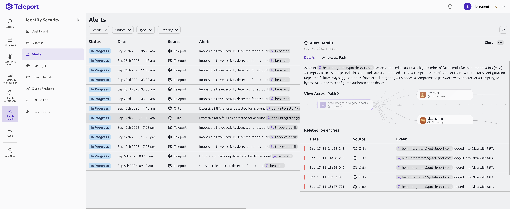

Teleport Identity Security provides pre-built security detections that automatically create alerts for suspicious identity-related activities across your infrastructure. These detections monitor events from Teleport and integrated services like AWS, GitHub, and Okta to identify potential security risks.

Teleport Identity Security alerts help you detect and respond to security threats by monitoring for:
- Unusual authentication patterns
- Privilege escalations
- Configuration changes that affect security
- Account compromises
- Policy violations

All detections are pre-configured and currently cannot be modified. The severity levels (Critical, High, Medium, Low) are defined by the Identity Security team based on the potential impact of each detection.

To view active alerts, navigate to **Identity Security** > **Alerts** in the Teleport Web UI.

<Admonition type="tip">

Teleport Identity Security Alerts and the Investigate view are currently only available in self-hosted AWS Teleport Enterprise deployments.  They will be coming to Teleport Enterprise Cloud in Q4 2025.

</Admonition>

## Detection categories

Each category below represents an integrated service where Teleport monitors for security events and suspicious activities pulled from various integration audit logs. The detections within each category are further organized by severity level to help you prioritize your security response efforts.

### AWS detections

Teleport Identity Security monitors your AWS infrastructure for critical to low security events. Set up AWS detections: [AWS Settings](../integrations/aws-sync.mdx)

#### Critical and high severity
- Root account activities (console login, access key creation, general activity)
- Security settings deletions (CloudTrail, GuardDuty, flow logs)
- EBS encryption disabled
- DB snapshots made public
- Exposed credential policy modifications
- Login profile updates

#### Medium and low severity
- IAM user creation
- DB snapshot attribute modifications
- AWS key deletion or disabling

### GitHub detections

Monitor your GitHub organizations and repositories for security-relevant changes:

#### Critical and high severity
- Organization security updates (SAML, MFA, OAuth restrictions)
- Protected branch policy overrides or deletions
- Repository access and visibility changes
- Secret scanning alerts
- Organization member updates

#### Medium and low severity
- Repository member updates
- Organization moderator additions
- Integration installations

#### Advanced Security Detections
The system includes 26 sub-types of GitHub advanced security change detections that monitor for modifications to security features like Dependabot alerts if enabled in your GitHub plan and organization. About GitHub Advanced Security: [GitHub Docs](https://docs.github.com/en/get-started/learning-about-github/about-github-advanced-security)

Set up GitHub detections: [GitHub Settings](../integrations/github.mdx)

### Okta detections

Track identity and access management events in your Okta environment:

#### High severity
- Admin MFA disabled
- All MFA factors reset
- OAuth token reuse patterns
- Rate limit violations
- Sign-on policy evaluations
- IDP lifecycle changes
- API token creation/revocation
- Security threat events

#### Medium severity
- Excessive MFA failures
- Multiple password reset attempts
- Dormant account access
- Support-initiated password or MFA resets

### Teleport detections

Monitor Teleport-specific security events:

#### High severity
- Root SSH session initiation
- Authentication without MFA for local accounts
- Unusual authentication failure patterns
- Role creation/updates/deletions
- Connector updates
- Unusual session commands

Set up Teleport detections: [Teleport Settings](../integrations/teleport.mdx)

### Cross-platform detections

####  High severity
- Impossible travel detection (GitHub, Okta, Teleport). Triggers when login attempts occur from multiple geographic locations within a timeframe that makes legitimate travel physically impossible

### Current Capabilities
- View alerts across all integrated systems - Access a unified dashboard in the Teleport Identity Security  that displays all security alerts from AWS, GitHub, Okta, and Teleport in a single view, eliminating the need to check multiple platforms separately.
- Filter by severity level - Narrow down the alerts list to show only Critical, High, Medium, or Low severity events, helping you prioritize which security issues to investigate first.
- Investigate related events - View associated events, graph and context in the Investigate view, allowing you to understand the full scope of the security incident and trace related activities across your infrastructure.

## Frequently asked questions

### Are these detections available in Teleport Cloud?
No, Identity Activity Center detections are only available in self-hosted Teleport Enterprise deployments. They will be coming to Teleport Enterprise Cloud in Q4 2025.

### Can I write my own detections?
No, detections are currently pre-configured per integration and cannot be customized.

### Can I resolve an alert?
Not currently, but we plan to add workflows to resolve, acknowledge, and mute alert types in future updates.

### What determines the severity level?
Severity levels are defined by the Identity Security Team based on the potential security impact. Feedback on severity assignments is welcome.

### Can I forward these events to another service?
This feature is planned for future release.

### How can I request new detection types?
For new detection requests based on customer needs, [reach out to the Identity Security Team](https://goteleport.com/contact-us/). Customer feedback is welcomed and helps prioritize new detection development.

## How do I deploy Identity Security Alerts?
Teleport Identity Security is a separately licensed product available to Teleport Enterprise customers. Alerts and Investigate view are only available in AWS self-hosted deployments. To deploy Identity Security, follow the instructions in [Self-Host Teleport Security - Identity Activity Center](../access-graph/identity-activity-center.mdx).

## Next steps

- Review the [Investigate](./investigate.mdx) documentation to learn about exploring identity-related activity
- Configure [integrations](../integrations/integrations.mdx) to expand detection coverage