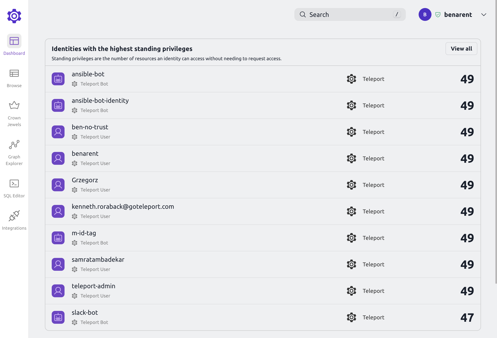

The Teleport  Access Graph dashboard provides a high-level overview of standing
privileges across your infrastructure.  Standing privileges are the number of
resources that an identity can access without creating an Access Request.
Details about standing privileges can be found by clicking on the user or bot. 

