{/*TODO: use case paragraph */}
{/*TODO: explain key terms and introduce the feature*/}

Teleport Access Graph feature can help you to answer questions like:

- Who can access a specific resource?

Determine who has access to resources and understand the pathways that grant access:

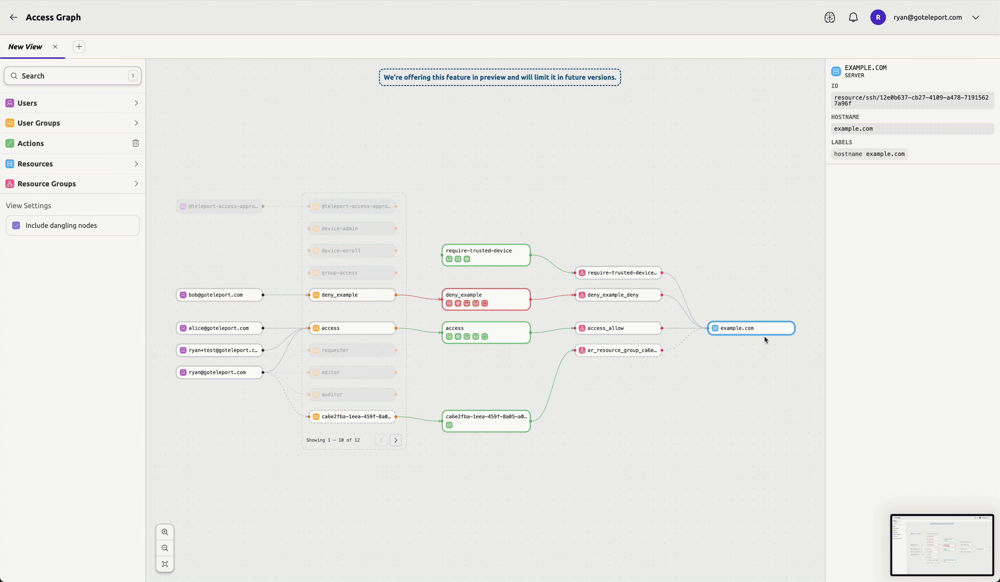

- What resources can a specific user access?

At a glance, you can view all the resources a user can access:

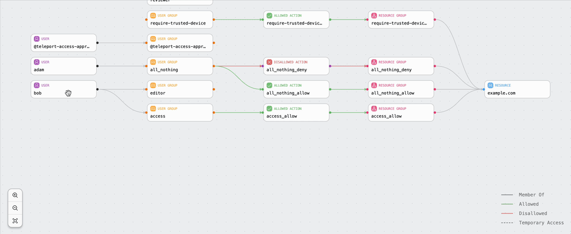

## Search

To search for a graph node, use the search bar at the top of the page or press `/`.

This will bring up the global search, where you can search for nodes, pages and access paths.

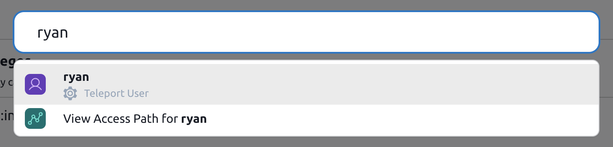

Clicking on a node will open a drawer with more details about that node.

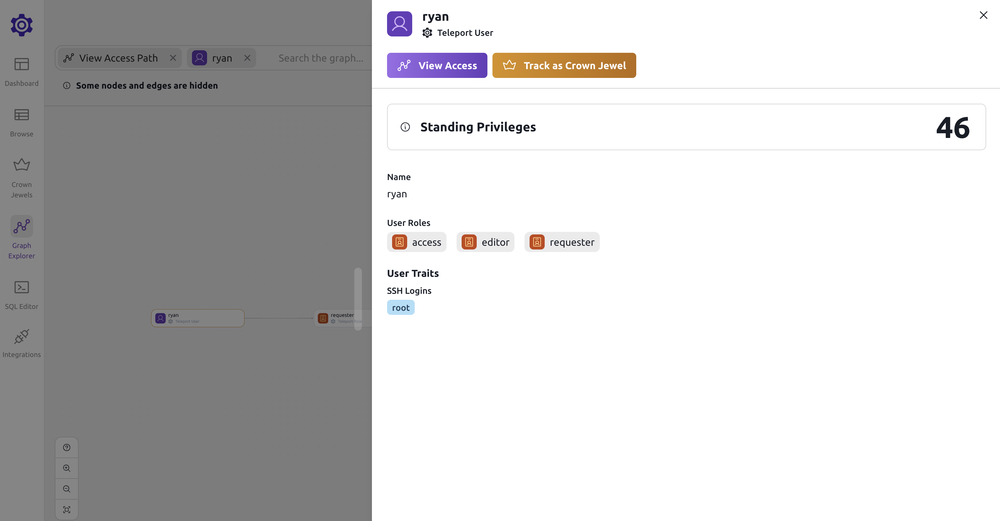

Viewing a node's access path will open up the graph explorer view with the selected node.

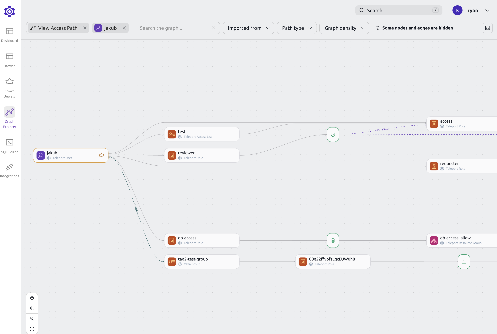

## Access path view

A node's access path shows all the resources that the node can access.

When viewing an access path, you can filter down the graph to show only the nodes that you are interested in.

For example, if you are viewing a user's access path and want to see what access is given to that user through a certain role, you can right-click the role and select "Add to search".

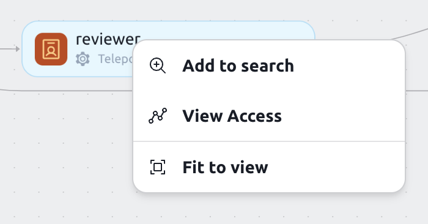

This will narrow down the graph to show you only the access paths that include that role.

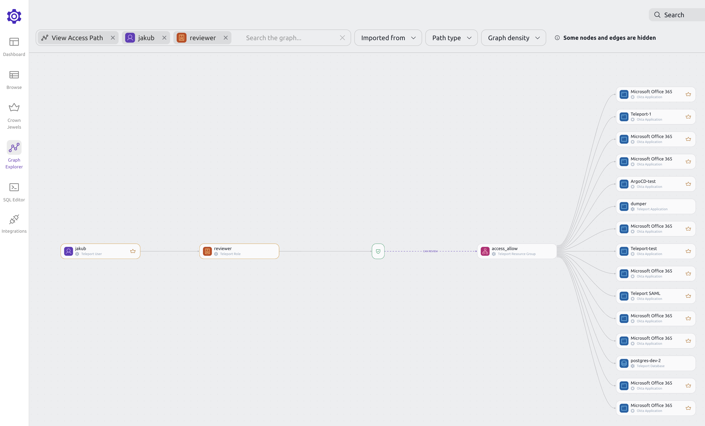

## Graph nodes

Access Graph divides your infrastructure into six main components:

### Identities

Identities are the actors that can access your infrastructure. They can be employees, contractors, machines or bots.

The number on the right hand side shows **standing privileges**. The standing privileges metric indicates the number of
resources that an identity can access without creating an Access Request.

### User Groups

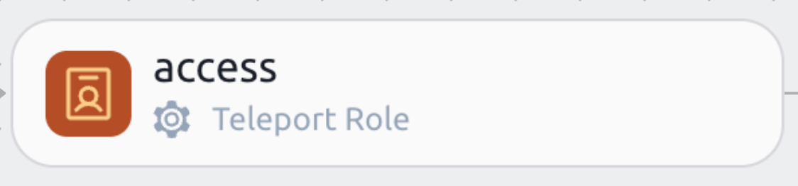

Identity Groups are collections of identities. They can be used to organize users
based on their role or team, and they can be nested.

### Actions

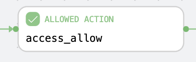

Actions are the things that identities can or cannot do. Actions are related to resources.
For example, a user can SSH into a node.

### Deny Actions

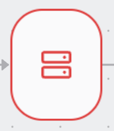

Deny Actions are the things that identities cannot do. Deny Actions are related to resources.
For example, a user cannot SSH into a node.

### Resource Groups

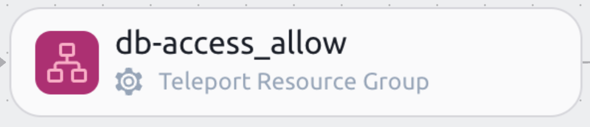

Resource Groups are collections of resources. They can be used to organize resources based on their role or team.

The number on the right hand side shows the number of resources that a resource group contains.

### Resources

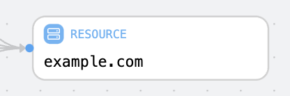

Resources are the things that users can or cannot access. They can be servers, databases, or Kubernetes clusters.

