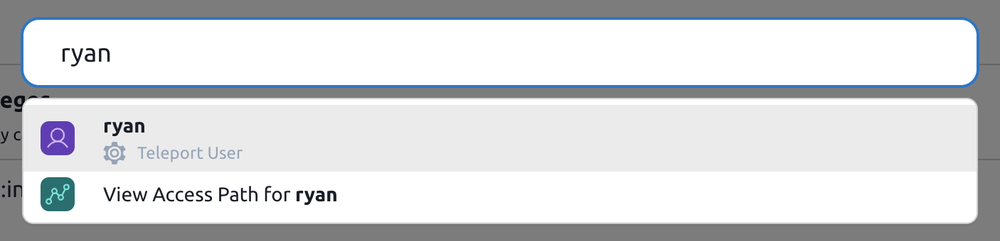
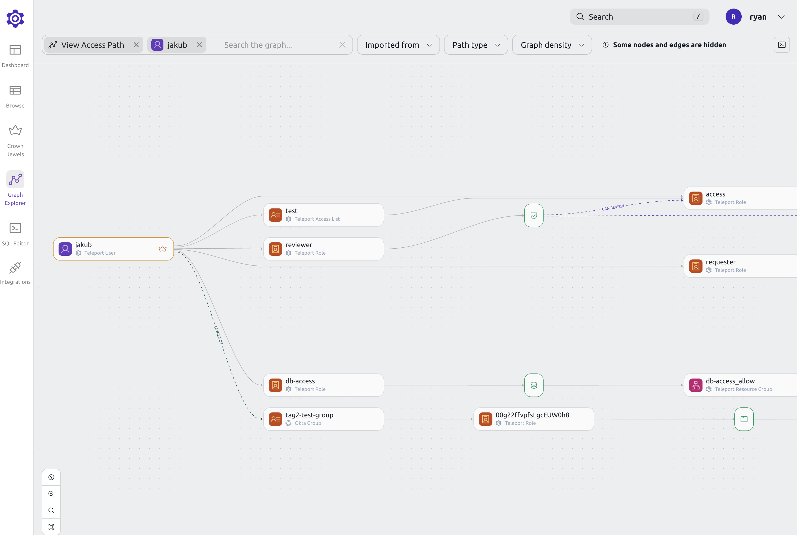
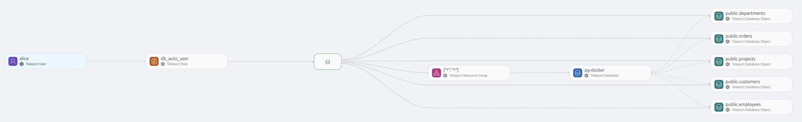
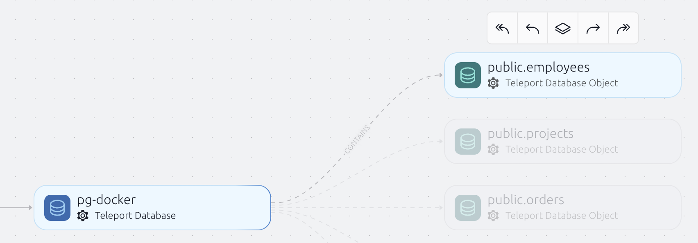

The Graph Explorer view in Teleport Access Graph reveals access patterns within
your infrastructure. You can see which infrastructure resources different
identities have access to, and which identities have access to a single
resource. You can reveal identities with excessive permissions and resources
with unexpected sources of access, helping you protecting your infrastructure
against identity-based attacks.

The Graph Explorer displays access controls from multiple systems in a single
view, including Teleport roles and access controls from cloud providers, code
repositories, and other [integrations](../integrations/integrations.mdx).

## Using Graph Explorer

To begin using Graph Explorer:

1. From the left sidebar, navigate to **Identity Security** > **Graph
   Explorer**.
1. From the main dropdown menu, select an identity, role, or resource to view.

From there, you can view more information about an access path or continue
exploring using the search bar.

### Drill down to an access path

In Graph Explorer, a node's access path shows all the resources that the node can access.

When viewing an access path, you can filter down the graph to show only the nodes that you are interested in.

For example, if you are viewing a user's access path and want to see what access is given to that user through a certain role, you can right-click the role and select "Add to search".

This will narrow down the graph to show you only the access paths that include that role.

### Using the search bar

To search for a graph node, use the search bar at the top of the page or press `/`.

This will bring up the global search, where you can search for nodes, pages and access paths.

Clicking on a node will open a drawer with more details about that node.

Viewing a node's access path will open up the graph explorer view with the selected node.

## Graph nodes

Access Graph divides your infrastructure into six main components:

### Identities

Identities are the actors that can access your infrastructure. They can be employees, contractors, machines or bots.

Users are created from Teleport Users.  Local users are imported as soon as they
are created.  External users (created from authentication connectors for GitHub,
SAML, etc.) are imported when they log in for the first time.

The number on the right hand side shows **standing privileges**. The standing privileges metric indicates the number of
resources that an identity can access without creating an Access Request.

### User groups

Identity Groups are collections of identities. They can be used to organize users
based on their role or team, and they can be nested.

User Groups are created from Teleport roles and Access Requests. Roles create
User Groups where the members are the users that have that role. Access requests
create a temporary User Group where the members are the users that got the
access through the accepted Access Request.

### Actions

Actions are the things that identities can or cannot do. Actions are related to resources.
For example, a user can SSH into a node.

Allow paths connect identities to resources. They show what an identity can access and what actions they can perform.

### Deny actions

Deny Actions are the things that identities cannot do. Deny Actions are related to resources.
For example, a user cannot SSH into a node.

Deny paths connect identities to resources. They show what an identity cannot
access and what actions they cannot perform. Deny paths take precedence over
allow paths.

### Temporary actions

Temporary Actions are created when a user is granted temporary access to a resource. 
They are automatically deleted when the user's access expires. The temporary actions 
can be identified by having `Temporary: true` property.

### Resource groups

Resource Groups are collections of resources. They can be used to organize resources based on their role or team.

The number on the right hand side shows the number of resources that a resource group contains.

### Resources

Resources are the things that users can or cannot access. They can be servers, databases, or Kubernetes clusters.

### Database Access Controls

Teleport supports [object-level permissions](../../enroll-resources/database-access/rbac.mdx) for select database protocols.

The database objects-level access information is automatically synchronized to Identity Security, making it possible to see who has particular levels of access to the different parts of the database.

When you inspect a particular user's access, the Teleport Access Graph will automatically display the database objects that the user can access.

To see more details about a specific database object, simply select it.

In the graph, database objects are connected by multiple edges:

1. There is exactly one edge connecting the object to its parent database resource. This edge has "contains" label.

   

2. At least one edge shows the permissions associated with the object, such as `INSERT, SELECT, UPDATE`. If multiple roles grant permissions to the same object, additional edges of this type may be present. The permissions are presented as edge labels.

   

