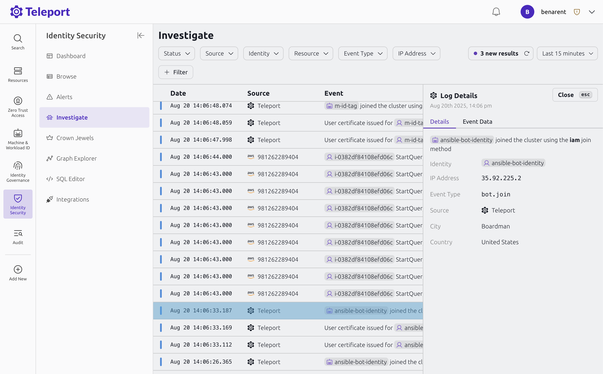

The Investigate dashboard provides an overview of recent identity activity
across your infrastructure, helping you investigate security risks and
incidents. You can see Teleport audit events related to identity, such as
certificate issuance and multi-factory authentication challenges, as well as
events from [integrations](../integrations/integrations.mdx) such as GitHub and
AWS. Because Identity Activity Center visualizes events from multiple
integrations at once, you can investigate identity-related incidents that
involve pivoting from one system to another.

To visit the Investigate dashboard, open the Teleport Web UI and navigate to
**Identity Security** > **Investigate**.

