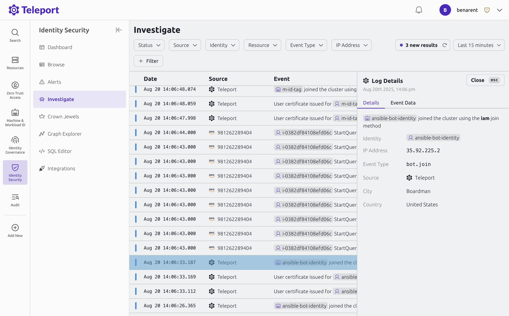

The Identity Activity Center dashboard provides an overview of recent identity
activity across your infrastructure. Ingest and correlate data between IdPs
(Okta), Code ([GitHub](../integrations/github.mdx)), Cloud Providers
([AWS](../integrations/aws-sync.mdx)) and Teleport Audit Log. 

{/*TODO: How does this work? I can connect the architecture to a use case. Is
this useful because it provides a uniform abstraction over a number of different
event types? What about correlation?*/}

