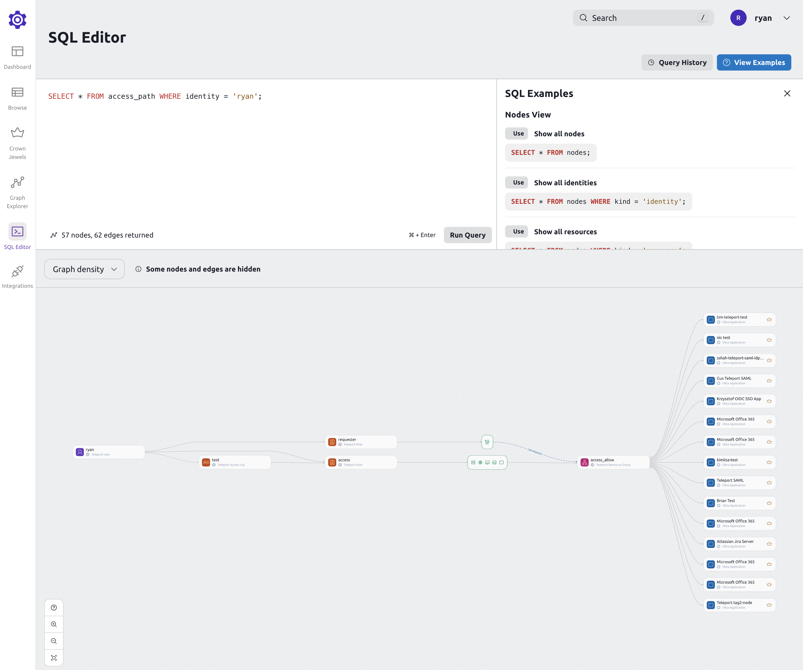

The Access Graph SQL Editor allows you to view nodes and edges within Access
Graph that satisfy specific criteria. This helps you make sense of the access
paths between identities and resources in your infrastructure so you can
pinpoint and remediate access control issues. In the SQL Editor, you can enter
SQL-like queries to explore selected nodes and edges within the graph.



The query language allows to create different views of the graph.

Show only allowed paths:

```sql
SELECT * FROM access_path WHERE kind = 'ALLOWED';
```

Show only denied paths:
```sql
SELECT * FROM access_path WHERE kind = 'DENIED';
```

Show all access paths for a user:
```sql
SELECT * FROM access_path WHERE identity = 'bob';
```

Show all access paths for a user AND a resource:
```sql
SELECT * FROM access_path WHERE identity = 'bob' AND resource = 'postgres';
```

Show all access paths for resources with specific labels:
```sql
SELECT * FROM access_path WHERE resource_labels @> '{"key": "value"}';
```

Show all SSH Keys from SSH Key Scanning:

```sql
SELECT * FROM ssh_keys;
```

You can view more SQL examples in the editor.
