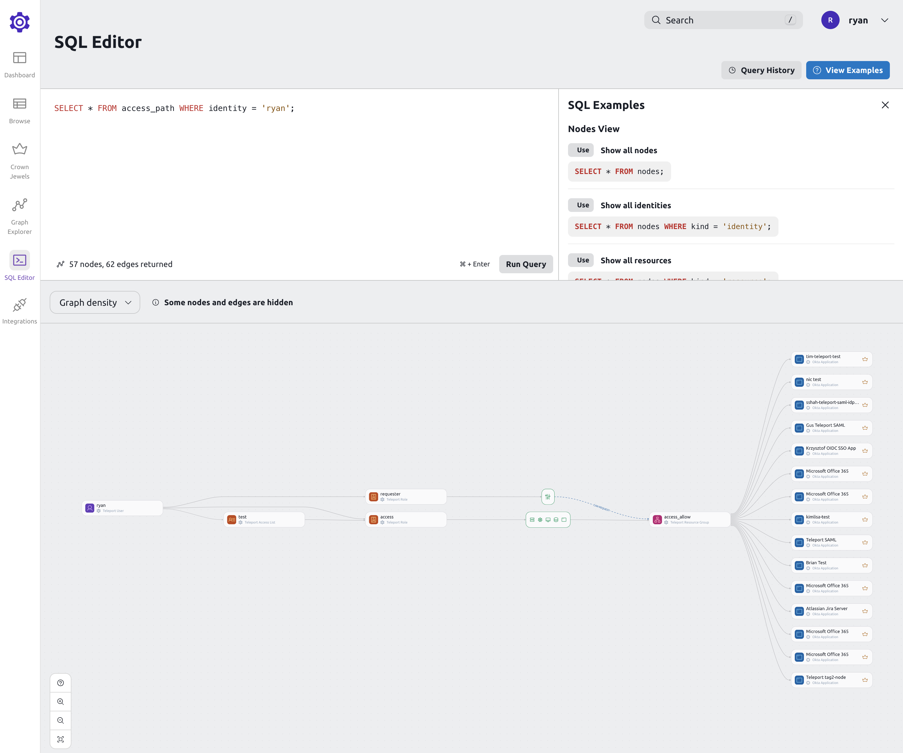

Access Graph allows creating SQL like queries to explore the graph.



The query language allows to create different views of the graph, ex:

Show only allowed paths:

```sql
SELECT * FROM access_path WHERE kind = 'ALLOWED';
```

Show only denied paths:
```sql
SELECT * FROM access_path WHERE kind = 'DENIED';
```

Show all access paths for a user:
```sql
SELECT * FROM access_path WHERE identity = 'bob';
```

Show all access paths for a user AND a resource:
```sql
SELECT * FROM access_path WHERE identity = 'bob' AND resource = 'postgres';
```

Show all access paths for resources with specific labels:
```sql
SELECT * FROM access_path WHERE resource_labels @> '{"key": "value"}';
```

Show all SSH Keys from SSH Key Scanning:

```sql
SELECT * FROM ssh_keys;
```

You can view more SQL examples in the editor.
