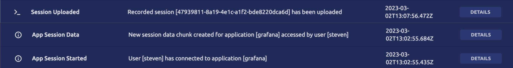

Teleport records the HTTP activity within an Application Session. Only metadata
such as path and status code from the HTTP activity is recorded, not the data
sent or recieved by the application client.

Within the Audit Log the `session_chunk_id` of the `App Session Data` record is
the session id that activity is recorded against.  Once the `Session Uploaded`
record is uploaded with that session id the activity is retrievable.



To retrieve the activity use the `tsh play` of the session id with a format of `json` or `yaml`.

```code
$ tsh play session-id --format=json
```

```json
[
    {
        "app_name": "grafana",
        "app_public_addr": "grafana.teleport.example.com",
        "app_uri": "http://grafana:3000",
        "cluster_name": "teleport.example.com",
        "code": "T2009I",
        "ei": 36,
        "event": "app.session.request",
        "method": "POST",
        "path": "/api/frontend-metrics",
        "raw_query": "",
        "status_code": 200,
        "time": "2023-03-02T13:03:06.796Z",
        "uid": "c1f3e405-9cfc-40d9-8829-8fe99ca297a0"
    }
]
```
