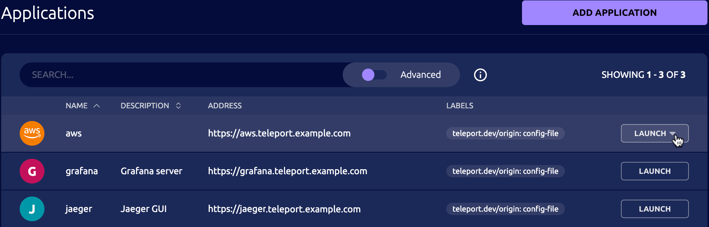

Log in to the Teleport Web UI at `https://teleport.example.com` (replace with
your Proxy Service's public address).

Navigate to the Applications tab in your Teleport cluster's control panel and
click on the Launch button for the AWS application. This will bring up an IAM
role selector:

Click on the role `{{ iam-role }}` and you will get redirected to the AWS
Management Console, signed in with the selected role.

In the console's top-right corner, you should see that you're logged in through
federated login and the name of your assumed IAM role is
`{{ iam-role }}/<teleport-username>` where the session name is your Teleport username.
