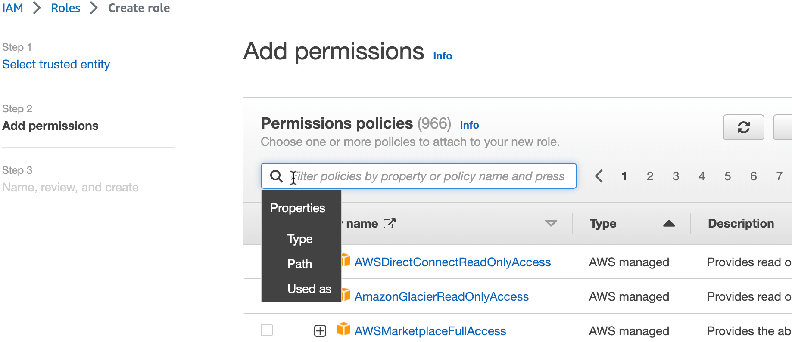
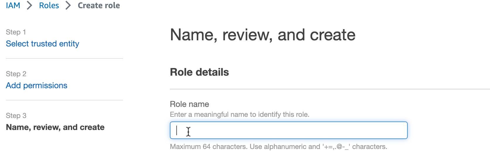

Create an IAM role that provides access to your {{ database }} resources.
Teleport Application Service will assume this IAM role on behalf of the
Teleport user that accesses these {{ database }} resources.

There are several methods to create an IAM role:

<Tabs>
<TabItem label="Using AWS Console">
Visit the [Roles page](https://console.aws.amazon.com/iamv2/home#/roles) of
the AWS Console, then press "Create Role".

Select the "AWS account" option, which creates a default trust policy to allow
other entities in this account to assume this role:


Press "Next". Find the AWS-managed policy `{{ managed-policy }}` and then select the policy:



Press "Next". Enter role name `{{ iam-role }}` and press "Create role":


</TabItem>

<TabItem label="Using AWS CLI">
Create a file with the following trust policy. Replace <Var
name="aws-account-id"/> with your AWS Account ID:
```code
$ cat > trust-relationship.json <<EOF
{
  "Version": "2012-10-17",
  "Statement": [
    {
      "Effect": "Allow",
      "Principal": {
        "AWS": "arn:aws:iam::<Var name="aws-account-id"/>:root"
      },
      "Action": "sts:AssumeRole"
    }
  ]
}
EOF
```

Create an IAM role with name `{{ iam-role }}`:
```code
$ aws iam create-role --role-name {{ iam-role }} --assume-role-policy-document file://trust-relationship.json
```

Attach managed policy `{{ managed-policy }}` to the role:
```code
$ aws iam attach-role-policy --role-name {{ iam-role }} --policy-arn arn:aws:iam::aws:policy/{{ managed-policy }}
```
</TabItem>

<TabItem label="Using Terraform">
Add the following resources to your Terraform deployment. Replace <Var
name="aws-account-id"/> with your AWS Account ID:
```code
$ cat > teleport_iam_role_{{ iam-role }}.tf <<EOF
resource "aws_iam_role" "teleport-{{ iam-role }}" {
  name = "{{ iam-role }}"
  assume_role_policy = jsonencode({
    Version = "2012-10-17"
    Statement = [
      {
        Effect = "Allow"
        Principal = {
          AWS = "arn:aws:iam::<Var name="aws-account-id"/>:root"
        }
        Action = "sts:AssumeRole"
      },
    ]
  })
}
resource "aws_iam_role_policy_attachment" "teleport-{{ iam-role }}-{{ managed-policy }}" {
  role       = aws_iam_role.teleport-{{ iam-role }}.name
  policy_arn = "arn:aws:iam::aws:policy/{{ managed-policy }}"
}
EOF
```
Then `terraform apply`.
</TabItem>
</Tabs>
