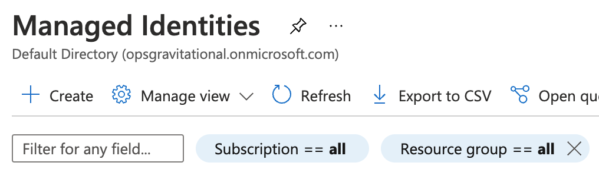
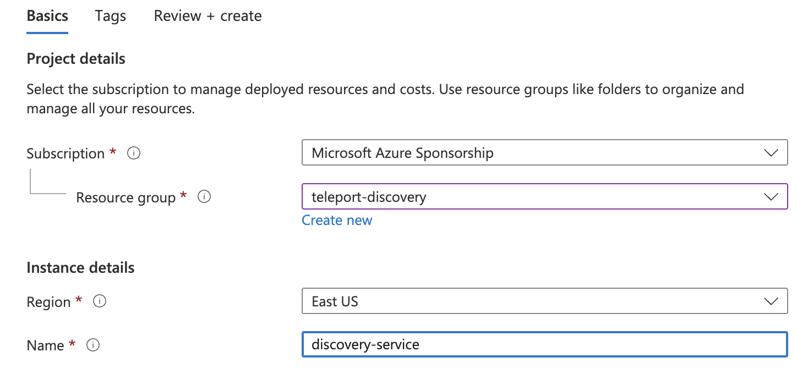
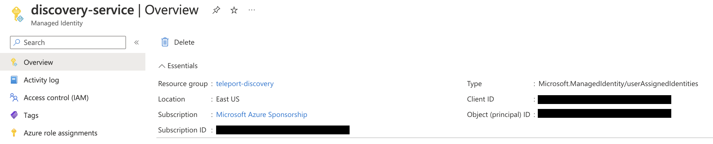
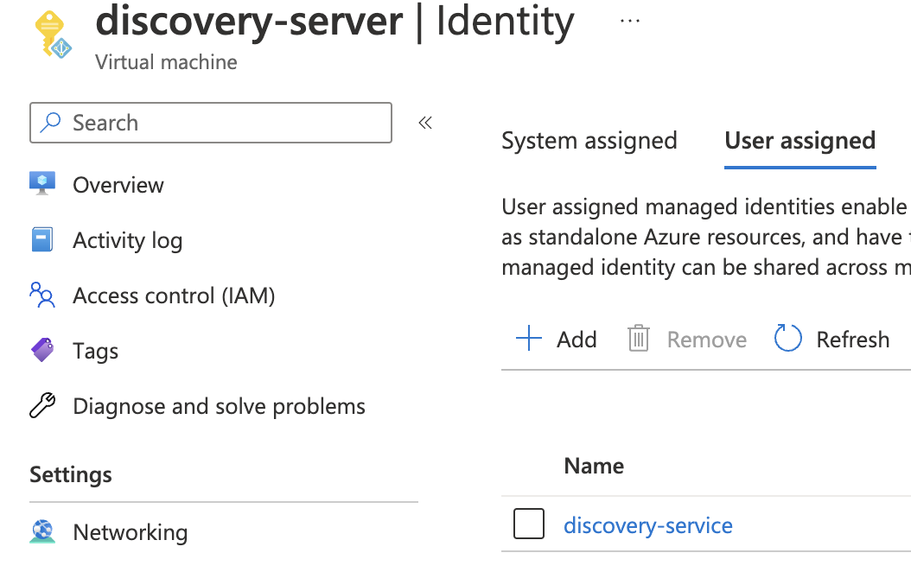
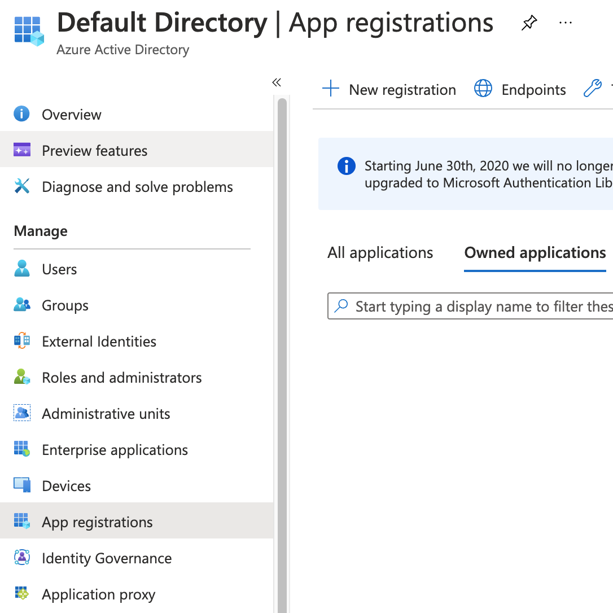
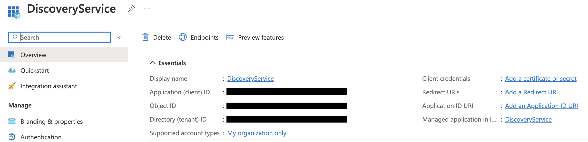
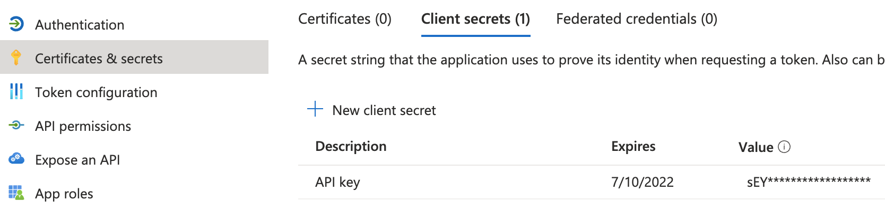

### Configure an Azure service principal

There are a couple of ways for the Teleport Discovery Service to access Azure
resources:

- The Discovery Service can run on an Azure VM with attached managed identity. This
  is the recommended way of deploying the Discovery Service in production since
  it eliminates the need to manage Azure credentials.
- The Discovery Service can be registered as a Microsoft Entra ID application
  and configured with its credentials. This is only recommended for development
  and testing purposes since it requires Azure credentials to be present in the
  Discovery Service's environment.

<Tabs>
<TabItem label="Using managed identity">
  Go to the [Managed Identities](https://portal.azure.com/#browse/Microsoft.ManagedIdentity%2FuserAssignedIdentities)
  page in your Azure portal and click *Create* to create a new user-assigned
  managed identity:

  

  Pick a name and resource group for the new identity and create it:

  

  Take note of the created identity's *Client ID*:

  

  Next, navigate to the Azure VM that will run your Discovery Service instance and
  add the identity you've just created to it:

  

  Attach this identity to all Azure VMs that will be running the Discovery
  Service.
</TabItem>
<TabItem label="Using app registrations">
  <Admonition type="note">
    Registering the Discovery Service as a Microsoft Entra ID application is
    suitable for test and development scenarios, or if your Discovery Service
    does not run on an Azure VM. For production scenarios prefer to use the
    managed identity approach.
  </Admonition>

  Go to the [App registrations](https://portal.azure.com/#blade/Microsoft_AAD_IAM/ActiveDirectoryMenuBlade/RegisteredApps)
  page in Microsoft Entra ID and click on *New registration*:

  

  Pick a name (e.g. *DiscoveryService*) and register a new application. Once the
  app has been created, take note of its *Application (client) ID* and click on
  *Add a certificate or secret*:

  

  Create a new client secret that the Discovery Service agent will use to
  authenticate with the Azure API:

  

  The Teleport Discovery Service uses Azure SDK's default credential provider chain to
  look for credentials. Refer to [Azure SDK Authorization](https://docs.microsoft.com/en-us/azure/developer/go/azure-sdk-authorization)
  to pick a method suitable for your use-case. For example, to use
  environment-based authentication with a client secret, the Discovery Service should
  have the following environment variables set:

  ```text
  export AZURE_TENANT_ID=
  export AZURE_CLIENT_ID=
  export AZURE_CLIENT_SECRET=
  ```
</TabItem>
</Tabs>
