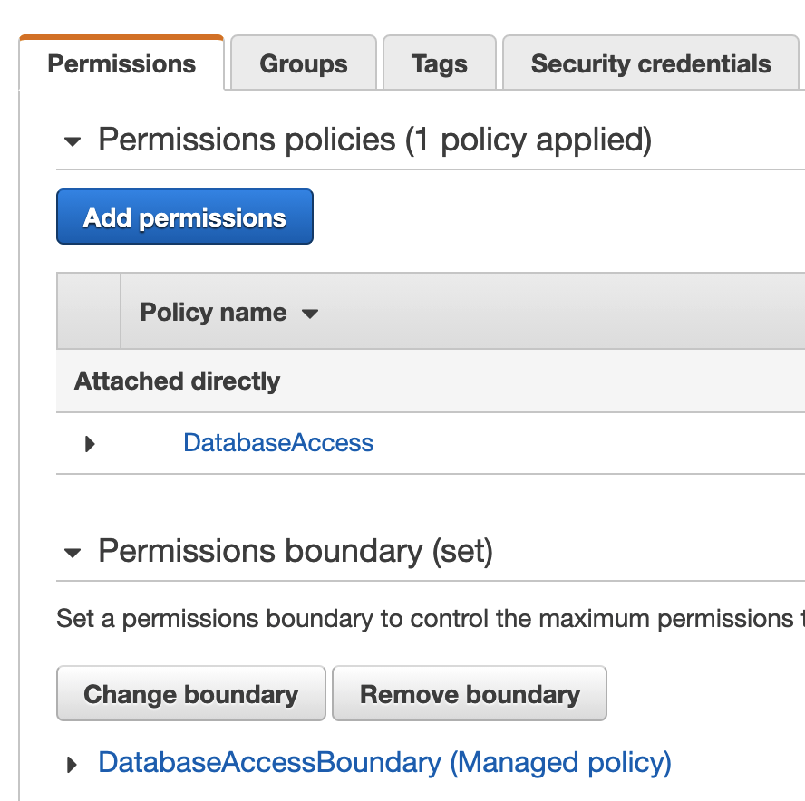

Attach the policy and permission boundary you created earlier to the IAM
identity your Teleport Database Service will be using.

For example, if the Database Service runs as an IAM user, go to the page of the IAM user
in the AWS Management Console, attach the created policy in the "Permissions
policies" section, and set the created boundary policy in the "Permissions
boundary" section.

