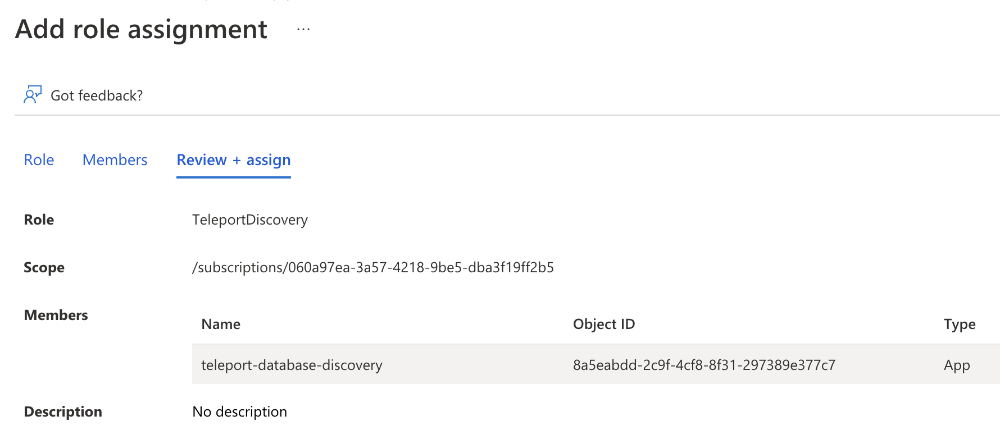

To grant Teleport permissions, the custom role you created must be assigned to the Teleport service principal -
either the managed identity or the app registration you created earlier.

Navigate to the resource scope where you want to make the role assignment. Click *Access control (IAM)* and 
select *Add > Add role assignment*. Choose the custom role you created as the role and the Teleport
service principal as a member.

<Admonition type="note" title="Azure Role Assignments">
The role assignment should be at a high enough scope to allow the Teleport Database Service to discover
all matching databases. See
[Identify the needed scope](https://docs.microsoft.com/en-us/azure/role-based-access-control/role-assignments-steps#step-3-identify-the-needed-scope)
for more information about Azure scopes and creating role assignments.
</Admonition>
