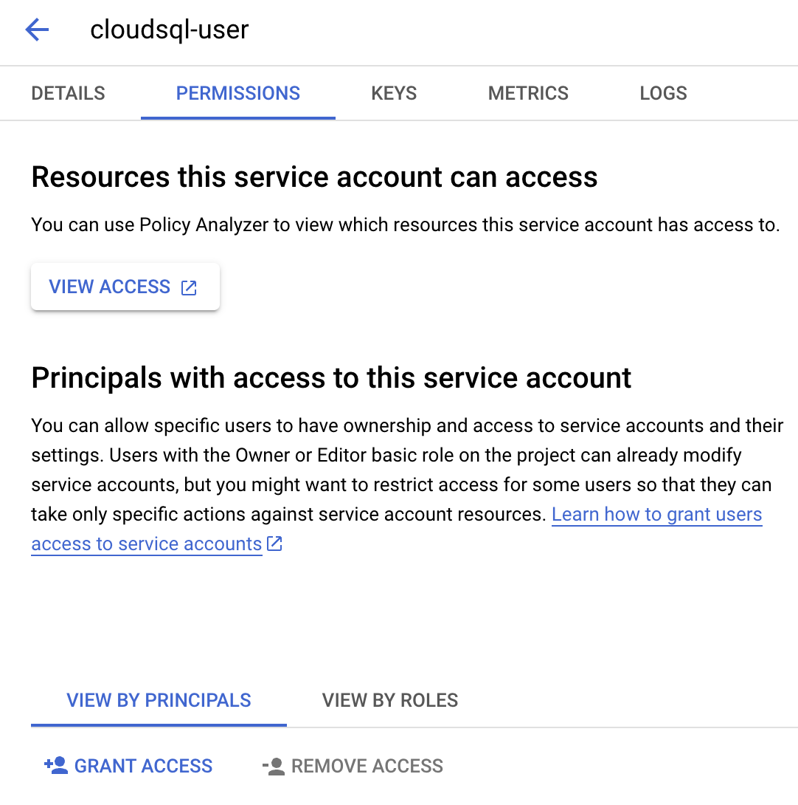
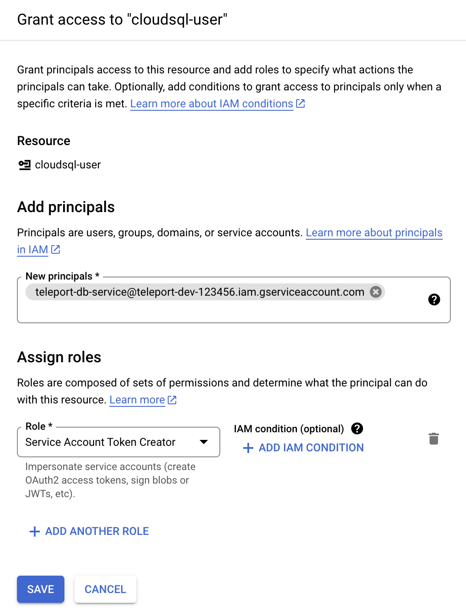

### Grant access to the service account

The Teleport Database Service must be able to impersonate this service account.
Navigate to the "cloudsql-user" service account overview page and select the
"permissions" tab:



Click "Grant Access" and add the "teleport-db-service" principal ID.
Select the "Service Account Token Creator" role and save the change:



<Admonition type="note" title="Service account permissions">
  The "Service Account Token Creator" IAM role includes more permissions than
  the Teleport Database Service needs. To further restrict the service 
  account, you can create a role that includes only the following permission:
  ```ini
  # Used to generate IAM auth tokens when connecting to a database instance.
  iam.serviceAccounts.getAccessToken
  ```
</Admonition>
