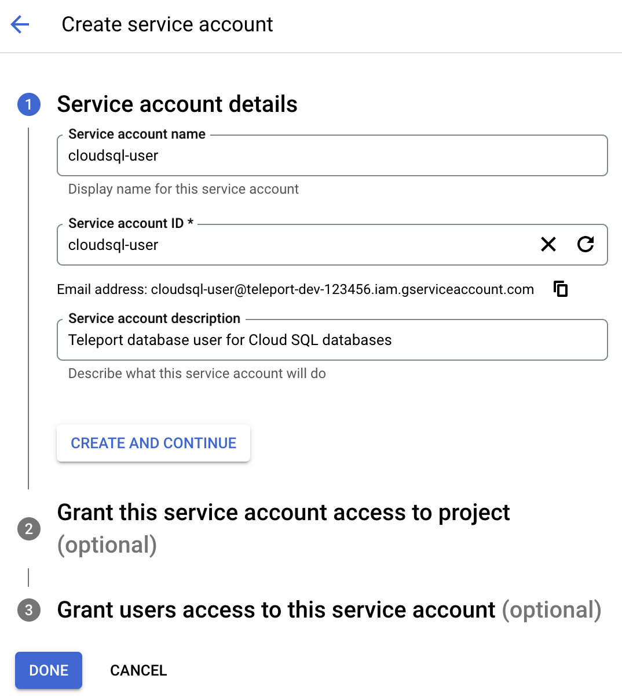

### Create a service account

Go to the IAM & Admin [Service Accounts](https://console.cloud.google.com/iam-admin/serviceaccounts)
page and create a new service account named "cloudsql-user":

Click "Create and continue".
