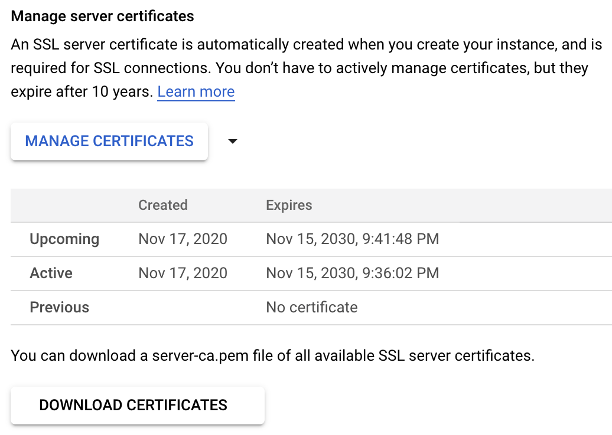

The Cloud SQL instance's root CA certificate is required so that the Teleport
Database Service can validate the certificate presented by the database instance.

The Teleport Database Service can automatically download the instance's root
CA certificate if it is granted the "cloudsql.instances.get" permission.

Alternatively, you can download the instance's CA certificate file from the
"Connections" tab under the "Security" section:

