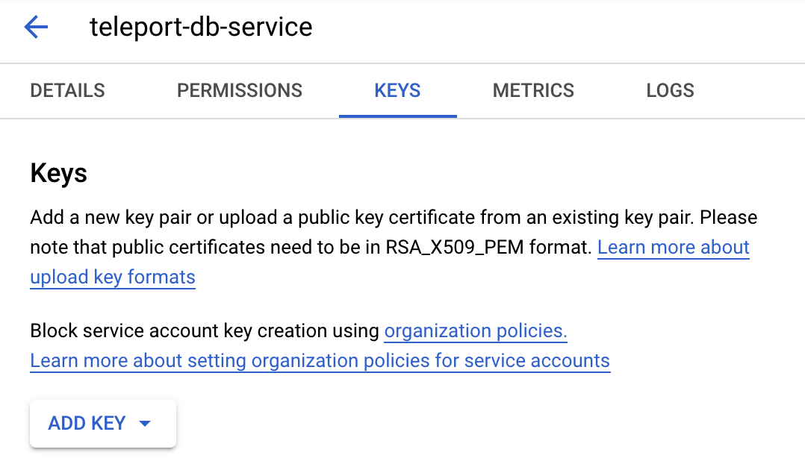
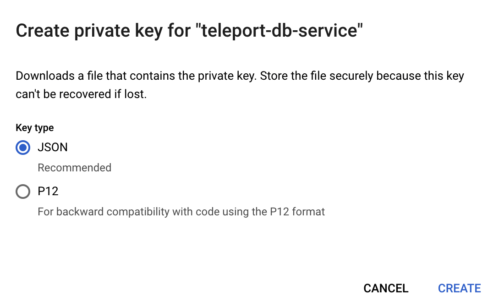

The Teleport Database Service must have credentials for the
"{{ serviceAccount }}" GCP service account.

If the Teleport Database Service is hosted on a GCE instance, you can
[change the attached service account](https://cloud.google.com/compute/docs/instances/change-service-account).
For non-GCE deployments of Teleport, we recommend using
[workload identity](https://cloud.google.com/iam/docs/workload-identity-federation).

Alternatively, go to that service account's Keys tab and create a new key:



Make sure to choose JSON format:



Save the file. Set the `GOOGLE_APPLICATION_CREDENTIALS` environment variable to
point to the JSON credentials file you downloaded earlier. For example, if you
use `systemd` to start `teleport`, then you should edit the service's
`EnvironmentFile` to include the env var:
```code
$ echo 'GOOGLE_APPLICATION_CREDENTIALS=/path/to/credentials.json' | sudo tee -a /etc/default/teleport
```

<Admonition type="warning">
A service account key can be a security risk - we only describe using a key in
this guide for simplicity.
We do not recommend using service account keys in production.
See [authentication](https://cloud.google.com/docs/authentication#service-accounts)
in the Google Cloud documentation for more information about service account
authentication methods.
</Admonition>
