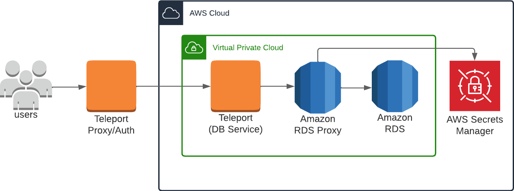
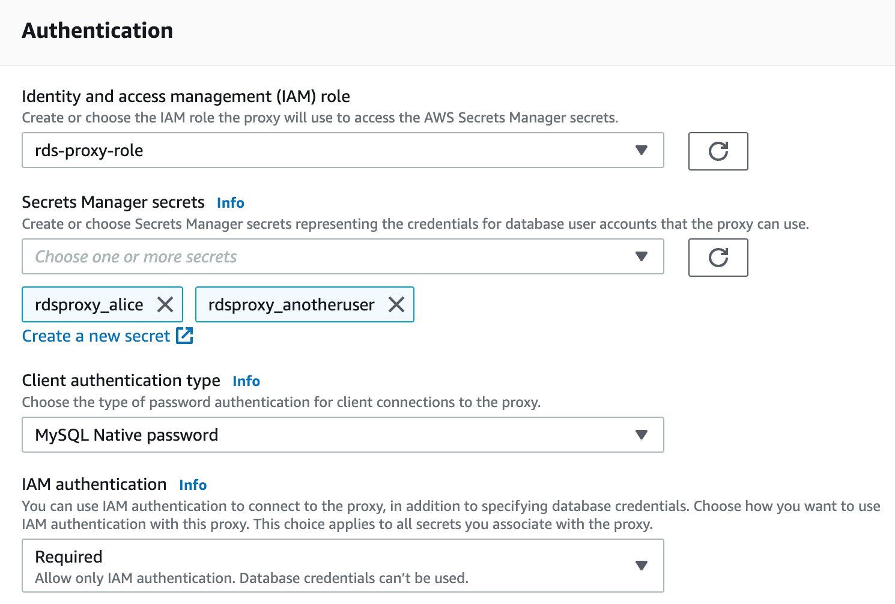

## How it works

(!docs/pages/includes/database-access/how-it-works/iam.mdx db="RDS Proxy" cloud="AWS"!)

<Tabs>
<TabItem label="Self-Hosted">

</TabItem>
<TabItem label="Cloud-Hosted">

</TabItem>

</Tabs>

<Admonition type="note" title="Supported Engine Family">
Teleport currently supports RDS Proxy instances with engine family
[PostgreSQL](../../enroll-resources/database-access/enroll-aws-databases/rds-proxy-postgres.mdx),
[MariaDB/MySQL](../../enroll-resources/database-access/enroll-aws-databases/rds-proxy-postgres.mdx) or
[Microsoft SQL Server](../../enroll-resources/database-access/enroll-aws-databases/rds-proxy-sqlserver.mdx).
</Admonition>

(!docs/pages/includes/database-access/auto-discovery-tip.mdx dbType="RDS Proxy" providerType="AWS"!)

## Prerequisites

(!docs/pages/includes/edition-prereqs-tabs.mdx!)

- AWS account with RDS Proxy instances and permissions to create and attach IAM policies.
- Any RDS Proxy instances intended for connection through Teleport must have TLS enabled.
- A host, e.g., an EC2 instance, where you will run the Teleport Database
  Service.
- (!docs/pages/includes/tctl.mdx!)

## Step 1/6. Install Teleport

(!docs/pages/includes/install-linux.mdx!)

## Step 2/6. Create a Teleport Database Service configuration

(!docs/pages/includes/tctl-token.mdx serviceName="Database" tokenType="db" tokenFile="/tmp/token"!)

(!docs/pages/includes/database-access/alternative-methods-join.mdx!)

Create the Database Service configuration. Replace <Var
name="teleport.example.com:443" /> with the domain name **and port** of your
Teleport Proxy Service or cloud-hosted Teleport Enterprise account and
<Var name="endpoint:port" /> with the host **and port** of the database endpoint:

```code
$ sudo teleport db configure create \
   -o file \
   --proxy=<Var name="teleport.example.com:443"/> \
   --uri=<Var name="endpoint:port" /> \
   --protocol={{ protocol }} \
   --token=/tmp/token \
   --labels=env=dev
```

The command will generate a Teleport Database Service configuration file and
place it at the `/etc/teleport.yaml` location.

## Step 3/6. Configure Database Service IAM permissions

(!docs/pages/includes/database-access/create-iam-role-step-description.mdx accessFor="RDS Proxy instances" !)

### Create an IAM role for Teleport

(!docs/pages/includes/aws-credentials.mdx service="the Database Service"!)

### Grant permissions

Attach the following AWS IAM permissions to the Database Service IAM role:

(!docs/pages/includes/database-access/reference/aws-iam/rds-proxy/access-policy.mdx!)

## Step 4/6. Start the Database Service

(!docs/pages/includes/start-teleport.mdx service="the Teleport Database Service"!)

## Step 5/6. Configure database user credentials

The Database Service connects to an RDS Proxy instance using IAM
authentication. In addition, the RDS Proxy instance must also be able to
connect to the RDS DB instance or Aurora DB cluster using pre-configured
database user credentials.

First, use Secrets Manager to store sets of user name and password credentials.
You create a separate Secrets Manager secret for each database user account
that RDS Proxy connects to on the RDS DB instance or Aurora DB cluster. The
password associated with the secret must match the database password for that
user in the target database.

For example, the following AWS CLI command creates a Secrets Manager secret for
database user `alice`:

```code
$ aws secretsmanager create-secret \
  --name rdsproxy_alice --description "database user alice" \
  --secret-string '{"username":"alice","password":"password_for_alice"}'
```

Next, create an IAM role with a policy that can access these secrets, for
example:

```json
{
    "Version": "2012-10-17",
    "Statement": [
        {
            "Effect": "Allow",
            "Action": "secretsmanager:GetSecretValue",
            "Resource": [
                "arn:aws:secretsmanager:us-west-1:account_id:secret:rdsproxy_alice",
                "arn:aws:secretsmanager:us-west-1:account_id:secret:rdsproxy_anotheruser"
            ]
        },
        {   
            "Effect": "Allow",
            "Action": "kms:Decrypt",
            "Resource": "arn:aws:kms:us-west-1:account_id:key/key_id",
            "Condition": {
                "StringEquals": {
                    "kms:ViaService": "secretsmanager.us-east-2.amazonaws.com"
                }
            }
        }
    ]
}
```

The IAM role should have the following trust policy:

```json
{
  "Version": "2012-10-17",
  "Statement": [
    {
      "Sid": "",
      "Effect": "Allow",
      "Principal": {
        "Service": "rds.amazonaws.com"
      },
      "Action": "sts:AssumeRole"
    }
  ]
}
```

Lastly, modify the RDS Proxy authentication settings to use the created IAM
role and Secrets Manager secrets. Make sure IAM authentication is set to
**Required**:



<Admonition type="tip" title="IAM authentication per database user">
If you need to disable IAM authentication for some database users that are not
intended for Teleport access, use the following AWS CLI command to set
**IAMAuth** *per secret*:

```code
$ aws rds modify-db-proxy --db-proxy-name my-rds-proxy --auth AuthScheme=SECRETS,SecretArn=arn-of-teleport-access-user,\
IAMAuth=REQUIRED AuthScheme=SECRETS,SecretArn=arn-of-non-teleport-user,IAMAuth=DISABLED ...
```

See `aws rds modify-db-proxy help` for more information.
</Admonition>

## Step 6/6. Connect

Once the Database Service has started and joined the cluster, log in to see the
registered database:

```code
$ tsh login --proxy=<Var name="teleport.example.com:443" /> --user=alice
$ tsh db ls
Name                         Description                     Labels
---------------------------- ------------------------------- -------
rds-proxy                    RDS Proxy in us-west-1          ...
```

Retrieve credentials for the database and connect to it as the `alice` user:

```code
$ tsh db connect --db-user=alice --db-name=dev rds-proxy
```

(!docs/pages/includes/database-access/pg-access-webui.mdx!)

To log out of the database and remove credentials:

```code
$ tsh db logout rds-proxy
```

## Troubleshooting

(!docs/pages/includes/database-access/aws-troubleshooting.mdx!)

(!docs/pages/includes/database-access/aws-troubleshooting-max-policy-size.mdx!)

## Next steps

(!docs/pages/includes/database-access/guides-next-steps.mdx!)
- Learn more on [Setting up database credentials in AWS Secrets
  Manager](https://docs.aws.amazon.com/AmazonRDS/latest/UserGuide/rds-proxy-setup.html)
  and [Setting up AWS Identity and Access Management (IAM)
  policies](https://docs.aws.amazon.com/AmazonRDS/latest/UserGuide/rds-proxy-setup.html)
  for RDS Proxy
