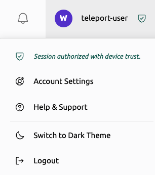

### "binary missing signature or entitlements" on `tsh device enroll`

A signed and notarized `tsh` binary is necessary to enroll and use a a trusted
device. [Download the macOS tsh installer](../../installation.mdx#macos) to fix
the problem.

### "unauthorized device" errors using a trusted device

A trusted device needs to be registered and enrolled before it is recognized by
Teleport as such. Follow the [registration](../../admin-guides/access-controls/device-trust/device-management.mdx) and
[enrollment](../../admin-guides/access-controls/device-trust/device-management.mdx) steps
and make sure to `tsh logout` and `tsh login` after enrollment is done.

### "Failed to open the TPM device" on Linux

Linux users need permissions to read and write from the TPM device, `/dev/tpmrm0`.
Without such permissions `tsh` would need `sudo` prompts for most operations.

The simplest way to solve this is to check if your distro ships with the `tss`
group and assign it to your OS user. If that is not possible, or you are looking
for a different solution, we recommend creating udev rules similar to the ones
shipped by the [TPM2 Software Stack](
https://github.com/tpm2-software/tpm2-tss/blob/ede63dd1ac1f0a46029d457304edcac2162bfab8/dist/tpm-udev.rules#L4).

### App access and "access to this app requires a trusted device"

Follow the instructions in the [Web UI troubleshooting section](
#web-ui-fails-to-authenticate-trusted-device) below (Teleport v16 or later).

Alternatively, you may use one of the tsh commands described by
[App Access support](../../admin-guides/access-controls/device-trust/enforcing-device-trust.mdx).
For example, for an app called `myapp`, run `tsh proxy app myapp -p 8888`, then
open http://localhost:8888 in your browser.

If you are already running `tsh proxy app`, or using the certificates acquired
from `tsh app login`, then it's likely your device isn't registered or enrolled.
In this case, follow the advice from the [unauthorized device section](
#unauthorized-device-errors-using-a-trusted-device) above.

### Desktop access and "access to this app requires a trusted device"

Follow the instructions in the [Web UI troubleshooting section](
#web-ui-fails-to-authenticate-trusted-device) below.

### Web UI fails to authenticate trusted device

The Web UI attempts to authenticate your device using Teleport Connect during
login. If you are not asked to authenticate your device immediately after login,
follow the steps below:

1. Make sure your device is [registered and enrolled](
   ../../admin-guides/access-controls/device-trust/device-management.mdx#register-a-trusted-device)
2. Install [Teleport Connect](
   ../../connect-your-client/teleport-connect.mdx#installation--upgrade).
   Use the DEB or RPM packages on Linux (the tarball doesn't register the custom
   URL handler).
3. Make sure Teleport Connect can access the same resource you are trying to
   access on the Web
4. Ask your cluster administrator if device trust is enabled (cluster mode
   "optional" or higher)

If all of the above steps are done, try logging out from the Web UI and logging
in again.

#### Successful device trust authentication

When successfully authenticated to use device trust in the web UI, the user will see a green
shield icon next to the logged-in username at the top right of the screen:

<Figure width="257" height="76" bordered>

</Figure>

Additionally, clicking on the username to show the user menu will indicate that the session
is authorized with device trust:

<Figure width="306" height="346" bordered>

</Figure>

#### Unsuccessful device trust authentication

If the user is not authenticated to use device trust in the web UI, but either the cluster-wide
configuration or their assigned role(s) require device trust, the user will see a yellow warning
shield next to the logged-in username at the top right of the screen:

<Figure width="207" height="70" bordered>

</Figure>

Additionally, clicking on the username to show the user menu will indicate that the session is not
authorized with device trust, so the user's access is restricted:

<Figure width="304" height="368" bordered>

</Figure>